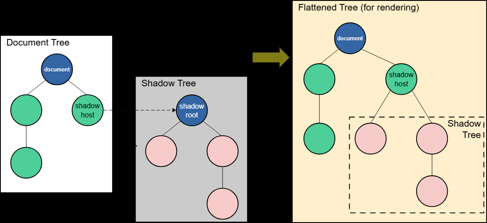

### Shadow DOM - «DOM внутри DOM»

DOM — это программный интерфейс (API) для кода страницы, который представляет страницу как древовидную структуру объектов.

Каждый HTML-элемент (например, `<p>`, `<div>`, ``), каждый атрибут и каждый фрагмент текста является отдельным «узлом»
(node) в этом дереве. С JavaScript, мы можем обращаться к этим узлам, чтобы динамически изменять страницу: менять текст, добавлять стили, создавать новые элементы или удалять существующие. По сути, DOM — это «живая» модель документа, с которой взаимодействует код.

Но у этой открытости есть и обратная сторона. Когда мы создаем сложный, многократно используемый компонент (например, кастомный видеоплеер или виджет календаря), его внутренняя структура и стили становятся уязвимыми. Стили CSS с основной страницы могут случайно «протечь» внутрь компонента и сломать его внешний вид. Аналогично, JavaScript-код страницы может непреднамеренно изменить внутренние элементы компонента, нарушив его логику.

Для решения этой проблемы и существует **Shadow DOM (теневой DOM)**.

По своей сути, Shadow DOM — это **«DOM внутри DOM»**. Это скрытое дерево элементов, которое прикрепляется к обычному элементу на странице (называемому «хостом»), но при этом оно изолировано от основного DOM. Оно позволяет разработчику создать герметичную границу вокруг внутренней структуры компонента, защищая его от внешнего мира.

#### Общий обзор и ключевые термины

Теневой DOM позволяет прикреплять скрытые DOM-деревья к элементам в обычном DOM-дереве. Это теневое дерево начинается с **теневого корня** (shadow root), под который можно прикреплять любые элементы так же, как и в обычном DOM.

Существует несколько терминов, связанных с теневым DOM, которые следует знать:

*   **Теневой хост (Shadow host):** Обычный узел DOM, к которому прикреплен теневой DOM.
*   **Теневое дерево (Shadow tree):** DOM-дерево внутри теневого DOM.
*   **Теневая граница (Shadow boundary):** Место, где заканчивается теневой DOM и начинается обычный DOM.
*   **Теневой корень (Shadow root):** Корневой узел теневого дерева.

Вы можете воздействовать на узлы в теневом DOM точно так же, как и на обычные узлы. Разница в том, что никакой код внутри теневого DOM не может повлиять на что-либо за его пределами, что обеспечивает надёжную инкапсуляцию.

До того, как теневой DOM стал доступен веб-разработчикам, браузеры уже использовали его для инкапсуляции внутренней структуры стандартных элементов. Например, элемент `<video>` с элементами управления. Всё, что вы видите в DOM, — это тег `<video>`, но он содержит ряд кнопок и других элементов управления внутри своего теневого DOM.

#### Создание теневого DOM

Создавать теневой DOM можно двумя способами: императивно с помощью JavaScript или декларативно прямо в HTML.

##### Императивно с помощью JavaScript

Этот способ отлично подходит для приложений, рендерящихся на стороне клиента. Мы выбираем элемент-хост и вызываем на нём метод `attachShadow()`.

```html
<!-- HTML-разметка -->
<div id="host"></div>
<span>Я не в теневом DOM</span>
```

```javascript
// Находим хост и прикрепляем к нему теневой DOM
const host = document.querySelector("#host");
const shadow = host.attachShadow({ mode: "open" });

// Создаём и добавляем элементы в теневое дерево
const span = document.createElement("span");
span.textContent = "Я нахожусь в теневом DOM";
shadow.appendChild(span);
```

Результат на странице будет выглядеть так:
> Я нахожусь в теневом DOM
> Я не в теневом DOM

##### Декларативно с помощью HTML

Для приложений, где важен рендеринг на стороне сервера, можно определить теневой DOM декларативно, используя элемент `<template>` с атрибутом `shadowrootmode`.

```html
<div id="host">
  <template shadowrootmode="open">
    <p>Этот параграф находится внутри теневого DOM.</p>
    <style>
      p { color: red; } /* Эти стили будут изолированы */
    </style>
  </template>
</div>
```

Когда браузер обработает этот код, он автоматически создаст теневой корень для `<div>` и поместит в него содержимое тега `<template>`. Сам тег `<template>` при этом исчезнет из основного DOM-дерева.

#### Инкапсуляция: защита от JavaScript и CSS

Главное преимущество Shadow DOM — это изоляция. Давайте посмотрим, как она работает.

##### Инкапсуляция от JavaScript

Добавим кнопку, которая будет пытаться изменить все элементы `<span>` на странице.

```javascript
// ... код создания теневого DOM ...

const upper = document.querySelector("#upper-button");
upper.addEventListener("click", () => {
  // Этот селектор ищет по всему документу
  const spans = document.querySelectorAll("span");
  for (const span of spans) {
    span.textContent = span.textContent.toUpperCase();
  }
});
```

При нажатии на кнопку текст изменится только у `<span>`, который находится в основном документе. Элемент внутри теневого DOM останется нетронутым, потому что `document.querySelectorAll()` не может "заглянуть" за теневую границу.

##### Доступ к теневому DOM: свойство `shadowRoot` и работа с вложенностью

Когда мы вызываем `host.attachShadow({ mode: "open" })`, мы создаём теневой DOM в "открытом" режиме. Это означает, что мы можем получить доступ к его содержимому извне через свойство `host.shadowRoot`.

```javascript
// Находим спаны только внутри теневого дерева конкретного хоста
const spansInShadow = host.shadowRoot.querySelectorAll("span");
```

Если же указать `mode: "closed"`, свойство `host.shadowRoot` вернёт `null`, и доступ к теневому дереву извне будет закрыт. Это не строгий механизм безопасности, а скорее соглашение для разработчиков о том, что внутренности компонента трогать не следует.

**Работа с вложенными теневыми деревьями**

В сложных компонентных архитектурах один пользовательский элемент может содержать внутри себя другие пользовательские элементы, каждый из которых имеет свой собственный Shadow DOM. Чтобы добраться до элемента в глубоко вложенном теневом дереве, придётся последовательно "проходить" через каждый `shadowRoot`.

Представим себе такую структуру:
*   Компонент `<nmbrs-form>` (основная форма).
*   Внутри него находится `<div>`, а в нём — компонент `<nmbrs-button>` (кастомная кнопка).
*   Внутри `<nmbrs-button>` находится настоящая HTML-кнопка `<button>`.

Чтобы получить доступ к этой кнопке из глобального контекста, путь будет выглядеть так:

```javascript
// 1. Находим корневой компонент в основном документе
const formComponent = document.querySelector('nmbrs-form');

// 2. "Входим" в его теневое дерево
const shadowRoot1 = formComponent.shadowRoot;

// 3. Находим вложенный компонент-кнопку
const buttonComponent = shadowRoot1.querySelector('div div.btn-container nmbrs-button');

// 4. "Входим" в теневое дерево уже этого компонента
const shadowRoot2 = buttonComponent.shadowRoot;

// 5. И только теперь находим конечный элемент
const finalButton = shadowRoot2.querySelector('button#button');
```

В виде одной цепочки вызовов это выглядит так:

```javascript
const button = document.querySelector('nmbrs-form').shadowRoot
                      .querySelector('div div.btn-container nmbrs-button').shadowRoot
                      .querySelector('button#button');
```

Такая длинная цепочка наглядно демонстрирует мощь инкапсуляции: чтобы добраться до внутренних деталей, нужно явно пройти через каждую "границу". Это делает код более предсказуемым и защищает компоненты от случайных изменений.

##### Инкапсуляция от CSS

Стили, определённые на основной странице, не влияют на элементы внутри теневого DOM.

```css
/* Этот стиль применится только к спанам в основном документе */
span {
  color: blue;
  border: 1px solid black;
}
```

Элемент `<span>` внутри теневого дерева не получит эти стили. Это решает огромную проблему случайных пересечений и конфликтов CSS.

#### Применение стилей внутри теневого DOM

Стили, определённые внутри теневого дерева, в свою очередь, не влияют на основную страницу. Есть два основных способа их добавления.

##### 1. Конструируемые таблицы стилей (Constructable Stylesheets)

Этот метод позволяет создавать объект `CSSStyleSheet` в JavaScript и применять его к одному или нескольким теневым деревьям. Это эффективно, если у вас есть общие стили для множества компонентов.

```javascript
const sheet = new CSSStyleSheet();
sheet.replaceSync("span { color: red; border: 2px dotted black; }");

const shadow = host.attachShadow({ mode: "open" });
// Применяем таблицу стилей к теневому корню
shadow.adoptedStyleSheets = [sheet];
```

##### 2. Добавление элемента `<style>`

Простой и декларативный способ — поместить тег `<style>` прямо внутрь теневого дерева (часто внутри `<template>`).

```html
<template id="my-element">
  <style>
    span {
      color: red;
      border: 2px dotted black;
    }
  </style>
  <span>Я в теневом DOM</span>
</template>
```

#### Теневой DOM и пользовательские элементы: идеальное сочетание

Вся мощь теневого DOM раскрывается при создании **пользовательских элементов (Custom Elements)**. Без инкапсуляции они были бы невероятно хрупкими.

Пользовательский элемент — это класс, наследующий `HTMLElement`. Как правило, сам элемент выступает в роли теневого хоста, а вся его внутренняя структура создаётся внутри теневого дерева.

Вот пример простого компонента `<filled-circle>`:

```javascript
class FilledCircle extends HTMLElement {
  connectedCallback() {
    const shadow = this.attachShadow({ mode: "open" });

    // Создаём внутреннюю реализацию (например, SVG-круг)
    const svg = document.createElementNS("http://www.w3.org/2000/svg", "svg");
    const circle = document.createElementNS("http://www.w3.org/2000/svg", "circle");
    circle.setAttribute("r", "50");
    circle.setAttribute("cx", "50");
    circle.setAttribute("cy", "50");
    // Цвет берём из атрибута самого хоста
    circle.setAttribute("fill", this.getAttribute("color"));
    
    svg.appendChild(circle);
    shadow.appendChild(svg);
  }
}
customElements.define("filled-circle", FilledCircle);
```

Теперь мы можем использовать его в HTML как обычный тег, не беспокоясь о его внутреннем устройстве:

```html
<filled-circle color="blue"></filled-circle>
<filled-circle color="green"></filled-circle>
```

Каждый из этих компонентов будет полностью инкапсулирован и защищён от влияния внешней страницы.