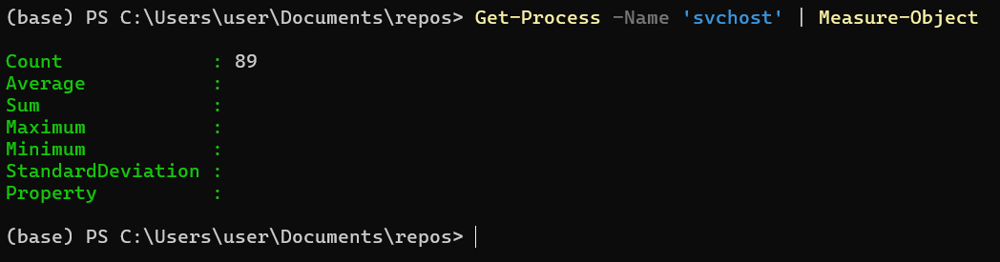
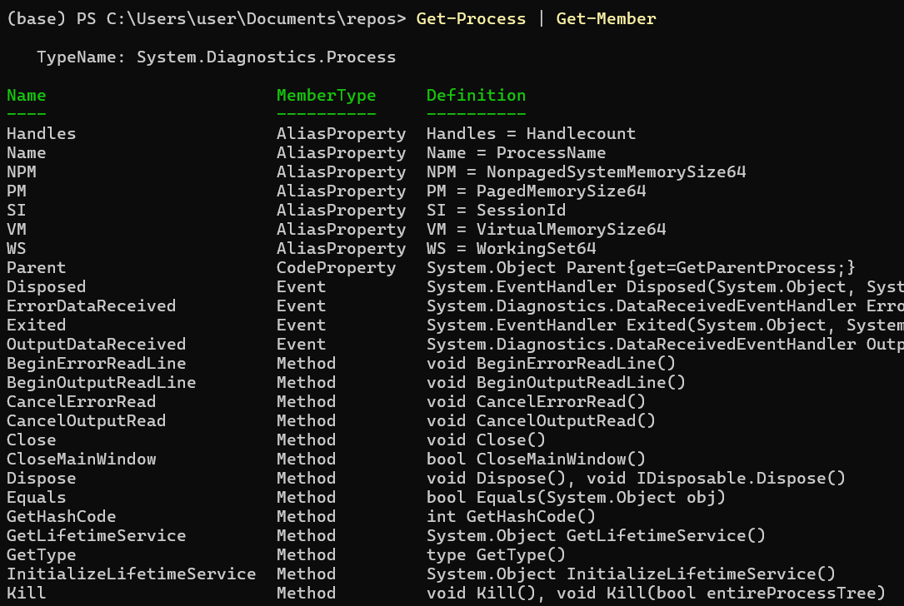
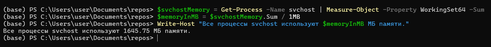
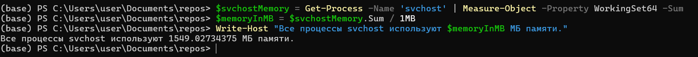
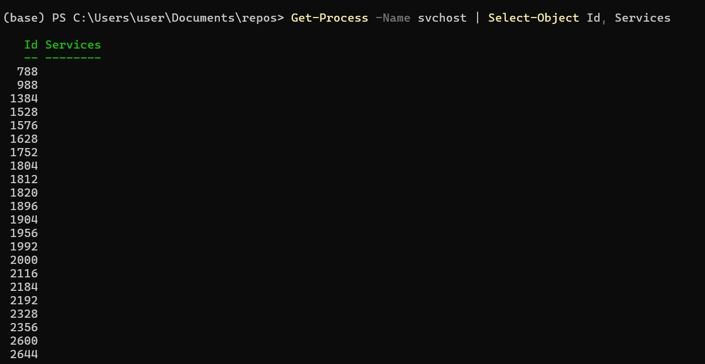

# Часть 2: Конвейер (Pipeline), переменные, Get-Member,  файл *.ps1* и экспорт результатов
**❗ Важно:**
Я пишу про PS7 (PowerShell 7). Он отличается от PS5 (PowerShell 5). Начиная с седьмой версии ps стал кросплатформенным. Из-за этого 
изменилось поведение некоторых команд. 

В первой части мы установили ключевой принцип: PowerShell работает с **объектами**, а не с текстом. 
Этот пост посвящен некоторым важным инструментам PowerShell: 
научимся передавать объекты по **конвейеру**, анализировать их с помощью **`Get-Member`**, 
сохранять результаты в **переменные** и автоматизировать все это в **файлах скриптов (`.ps1`)** с **экспортом** 
результатов в удобные форматы.

## 1. Что такое конвейер (`|`)?
Конвейер в PowerShell это механизм передачи полноценных .NET объектов (а не просто текста) от одной команды 
к другой, где каждый следующий командлет получает структурированные объекты со всеми их свойствами и методами.

Символ `|` (вертикальная черта) — это оператор конвейера. Его задача — взять результат (вывод) команды, стоящей слева от него, и передать его на вход команде, стоящей справа.

`Команда 1 (создает объекты)` → `|` → `Команда 2 (получает и обрабатывает объекты)` → `|` → `Команда 3 (получает обработанные объекты)` → | ...

### Классический UNIX-конвейер: Поток текста

В `bash` по конвейеру передается **поток байтов**, который обычно интерпретируется как текст.

```bash
# Найти все процессы 'nginx' и посчитать их количество
ps -ef | grep 'nginx' | wc -l
```
Здесь `ps` выводит текст, `grep` фильтрует этот текст, а `wc` считает строки. Каждая утилита ничего не знает о "процессах", она работает только со строками.

### PowerShell-конвейер: Поток объектов
**Пример:** Давайте получим все процессы, отсортируем их по использованию CPU и выберем 5 самых "прожорливых".

```powershell
Get-Process | Sort-Object -Property CPU -Descending | Select-Object -First 5
```


Здесь `Get-Process` создает **объекты** процессов. `Sort-Object` получает эти **объекты** и сортирует их по свойству `CPU`. `Select-Object` получает отсортированные **объекты** и выбирает первые 5. 

Вы наверняка заметили в команде слова, начинающиеся с дефиса (-): -Property, -Descending, -First. Это параметры.
Параметры — это настройки, переключатели и инструкции для командлета. Они позволяют управлять тем, **КАК** команда будет выполнять свою работу. 
Без параметров команда работает в режиме по умолчанию, а с параметрами вы даете ей конкретные указания.

Основные типы параметров:

- Параметр со значением: требует дополнительной информации. 

    `-Property CPU`: Мы говорим Sort-Object, по какому свойству сортировать. CPU — это значение параметра.
    
    `-First 5`: Мы говорим Select-Object, сколько объектов выбрать. 5 — это значение параметра.

- Параметр-переключатель (флаг): Не требует значения. Само его наличие в команде включает или выключает определенное поведение. 

   `-Descending`: Этот флаг говорит Sort-Object изменить порядок сортировки на обратный (от большего к меньшему). Ему не нужно дополнительное значение — он сам по себе инструкция.

```powershell
Get-Process -Name 'svchost' | Measure-Object
```

Эта команда отвечает на очень простой вопрос: 
**"Сколько именно процессов с именем `svchost.exe` сейчас запущено в моей системе?"**

### Разбор по шагам

#### **Шаг 1: `Get-Process -Name 'svchost'`**

Эта часть команды обращается к операционной системе и просит найти **все без исключения** запущенные процессы, у которых имя исполняемого файла — `svchost.exe`.
В отличие от процессов типа `notepad` (которых обычно один или два), процессов `svchost` в системе всегда **много**. Команда вернет **массив (коллекцию) объектов**, 
где каждый объект — это отдельный, полноценный процесс `svchost` со своим уникальным ID, использованием памяти и т.д.
PowerShell нашел в системе, например, 90 процессов `svchost` и теперь держит в руках коллекцию из 90 объектов.

#### **Шаг 2: `|` (Оператор конвейера)**

Этот символ берет коллекцию из 90 объектов `svchost`, полученную на первом шаге, и начинает передавать их **по одному** на вход следующей команде.

#### **Шаг 3: `Measure-Object`**

Поскольку мы вызвали `Measure-Object` без параметров (таких как `-Property`, `-Sum` и т.д.), он выполняет свою операцию **по умолчанию** — просто считает количество "предметов", которые ему передали.
Раз, два, три ... После того как все объекты посчитаны, `Measure-Object` создает **свой собственный объект-результат**, в котором есть свойство `Count`, равное итоговому числу.


**`Count: 90`** — это и есть ответ на наш вопрос. Запущено 90 процессов `svchost`. 
Остальные поля пустые, потому что мы не просили `Measure-Object` выполнять более сложные вычисления.


### Пример с `svchost` и параметрами

Давайте изменим нашу задачу. Теперь мы хотим не просто посчитать процессы `svchost`, 
а узнать, **сколько всего оперативной памяти (в мегабайтах) они потребляют вместе**.

Для этого нам понадобятся параметры:
*   `-Property WorkingSet64`: Эта инструкция говорит `Measure-Object`: "Из каждого объекта `svchost`, который к тебе придет, возьми числовое значение из свойства `WorkingSet64` (это использование памяти в байтах)".
*   `-Sum`: Эта инструкция-флаг говорит: "Сложи все эти значения, которые ты взял из свойства `WorkingSet64`".

Наша новая команда будет выглядеть так:
```powershell
Get-Process -Name 'svchost' | Measure-Object -Property WorkingSet64 -Sum
```


1.  `Get-Process` найдет количество объектов `svchost`.
2.  Конвейер `|` передаст их в `Measure-Object`.
3.  Но теперь `Measure-Object` работает по-новому:
    *   Он берет первый объект `svchost`, смотрит его свойство `.WorkingSet64` (например, `25000000` байт) и запоминает это число.
    *   Берет второй объект, смотрит его `.WorkingSet64` (например, `15000000` байт) и прибавляет к предыдущему.
    *   ...и так далее для всех объектов.
4.  В итоге `Measure-Object` создаст объект-результат, но теперь он будет другим.


*   **`Count: 92`**: Количество объектов.
*   **`Sum: 1661890560`**:  Это общая сумма всех значений `WorkingSet64` в байтах.
*   **`Property: WorkingSet64`**: Это поле теперь тоже заполнено, оно информирует нас, какое именно свойство было использовано для вычислений.


## 2. Переменные (Обычные и специальная `$_`)

Переменная — это именованное хранилище в памяти, которое содержит какое-либо значение. 

Этим значением может быть что угодно: текст, число, дата или, что самое важное для PowerShell, 
целый объект или даже коллекция объектов. Имя переменной в PowerShell всегда начинается со знака доллара ($).
Примеры: $name, $counter, $processList.

Специальная переменная $_?

$_ — это сокращение для "текущий объект" или "вот эта штука".
Представьте себе конвейер на заводе. По нему едут разные детали (объекты). 

$_ — это та самая деталь, которая находится прямо сейчас перед вами (или перед роботом-обработчиком). 

Источник (Get-Process) — высыпает на конвейер целую коробку с деталями (всеми процессами). 

Конвейер (|) — заставляет эти детали двигаться по ленте по одной. 

Обработчик (Where-Object или ForEach-Object) — это робот, который смотрит на каждую деталь. 

Переменная $_ — это та самая деталь, которая сейчас находится в "руках" у робота. 

Когда робот закончит с одной деталью, конвейер подает ему следующую, и $_ теперь будет указывать уже на нее.


Давайте посчитаем, сколько всего памяти используют процессы `svchost`, и выведем результат на монитор.
```powershell
# 1. Выполняем команду и сохраняем ее сложный объект-результат в переменную $svchostMemory
$svchostMemory = Get-Process -Name svchost | Measure-Object -Property WorkingSet64 -Sum

# 2. Теперь мы можем работать с сохраненным объектом. Достаем из него свойство Sum
$memoryInMB = $svchostMemory.Sum / 1MB

# 3. Выводим результат на экран, используя новую переменную
Write-Host "Все процессы svchost используют $memoryInMB МБ памяти."
```


*   `Write-Host` — это специализированный командлет, чья единственная задача — **показать текст непосредственно пользователю в консоли**.

*   Строка в двойных кавычках: `"..."` - текстовая строка, которую мы передаем командлету `Write-Host` в качестве аргумента. Почему двойные, а не одинарные кавычки? 
    
    В PowerShell есть два типа кавычек:
    
    *   **Одинарные (`'...'`):** Создают **буквальную строку**. Все, что внутри них, воспринимается как обычный текст, без исключений.
    *   **Двойные (`"..."`):** Создают **расширяемую (или подстановочную) строку**. PowerShell "сканирует" такую строку на предмет переменных (начинающихся с `$`) и подставляет на их место их значения.

* `$memoryInMB`. Это переменная, в которую мы **на предыдущем шаге** нашего скрипта положили результат вычислений. Когда `Write-Host` получает строку в двойных кавычках, 
происходит процесс, называемый **"подстановка переменных" (String Expansion)**:
    1.  PowerShell видит текст `"Все процессы svchost используют "`.
    2.  Затем он натыкается на конструкцию `$memoryInMB`. Он понимает, что это не просто текст, а переменная.
    3.  Он заглядывает в память, находит значение, хранящееся в `$memoryInMB` (например, `1585.52`).
    4.  Он **подставляет это значение** прямо в строку.
    5.  Затем он добавляет оставшуюся часть текста: `" МБ памяти."`.
    6.  В итоге, в `Write-Host` передается уже готовая, собранная строка: `"Все процессы svchost используют 1585.52 МБ памяти."`.


Запустите блокнот:
 1. Находим процесс Блокнота и сохраняем его в переменную $notepadProcess
 ```powershell
$notepadProcess = Get-Process -Name notepad
```

 2. Обращаемся к свойству 'Id' этого объекта через точку и выводим его
 ```powershell
Write-Host "ID процесса 'Блокнот' равен: $($notepadProcess.Id)"
```


**❗ Важно:** 
    Write-Host "ломает" конвейер. Текст, выведенный им, нельзя передать дальше по конвейеру для обработки. Он предназначен только для отображения.

## 3. Get-Member (Инспектор объектов)

Мы знаем, что по конвейеру "текут" объекты. Но как узнать, из чего они состоят? Какие у них есть свойства и какие действия (методы) с ними можно совершать?

командлет **`Get-Member`** (псевдоним: `gm`) главный инструмент для исследования. 
Прежде чем работать с объектом, пропустите его через `Get-Member`, чтобы увидеть все его возможности. 

Давайте проанализируем объекты, которые создает `Get-Process`:
```powershell
Get-Process | Get-Member
```


*Разберем каждую часть вывода Get-Member.*

`TypeName: System.Diagnostics.Process` - Это полное, официальное "имя типа" объекта из библиотеки .NET. Это его "паспорт".
Эта строка говорит вам, что все объекты, которые возвращает Get-Process, являются объектами типа System.Diagnostics.Process. 
Это гарантирует, что у них у всех будет одинаковый набор свойств и методов. 
Вы можете [загуглить](https://www.google.com/search?q=System.Diagnostics.Process+site%3Amicrosoft.com) "System.Diagnostics.Process", чтобы найти официальную документацию Microsoft с еще более подробной информацией.


- Колонка 1: `Name`

Это простое, человекочитаемое **имя** свойства, метода или другого "члена" объекта. Именно это имя вы будете использовать в своем коде для доступа к данным или выполнения действий.


- Колонка 2: `MemberType` (Тип члена)

Это самая важная для понимания колонка. Она классифицирует, **чем является** каждый член. Это его "должность", которая говорит вам, **КАК** его использовать.

*   **`Property` (Свойство):** 🧱 Это **характеристика** или **порция данных**, хранящаяся внутри объекта. Вы можете "прочитать" ее значение.
    *   *Примеры на скриншоте:* `BasePriority`, `HandleCount`, `ExitCode`. Это просто данные, которые можно посмотреть.

*   **`Method` (Метод):** 🛠️ Это **ДЕЙСТВИЕ**, которое можно совершить с объектом. Методы всегда вызываются с круглыми скобками `()`.
    *   *Примеры на скриншоте:* `Kill`, `Refresh`, `WaitForExit`. Вы бы написали `$process.Kill()` или `$process.Refresh()`.

*   **`AliasProperty` (Псевдоним свойства):** 🏷️ Это **дружелюбный псевдоним** для другого, более длинного свойства. PowerShell добавляет их для удобства и краткости.
    *   *Примеры на скриншоте:* `WS` — это короткий псевдоним для `WorkingSet64`. `Name` — для `ProcessName`. `VM` — для `VirtualMemorySize64`.

*   **`Event` (Событие):** 🔔 Это **УВЕДОМЛЕНИЕ** о том, что что-то произошло, на которое можно "подписаться".
    *   *Пример на скриншоте:* `Exited`. Ваш скрипт может "слушать" это событие, чтобы выполнить какое-то действие сразу после того, как процесс завершится.

*   **`CodeProperty` и `NoteProperty`:** Это специальные типы свойств, часто добавляемые самим PowerShell для удобства. `CodeProperty` вычисляет свое значение "на лету", а `NoteProperty` — это простое свойство-заметка, добавленное к объекту.

- Колонка 3: `Definition` (Определение)

Это **техническое определение** или "подпись" члена. Она дает вам точные детали для его использования. Ее содержимое зависит от `MemberType`:

*   **Для `AliasProperty`:** Показывает, **чему равен псевдоним**. Это невероятно полезно!
    *   *Пример на скриншоте:* `WS = WorkingSet64`. Вы сразу видите, что `WS` — это просто короткая запись для `WorkingSet64`.

*   **Для `Property`:** Показывает **тип данных**, который хранится в свойстве (например, `int` для целого числа, `string` для текста, `datetime` для даты и времени), и что можно с ним делать (`{get;}` — только читать, `{get;set;}` — читать и изменять).
    *   *Пример на скриншоте:* `int BasePriority {get;}`. Это целочисленное свойство, которое можно только прочитать.

*   **Для `Method`:** Показывает, что метод возвращает (например, `void` — ничего, `bool` — true/false) и какие **параметры** (входные данные) он принимает в скобках.
    *   *Пример на скриншоте:* `void Kill()`. Это значит, что метод `Kill` ничего не возвращает и может быть вызван без параметров. Также есть вторая версия `void Kill(bool entireProcessTree)`, которая принимает логическое значение (true/false).

### В виде таблицы

| Колонка      | Что это?                             | Пример с скриншота                  | Для чего?                                                                   |
|--------------|--------------------------------------|--------------------------------------------|-----------------------------------------------------------------------------------------|
| **Name**     | Имя, которое вы используете в коде.  | `Kill`, `WS`, `Name`                       | обратиться к свойству или методу (`$process.WS`, `$process.Kill()`).    |
| **MemberType**| Тип члена (данные, действие и т.д.). | `Method`, `Property`, `AliasProperty`      | **как** его использовать (читать значение или вызывать с `()`).              |
| **Definition** | Технические детали.                  | `WS = WorkingSet64`, `void Kill()`           | что скрывается за псевдонимом и какие параметры нужны методу.                |

### 4. Файл *.ps1* (Создание скриптов)

Когда ваша цепочка команд становится полезной, вы захотите сохранить ее для многократного использования. Для этого и нужны **скрипты** — текстовые файлы с расширением **`.ps1`**.

#### Разрешение на запуск скриптов
По умолчанию в Windows запрещен запуск локальных скриптов. Чтобы это исправить **для текущего пользователя**, выполните один раз в PowerShell **от имени администратора**:
```powershell
Set-ExecutionPolicy RemoteSigned -Scope CurrentUser
```
Это безопасная настройка, которая разрешает запускать ваши собственные скрипты и скрипты, подписанные доверенным издателем.

#### Пример скрипта `system_monitor.ps1`
Создайте файл с таким именем и вставьте в него код ниже. Этот скрипт собирает информацию о системе и генерирует отчеты.

```powershell
# system_monitor.ps1
#requires -Version 5.1

<#
.SYNOPSIS
    Скрипт для создания отчета о состоянии системы.
.DESCRIPTION
    Собирает информацию о процессах, службах и дисковом пространстве и генерирует отчеты.
.PARAMETER OutputPath
    Путь для сохранения отчетов. По умолчанию 'C:\Temp'.
.EXAMPLE
    .\system_monitor.ps1 -OutputPath "C:\Reports"
#>
param(
    [Parameter(Mandatory=$false)]
    [string]$OutputPath = "C:\Temp"
)

# --- Блок 1: Подготовка ---
Write-Host "Подготовка к созданию отчета..." -ForegroundColor Cyan
if (!(Test-Path $OutputPath)) {
    New-Item -ItemType Directory -Path $OutputPath -Force | Out-Null
}

# --- Блок 2: Сбор данных ---
Write-Host "Сбор информации..." -ForegroundColor Green
$processes = Get-Process | Sort-Object CPU -Descending
$services = Get-Service | Group-Object Status | Select-Object Name, Count

# --- Блок 3: Вызов функции для экспорта (см. следующий раздел) ---
Export-Results -Processes $processes -Services $services -OutputPath $OutputPath

Write-Host "Отчеты успешно сохранены в папке $OutputPath" -ForegroundColor Magenta
```
*Примечание: функция `Export-Results` будет определена в следующем разделе как пример хорошей практики.*

### 5. Экспорт результатов

Чистые данные — это хорошо, но часто их нужно представить в удобном для человека или другой программы виде. PowerShell предлагает множество командлетов для экспорта.

| Метод                               | Команда                                            | Описание                                                                            |
| ----------------------------------- | -------------------------------------------------- | ----------------------------------------------------------------------------------- |
| **Простой текст**                   | `... \| Out-File C:\Temp\data.txt`                 | Перенаправляет текстовое представление в файл.                                      |
| **CSV (для Excel)**                 | `... \| Export-Csv C:\Temp\data.csv -NoTypeInfo`   | Экспортирует объекты в CSV. `-NoTypeInfo` убирает служебную первую строку.     |
| **HTML-отчет**                      | `... \| ConvertTo-Html -Title "Отчет"`             | Создает HTML-код из объектов.                                                       |
| **JSON (для API, веб)**             | `... \| ConvertTo-Json`                            | Преобразует объекты в формат JSON.                                                  |
| **XML (родной формат PowerShell)** | `... \| Export-Clixml C:\Temp\data.xml`            | Сохраняет объекты со всеми типами данных. Их можно идеально восстановить через `Import-Clixml`. |

#### Дополнение к скрипту: функция экспорта
Давайте добавим в наш скрипт `system_monitor.ps1` функцию, которая будет заниматься экспортом. Поместите этот код **перед** вызовом `Export-Results`.

```powershell
function Export-Results {
    param(
        $Processes,
        $Services,
        $OutputPath
    )

    $timestamp = Get-Date -Format "yyyy-MM-dd_HH-mm"

    # Экспорт в CSV
    $Processes | Select-Object -First 20 | Export-Csv (Join-Path $OutputPath "processes_$timestamp.csv") -NoTypeInformation
    $Services | Export-Csv (Join-Path $OutputPath "services_$timestamp.csv") -NoTypeInformation

    # Создание красивого HTML-отчета
    $htmlReportPath = Join-Path $OutputPath "report_$timestamp.html"
    $processesHtml = $Processes | Select-Object -First 10 Name, Id, CPU | ConvertTo-Html -Fragment -PreContent "<h2>Топ-10 процессов по CPU</h2>"
    $servicesHtml = $Services | ConvertTo-Html -Fragment -PreContent "<h2>Статистика служб</h2>"

    ConvertTo-Html -Head "<title>Отчет о системе</title>" -Body "<h1>Отчет о системе от $(Get-Date)</h1> $($processesHtml) $($servicesHtml)" | Out-File $htmlReportPath
}
```
Теперь наш скрипт не просто собирает данные, но и аккуратно сохраняет их в двух форматах: CSV для анализа и HTML для быстрого просмотра.

### Заключение

1.  **Конвейер (`|`)** — это ваш главный инструмент для объединения команд и обработки объектов.
2.  **`Get-Member`** — ваш "рентген", который показывает, из чего состоят объекты.
3.  **Переменные (`$var`, `$_`)** позволяют сохранять данные и обращаться к текущему объекту в конвейере.
4.  **Файлы `.ps1`** превращают ваши команды в переиспользуемые инструменты автоматизации.
5.  **Командлеты экспорта** (`Export-Csv`, `ConvertTo-Html`) позволяют делиться результатами вашей работы.

**В следующей части мы применим эти знания для навигации и управления файловой системой, исследуя объекты `System.IO.DirectoryInfo` и `System.IO.FileInfo`.**