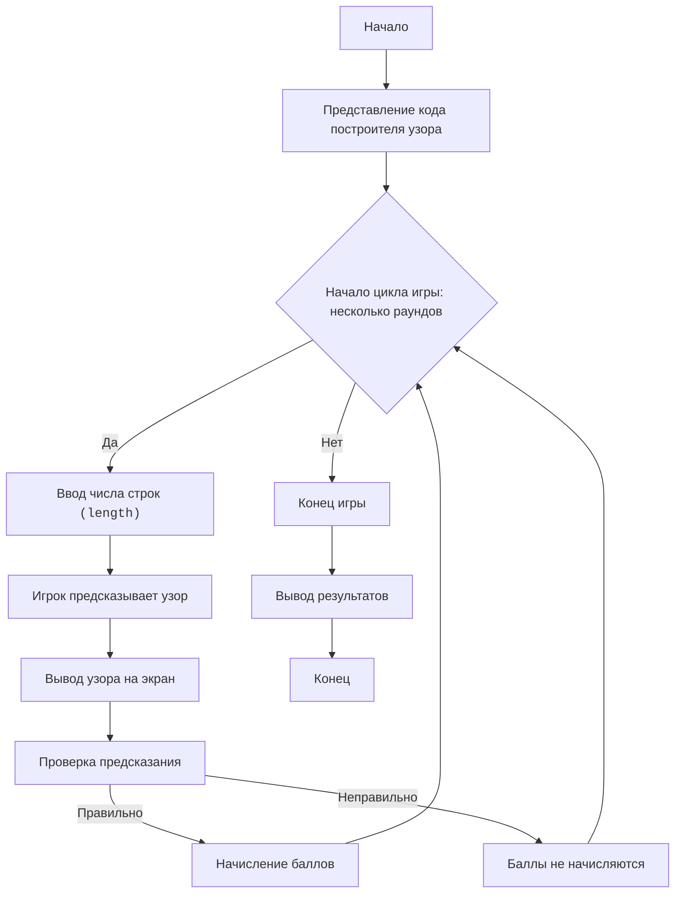

Вот описание игры, основанной на коде из изображения, которая выводит узор из звёздочек, акцент сделан на понимании работы циклов и алгоритма построения узора:

"""
STAR PATTERN:
=================
Сложность: 6
-----------------
Игра "Узор из звёзд" - это обучающая игра, в которой игрок пытается понять, как работает код Python, создающий узор из звездочек. Игрок, не имея прямого доступа к исполнению кода, анализирует его логику и пытается предсказать, какой узор получится при разных значениях ввода. Цель игры - научиться понимать, как вложенные циклы и команды вывода формируют сложные фигуры.

Правила игры:
1. Игроку предоставляется код Python, который выводит узор из звездочек.
2. Игроку предлагается ввести число строк (length).
3. Игрок должен предсказать, какой узор из звездочек будет выведен на экран.
4. Игрок получает баллы за правильные предсказания.
5. Игра состоит из нескольких раундов, каждый раз с новым числом строк.
-----------------
Алгоритм:
1. **Представление кода:** Игроку предоставляется код Python, который создает узор из звездочек.
2. **Ввод `length`:** Игроку предлагается ввести значение `length` (количество строк).
3. **Предсказание:** Игрок, анализируя код, должен предсказать, какой узор будет выведен для введенного `length`. Для этого нужно понять, как работают вложенные циклы.
    - Первый внешний цикл (верхняя часть узора) идет от `0` до `length - 1`
    - Первый внутренний цикл выводит звездочки слева. Число звездочек растёт от 0 до `length-1`
    - Второй внутренний цикл выводит пробелы в центре. Число пробелов уменьшается от `2*(length-1)` до `0`
    - Третий внутренний цикл выводит звездочки справа, число звёздочек от 0 до `length-1`
    - Второй внешний цикл (нижняя часть узора) идет от `0` до `length - 1`
    - Первый внутренний цикл выводит звездочки слева. Число звездочек уменьшается от `length` до `1`
    - Второй внутренний цикл выводит пробелы в центре. Число пробелов увеличивается от `0` до `2*(length-1)`
    - Третий внутренний цикл выводит звездочки справа, число звёздочек уменьшается от `length` до `1`
4.  **Проверка предсказания:** После предсказания, игроку демонстрируется реальный узор.
5.  **Оценка:** Игрок получает баллы за правильное предсказание.
6.  **Повторение:** Шаги 2-5 повторяются несколько раз с разными значениями `length`.
7.  **Завершение:** Игра заканчивается, и выводится общее количество баллов.
-----------------
Блок-схема:

Legenda:
    Start - Начало игры.
    PresentCode - Отображение игроку кода программы.
    GameLoopStart - Начало цикла игры, продолжается пока не закончатся раунды.
    PlayerInputLength - Запрос у игрока числа строк для узора.
    PlayerPredict - Игрок предсказывает, какой будет узор.
    DisplayResult - Вывод реального узора на экран.
    CheckPrediction - Проверка предсказания игрока.
    AwardPoints - Начисление баллов за правильный ответ.
    NoPoints - Баллы не начисляются за неправильный ответ.
    EndGame - Конец игры.
    OutputScore - Вывод общего количества баллов.
    End - Конец программы.
"""

import random

# Функция для отрисовки узора
def draw_star_pattern(length):
    # upper section
    for i in range(length):
        for j in range(i):
            print('*', end='')
        for k in range(2*(length-i)):
            print(' ', end='')
        for l in range(i):
            print('*', end='')
        print() # for new line
    
    #lower section
    for i in range(length):
      for j in range((length-i)-1):
          print('*',end='')
      for k in range(2*i):
          print(' ',end='')
      for l in range((length-i)-1):
          print('*',end='')
      print() #for new line
    
def play_star_pattern_game():
    """Игра по угадыванию узора из звездочек."""
    print("Добро пожаловать в игру 'Узор из звёзд'!")
    
    score = 0
    num_rounds = 3

    for round_num in range(num_rounds):
        print(f"\nРаунд {round_num + 1}/{num_rounds}:")
        length = random.randint(3, 6)  # выбираем случайное количество строк
        print(f"Попробуй предсказать узор, если количество строк: {length}")
    
        print("Вот код для узора:")
        print("""
# upper section
for i in range(length):
    for j in range(i):
        print('*', end='')
    for k in range(2*(length-i)):
        print(' ', end='')
    for l in range(i):
        print('*', end='')
    print() # for new line
    
#lower section
for i in range(length):
  for j in range((length-i)-1):
      print('*',end='')
  for k in range(2*i):
      print(' ',end='')
  for l in range((length-i)-1):
      print('*',end='')
  print() #for new line
""")
        input("Нажми Enter чтобы увидеть узор")
        draw_star_pattern(length)
    
        correct_prediction = input("Понятен ли алгоритм? (д/н): ")
        if correct_prediction.lower() == 'д':
           score += 1
           print("Отлично, бал начислен!")
        else:
           print("Попробуйте в следующем раунде.")
    print(f"Игра окончена, твой счет: {score}/{num_rounds}")
    

if __name__ == "__main__":
    play_star_pattern_game()

"""
**Объяснение кода**

1. **Функция `draw_star_pattern(length)`**:
    *   Принимает на вход целое число `length`, определяющее размер узора.
    *   **Верхняя секция:**
        *   Внешний цикл (`for i in range(length)`): итерирует по каждой строке верхней части узора.
        *   Внутренние циклы (`for j`, `for k`, `for l`):
            *   `for j`: Выводит `i` звездочек.
            *   `for k`: Выводит пробелы. Количество пробелов вычисляется по формуле: `2 * (length - i)`.
            *   `for l`: Выводит `i` звездочек.
        *   `print()`: Переход на новую строку.
    *   **Нижняя секция:**
         *   Внешний цикл (`for i in range(length)`): итерирует по каждой строке нижней части узора.
        *   Внутренние циклы (`for j`, `for k`, `for l`):
            *   `for j`: Выводит `length-i-1` звездочек.
            *   `for k`: Выводит пробелы. Количество пробелов вычисляется по формуле: `2 * i`.
            *   `for l`: Выводит `length-i-1` звездочек.
        *   `print()`: Переход на новую строку.

2. **Функция `play_star_pattern_game()`**:
   *   Выводит приветствие.
   *   Устанавливает счётчик `score` в `0`.
   *   Устанавливает количество раундов `num_rounds` в `3`.
   *   В цикле `for` по раундам:
        *   Выводит номер раунда и сгенерированное случайное число `length`.
        *   Выводит описание кода, как подсказку для игрока.
        *  Предлагает нажать enter и выводит с помощью функции `draw_star_pattern` узор.
        *  Спрашивает игрока, понял ли он как работает код.
        *  Если ответ `д`, то начисляет бал и сообщает об этом.
        *  В конце игры выводит результат.

3. **`if __name__ == "__main__":`**:
   *  Запускает игру `play_star_pattern_game`.

**Как использовать в игре:**

1.  **Представьте код:** Покажите игроку приведенный код (он включен в описание игры).
2.  **Сгенерируйте `length`:**  Случайным образом выберите число строк `length` (от 3 до 6 для начала).
3.  **Предсказание:**  Попросите игрока описать, какой узор он ожидает увидеть.
4.  **Вывод узора:**  Выведите сгенерированный узор.
5.  **Оценка:**  Оцените, насколько правильно игрок понял логику программы и предсказал узор.

Этот пример показывает, как можно преобразовать код, формирующий узор, в обучающую игру, в которой игрок учится анализировать код и предсказывать результаты.
"""
