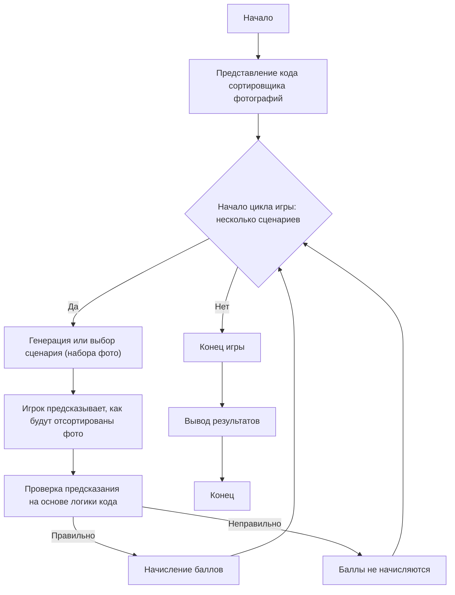

PHOTO SORTER:
=================
Сложность: 7
-----------------
Игра "Сортировщик фотографий" - это обучающая игра, которая проверяет понимание работы программы для сортировки фотографий по дате их создания. Игрок, не имея возможности запускать код напрямую, анализирует его поведение и предсказывает результат работы программы для конкретных сценариев. Цель игры - научиться понимать, как программа обрабатывает файлы, извлекает метаданные и организует их в папки.

Правила игры:
1. Игроку предоставляется описание кода для сортировки фотографий.
2. Игроку представляется несколько сценариев (наборы файлов с разными датами создания/съемки).
3. Для каждого сценария игрок должен предсказать, как программа отсортирует фотографии, то есть в какие папки будут помещены какие файлы, на основе логики работы кода.
4. Игрок получает баллы за правильные предсказания.
5. Игра состоит из нескольких раундов, каждый раз с новым сценарием.
-----------------
Алгоритм:
1. **Представление кода:** Игроку предоставляется код Python, сортирующий фотографии по дате съемки (из EXIF) или дате создания файла.
2. **Создание сценария:** Генерируется или выбирается вручную сценарий, представляющий собой набор файлов (фотографий) с разными датами создания или EXIF-данными.
3. **Предсказание игрока:** Игрок анализирует код и предсказывает, в какие папки будут помещены файлы. Для этого:
   - Проанализировать логику функции get_date, которая сначала пытается извлечь дату из EXIF, если EXIF нет, то использует дату создания файла.
   - Проанализировать логику функции sort_photos, которая пробегает по всем файлам в исходной папке, определяет их дату и переносит в папку с этой датой.
4. **Проверка предсказания:**  Правильность предсказания сравнивается с ожидаемым результатом, основываясь на алгоритме программы.
5. **Оценка:** Игрок получает баллы за каждое правильное предсказание.
6. **Повторение:**  Шаги 2-5 повторяются для нескольких сценариев.
7. **Завершение:**  Игра завершается, и выводится общее количество баллов.

-----------------
Блок-схема:

Legenda:
   Start - Начало игры.
    PresentCode - Отображение игроку кода сортировщика фотографий.
    GameLoopStart - Начало цикла игры, который продолжается, пока не закончатся сценарии.
    GenerateScenario - Генерация или выбор сценария с файлами и их датами.
    PlayerPredict - Игрок предсказывает, в какие папки попадут файлы.
    CheckPrediction - Проверка предсказания на основе логики работы кода.
    AwardPoints - Начисление баллов за правильный ответ.
    NoPoints - Баллы не начисляются за неправильный ответ.
    EndGame - Конец игры.
    OutputScore - Вывод общего количества баллов.
    End - Конец программы.
"""

import os
import shutil
from PIL import Image
from PIL.ExifTags import TAGS
from datetime import datetime

# Путь к папке с фотографиями
source_folder = "/path/to/photos"
destination_folder = "/path/to/sorted_photos"

# Получение даты съёмки из метаданных или даты создания файла
def get_date(photo_path):
    try:
        # Пытаемся получить дату из EXIF
        image = Image.open(photo_path)
        exif_data = image._getexif()
        if exif_data:
            for tag, value in exif_data.items():
                if TAGS.get(tag) == "DateTimeOriginal":
                    return value.split(" ")[0].replace(":", "-")
    except Exception as e:
        print(f"Ошибка чтения EXIF для {photo_path}: {e}")

    # Если EXIF недоступен, используем дату создания файла
    try:
        creation_time = os.path.getctime(photo_path)
        return datetime.fromtimestamp(creation_time).strftime("%Y-%m-%d")
    except Exception as e:
        print(f"Ошибка получения даты создания для {photo_path}: {e}")
        return "unknown"

# Сортировка фотографий
def sort_photos():
    for filename in os.listdir(source_folder):
        file_path = os.path.join(source_folder, filename)

        # Проверяем, является ли файл изображением
        if os.path.isfile(file_path) and filename.lower().endswith((".jpg", ".jpeg", ".png")):
            date_folder_name = get_date(file_path)

            # Создаём папку по дате
            date_folder = os.path.join(destination_folder, date_folder_name)
            os.makedirs(date_folder, exist_ok=True)

            # Перемещаем файл
            shutil.move(file_path, os.path.join(date_folder, filename))
            print(f"{filename} → {date_folder}")

# Запускаем сортировку
# sort_photos()

"""
Объяснение кода:

1.  **Импорт модулей:**
    *   `os`: Для работы с файловой системой (пути, создание каталогов, и т.д.).
    *   `shutil`: Для операций с файлами (перемещение).
    *   `PIL (Pillow)`: Для работы с изображениями и их метаданными (EXIF).
    *   `datetime`: Для работы с датами.

2.  **Начальные пути:**
    *   `source_folder`: Путь к папке, где хранятся фотографии.
    *   `destination_folder`: Путь к папке, куда будут перемещены отсортированные фотографии.

3.  **Функция `get_date(photo_path)`:**
    *   Пытается получить дату съемки из EXIF-данных изображения.
        *   Открывает изображение с помощью `PIL`.
        *   Получает EXIF-данные (`_getexif()`).
        *   Ищет тег `DateTimeOriginal` в EXIF. Если находит, возвращает дату.
    *   Если EXIF-данные не найдены или произошла ошибка,  использует дату создания файла.
    *   Возвращает дату в формате 'YYYY-MM-DD' или 'unknown', если не удается получить дату.

4.  **Функция `sort_photos()`:**
    *   Проходит по всем файлам в папке `source_folder`.
    *   Проверяет, является ли файл изображением (по расширению: `.jpg`, `.jpeg`, `.png`).
    *   Получает дату съемки или создания файла, используя `get_date()`.
    *   Создает папку с именем полученной даты (например, `2023-10-26`) в `destination_folder` (если такая папка не существует, то она будет создана).
    *   Перемещает файл изображения в созданную папку.
    *   Выводит в консоль информацию о перемещении файла.

5.  **Запуск сортировки:**
    *   Вызов функции `sort_photos()` для запуска процесса сортировки.

**Важные моменты:**

*   **EXIF:**  Метаданные изображений содержат информацию о съемке (дата, время, параметры камеры и т.д.).
*   **Обработка ошибок:** Код обрабатывает возможные ошибки при чтении EXIF или получении даты создания.
*   **Безопасность:** Важно не запускать этот скрипт напрямую, не понимая его работу, так как он перемещает файлы.

**Как использовать в игре:**

1.  **Представьте код:** Покажите игроку приведенный код (он включен в описание игры).
2.  **Создайте сценарии:**  Сформируйте несколько наборов файлов с разными датами создания и EXIF.  Например:
    *   **Сценарий 1:** Файл с EXIF (2023-10-26), файл без EXIF (дата создания 2023-10-27).
    *   **Сценарий 2:** Файл с EXIF (2023-10-25), файл без EXIF (дата создания 2023-10-25).
    *   **Сценарий 3:** Файл с EXIF (2023-11-01), файл без EXIF, и файл без EXIF (дата создания 2023-10-31).
3.  **Предсказание:**  Спросите игрока, в какие папки будут помещены файлы.
4.  **Проверка:**  Сравните предсказания с ожидаемыми результатами на основе логики кода.
"""

**Пример сценария игры**

1.  **Представление кода:** Игроку показывают код, который отсортирует фотографии.
2.  **Сценарий 1:**
    *   `photo1.jpg`: С EXIF-датой съемки 2023-11-05.
    *   `photo2.jpg`: Без EXIF, дата создания файла 2023-11-06.
    *   `photo3.png`: Без EXIF, дата создания файла 2023-11-05.
    
    **Вопрос игроку:**  В какие папки попадут файлы `photo1.jpg`, `photo2.jpg`, `photo3.png`?
    
    **Ожидаемый ответ:**
    *   `photo1.jpg` будет в папке "2023-11-05".
    *   `photo2.jpg` будет в папке "2023-11-06".
    *   `photo3.png` будет в папке "2023-11-05".

3.  **Сценарий 2:**
    *   `image1.jpg`: С EXIF-датой съемки 2023-12-20
    *   `image2.jpg`: Без EXIF, дата создания файла 2023-12-20
    
    **Вопрос игроку:** В какие папки попадут файлы `image1.jpg`, `image2.jpg`?
    
    **Ожидаемый ответ:**
    *   `image1.jpg` будет в папке "2023-12-20".
    *  `image2.jpg` будет в папке "2023-12-20".

Этот пример показывает, как можно преобразовать код в обучающую игру, в которой игрок предсказывает поведение программы, а не непосредственно взаимодействует с ней.
