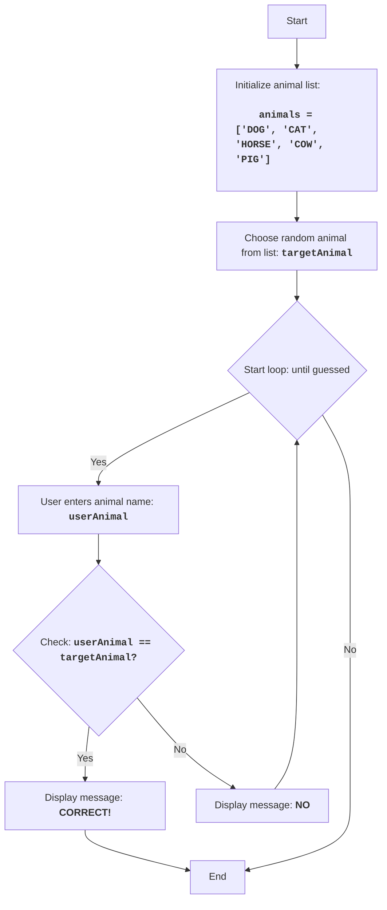

ANIMAL:
=================
Difficulty: 4
-----------------
The game "ANIMAL" is an animal guessing game in which the computer selects a random animal from a list, and the player tries to guess it by entering their guesses. The game continues until the player guesses the animal.

Game rules:
1. The computer selects a random animal from a predefined list.
2. The player enters their guesses for the hidden animal.
3. After each attempt, the computer reports whether the player guessed the animal or not.
4. The game continues until the player guesses the hidden animal.
-----------------
Algorithm:
1. Define a list of animals.
2. Select a random animal from the list.
3. Start a loop "while animal is not guessed":
    3.1 Prompt the player to enter the animal's name.
    3.2 If the entered name matches the hidden animal, go to step 4.
    3.3 Otherwise, display "NO".
4. Display "CORRECT!".
5. End of game.
-----------------
Flowchart:

Legend:
    Start - Program start.
    InitializeAnimals - Initialization of the animal list.
    ChooseRandomAnimal - Selection of a random animal from the list and saving it to the targetAnimal variable.
    LoopStart - Start of the loop, which continues until the animal is guessed.
    InputAnimal - Prompting the user to enter the animal's name and saving it to the userAnimal variable.
    CheckAnimal - Checking if the entered animal name userAnimal matches the hidden animal targetAnimal.
    OutputWin - Displaying a win message if the animal names match.
    End - End of program.
    OutputWrong - Displaying "NO" message if the entered animal name does not match the hidden animal.

import random

# List of animals for the game
animals = ['DOG', 'CAT', 'HORSE', 'COW', 'PIG']

# Choose a random animal from the list
targetAnimal = random.choice(animals)

# Start the loop until the animal is guessed
while True:
    # Prompt the user to enter the animal's name
    userAnimal = input("Guess the animal (DOG, CAT, HORSE, COW, PIG): ").upper()

    # Check if the user guessed the animal
    if userAnimal == targetAnimal:
        print("CORRECT!") # Display correct message
        break # End the loop if the animal is guessed
    else:
        print("NO") # Display incorrect message

Explanation of the code:

1.  **Import `random` module**:
    -   `import random`: Imports the `random` module, which is used for randomly selecting an animal.

2.  **List of animals**:
    -   `animals = ['DOG', 'CAT', 'HORSE', 'COW', 'PIG']`: Creates a list of strings with animal names.

3.  **Random animal selection**:
    -   `targetAnimal = random.choice(animals)`: Selects a random animal from the `animals` list and saves it to the `targetAnimal` variable.

4.  **Main game loop `while True:`**:
    -   An infinite loop that continues until the player guesses the animal.
    -   **Input**:
        -   `userAnimal = input("Guess the animal (DOG, CAT, HORSE, COW, PIG): ").upper()`: Prompts the user to enter the animal's name and converts it to uppercase for case-insensitive comparison.
    -   **Win condition**:
        -   `if userAnimal == targetAnimal:`: Checks if the animal name entered by the user matches the hidden one.
        -   `print("CORRECT!")`: Displays a win message if the animal is guessed.
        -   `break`: Ends the loop (and the game) if the animal is guessed.
    -   **Incorrect answer message**:
        -   `else:`: Executes if the entered animal name does not match the hidden one.
        -   `print("NO")`: Displays "NO" message if the answer is incorrect.