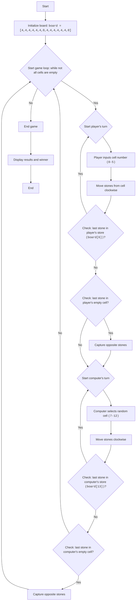

AWARI:
=================
Difficulty: 6
-----------------
The game "Awari" is a board game simulating the traditional Mancala game, where two players take turns moving "stones" (in this case, numbers) from cells on the board, trying to capture as many stones as possible into their "stores". This is a simplified version of the game where the player plays against the computer.

Game rules:
1. The game board consists of 14 cells, numbered from 0 to 13. Cells 6 and 13 are the players' "stores".
2. At the beginning of the game, each of the 12 cells (0-5 and 7-12) contains 4 stones.
3. The player (human) starts the game.
4. Selects a cell with their stones (0-5).
5. All stones from the selected cell are moved one by one into each subsequent cell clockwise, including their own "store".
6. If the last stone lands in the player's store, the player has the right to make another move.
7. If the last stone lands in an empty cell on the player's side, and there are stones opposite this cell, the player takes the stones from this cell and from the opposite cell into their store.
8. The computer moves similarly.
9. The game ends when all cells with stones become empty.
10. The player with more stones in their store wins.
-----------------
Algorithm:
1. Initialize the board (array) of 14 cells with 4 stones in each, except cells 6 and 13, which are 0.
2. Start a loop "while game is not over"
3. Player's turn:
    3.1 Request cell number input from the player (0 to 5).
    3.2 Move stones from the selected cell clockwise.
    3.3 Check if the last stone landed in the player's store (cell 6). If yes, give the player another turn.
    3.4 Check if the last stone landed in an empty cell on the player's side. If yes, capture stones from this cell and from the opposite cell.
4. Computer's turn (similar to player's turn, but cell selection is random from 7 to 12).
5. If all cells with stones are empty, end the game.
6. Display the result (number of stones in player's and computer's stores).
7. Determine the winner (who has more stones in their store).
-----------------
Flowchart:

Legend:
   Start - Program start.
    InitializeBoard - Initialize game board with 14 cells. First 6 (0-5) and last 6 (7-12) represent cells with stones, 6 and 13 are players' stores.
    GameLoopStart - Start of game loop, which continues until the game is over.
    PlayerTurnStart - Start of player's turn.
    PlayerInputCell - Prompt player for cell number from which to move stones.
    PlayerMoveStones - Move stones from selected cell clockwise.
    PlayerCheckExtraTurn - Check if the last stone landed in the player's store. If yes, player gets another turn.
    PlayerCheckCapture - Check if the last stone landed in an empty cell on the player's side.
    PlayerCaptureStones - Capture stones from the opposite cell if the last stone landed in an empty cell on the player's side.
    ComputerTurnStart - Start of computer's turn.
    ComputerSelectCell - Computer selects a random cell for its move.
    ComputerMoveStones - Computer moves stones clockwise.
    ComputerCheckExtraTurn - Check if the last stone landed in the computer's store. If yes, computer gets another turn.
    ComputerCheckCapture - Check if the last stone landed in an empty cell on the computer's side. If yes, computer captures stones from the opposite cell.
    ComputerCaptureStones - Capture stones from the opposite cell if the last stone landed in an empty cell on the computer's side.
    EndGame - End of game.
    OutputResult - Display results and determine winner.
    End - End of program.

import random

# Initialize board.
# Cells 0-5 - player's cells, 6 - player's store
# Cells 7-12 - computer's cells, 13 - computer's store
board = [4, 4, 4, 4, 4, 4, 0, 4, 4, 4, 4, 4, 4, 0]

def display_board():
    """Displays the current state of the game board."""
    print("----------------------------------------------------")
    print(f"  {board[12]:2}  {board[11]:2}  {board[10]:2}  {board[9]:2}  {board[8]:2}  {board[7]:2}   ")
    print("----------------------------------------------------")
    print(f"{board[13]:2}                                 {board[6]:2}")
    print("----------------------------------------------------")
    print(f"  {board[0]:2}  {board[1]:2}  {board[2]:2}  {board[3]:2}  {board[4]:2}  {board[5]:2}  ")
    print("----------------------------------------------------")

def player_turn():
    """Handles the player's turn."""
    while True:
        try:
            cell = int(input("Select a cell (0-5): "))
            if 0 <= cell <= 5 and board[cell] > 0:
                break
            else:
                print("Invalid choice. Select a cell with stones from 0 to 5.")
        except ValueError:
            print("Invalid input. Please enter a number.")
    
    stones = board[cell]
    board[cell] = 0
    current_cell = cell
    
    while stones > 0:
        current_cell = (current_cell + 1) % 14
        board[current_cell] += 1
        stones -= 1

    # Check for extra turn if the last stone landed in the player's store
    if current_cell == 6:
        print("Player gets an extra turn.")
        display_board()
        player_turn()
        return
        
    # Capture stones
    if 0 <= current_cell <= 5 and board[current_cell] == 1:
        opposite_cell = 12 - current_cell
        if board[opposite_cell] > 0:
             board[6] += board[opposite_cell] + 1
             board[opposite_cell]=0
             board[current_cell] = 0
             print(f"Player captures stones from cells {current_cell} and {opposite_cell}")
         
        
def computer_turn():
    """Handles the computer's turn."""
    possible_moves = [i for i in range(7, 13) if board[i] > 0]
    if not possible_moves:
        return  # If no available moves for the computer, exit
    
    cell = random.choice(possible_moves)
    print(f"Computer selects cell {cell}")
    stones = board[cell]
    board[cell] = 0
    current_cell = cell

    while stones > 0:
         current_cell = (current_cell + 1) % 14
         board[current_cell] += 1
         stones -= 1

    # Check for extra turn if the last stone landed in the computer's store
    if current_cell == 13:
        print("Computer gets an extra turn.")
        display_board()
        computer_turn()
        return

    # Capture stones
    if 7 <= current_cell <= 12 and board[current_cell] == 1:
          opposite_cell = 12 - current_cell
          if board[opposite_cell] > 0:
             board[13] += board[opposite_cell] + 1
             board[opposite_cell]=0
             board[current_cell] = 0
             print(f"Computer captures stones from cells {current_cell} and {opposite_cell}")

def is_game_over():
    """Checks if the game is over."""
    player_side_empty = all(board[i] == 0 for i in range(0, 6))
    computer_side_empty = all(board[i] == 0 for i in range(7, 13))
    return player_side_empty or computer_side_empty

def calculate_winner():
    """Determines the winner and displays the results."""
    player_score = board[6]
    computer_score = board[13]

    print(f"Player: {player_score} points")
    print(f"Computer: {computer_score} points")

    if player_score > computer_score:
        print("You win!")
    elif computer_score > player_score:
        print("Computer wins!")
    else:
        print("It's a tie!")

# Main game loop
while True:
    display_board()
    player_turn()
    if is_game_over():
        break
    display_board()
    computer_turn()
    if is_game_over():
       break
    

# After the game ends
display_board()
calculate_winner()

Explanation of the code:
1. **Board Initialization (`board`)**:
   - `board = [4, 4, 4, 4, 4, 4, 0, 4, 4, 4, 4, 4, 4, 0]`: A list representing the game board is created.
     The first 6 elements (0-5) are player's cells, 7-12 are computer's cells, 6 is player's store, 13 is computer's store.
     At the beginning of the game, each cell has 4 stones, and stores have 0.

2. **`display_board()` function**:
   - Displays the current state of the game board on the screen.

3. **`player_turn()` function**:
   - Handles the player's turn:
     - Prompts for cell number input (0-5).
     - Checks input validity (number from 0 to 5 and non-empty cell).
     - Takes stones from the selected cell.
     - Distributes stones one by one into each subsequent cell clockwise.
     - Checks if the last stone landed in the player's store (cell 6). If yes, the player gets another turn.
     - Checks if the last stone landed in an empty cell on the player's side, if yes, captures opposite stones.
4. **`computer_turn()` function**:
   - Handles the computer's turn:
     - Selects a random non-empty cell (7-12).
     - Distributes stones one by one into each subsequent cell clockwise.
     - Checks if the last stone landed in the computer's store (cell 13). If yes, the computer gets another turn.
     - Checks if the last stone landed in an empty cell on the computer's side, if yes, captures opposite stones.

5.  **`is_game_over()` function**:
    - Checks if the game is over. The game ends when all cells on the player's or computer's side are empty.
6.  **`calculate_winner()` function**:
    - Displays the score of each player.
    - Determines the winner.

7.  **Main game loop (`while True`)**:
    - Displays the board.
    - Gives the player a turn.
    - Checks if the game is over. If yes, exits the loop.
    - Gives the computer a turn.
    - Checks if the game is over. If yes, exits the loop.

8.  **Displaying results**:
    - After the game ends, displays the board and results.
