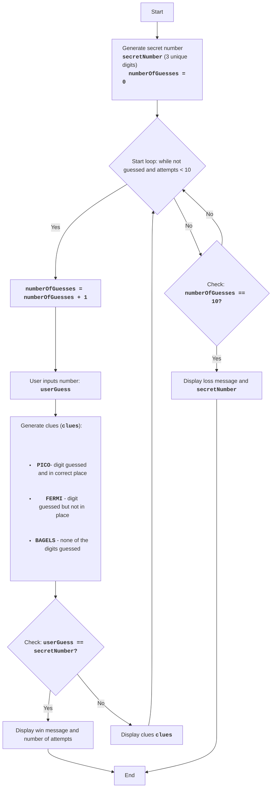

BAGLES:
=================
Difficulty: 6
-----------------
The game "Bagels" is a logic puzzle game in which the player tries to guess a three-digit number composed of unique digits. After each attempt, the player receives hints: "PICO" means that one of the digits is guessed and is in the correct position, "FERMI" means that one of the digits is guessed but not in the correct position, "BAGELS" means that none of the digits are guessed.

Game rules:
1. The computer generates a random three-digit number composed of unique digits.
2. The player enters their guesses as a three-digit number.
3. The computer provides hints:
    - "PICO" - one digit is guessed and is in the correct position.
    - "FERMI" - one digit is guessed but not in the correct position.
    - "BAGELS" - none of the digits are guessed.
4. Hints are given in the order of the digits in the hidden number, for example, if the hidden number is `123` and the player entered `142`, the hints will be `PICO FERMI`.
5. The game continues until the player guesses the number.
6. If after 10 attempts the player does not guess the number, the game ends and the hidden number is displayed.
-----------------
Algorithm:
1. Generate a random three-digit number consisting of unique digits (e.g., 123).
2. Set the number of attempts to 0.
3. Loop "while number is not guessed or number of attempts is less than 10":
    3.1. Increment the number of attempts by 1.
    3.2. Prompt the player for a three-digit number.
    3.3. Compare the entered number with the hidden one and generate hints "PICO", "FERMI", and "BAGELS".
    3.4. If the number is guessed, display a win message and the number of attempts.
    3.5. If the number is not guessed, display the generated hints.
4. If after 10 attempts the number is not guessed, display the hidden number and a loss message.
5. End of game.
-----------------
Flowchart:

Legend:
    Start - Game start.
    GenerateSecretNumber - Generate secret number secretNumber from 3 unique digits and initialize numberOfGuesses = 0.
    LoopStart - Start of the loop, which continues until the number is guessed and the number of attempts is less than 10.
    IncreaseGuesses - Increment the attempt counter by 1.
    InputGuess - Prompt the user for a number and save it to the userGuess variable.
    GenerateClues - Generate clues based on comparing userGuess and secretNumber.
    CheckWin - Check if the entered number userGuess is equal to the secret number secretNumber.
    OutputWin - Display a win message and the number of attempts.
    End - End of game.
    OutputClues - Display the generated clues.
    CheckLose - Check if the number of attempts has reached 10.
    OutputLose - Display a loss message and the secret number secretNumber.
