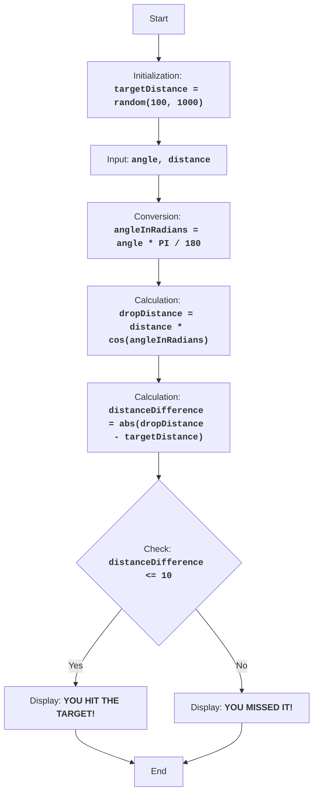

BOMBER:
=================
Difficulty: 5
-----------------
The game "Bomber" is a puzzle game in which the player tries to drop a bomb on a target located at a randomly generated distance. The player enters the drop angle and distance, and the computer calculates the bomb's trajectory. The goal of the game is to hit the target as accurately as possible.

Game rules:
1. The computer generates a random target distance in the range of 100 to 1000.
2. The player enters the bomb's drop angle and drop distance.
3. The computer calculates the distance the bomb will fall.
4. If the bomb's fall distance is within 10 units of the target distance, the player wins.
5. If the bomb's fall distance is not within the range, the player loses.
-----------------
Algorithm:
1. Generate a random target distance in the range of 100 to 1000 and assign it to the `targetDistance` variable.
2. Prompt the player for the bomb's drop angle in degrees (angle) and drop distance (distance).
3. Convert the angle from degrees to radians `angleInRadians = angle * 3.14159 / 180`.
4. Calculate the bomb's fall distance using the formula: `dropDistance = distance * cos(angleInRadians)`.
5. Calculate the difference between the bomb's fall distance and the target distance: `distanceDifference = abs(dropDistance - targetDistance)`.
6. If the distance difference is less than or equal to 10, display a win message.
7. Otherwise, display a loss message.
8. End of game.
-----------------
Flowchart:

Legend:
   Start - Program start.
    InitializeTargetDistance - Initialization: a random target distance (targetDistance) from 100 to 1000 is generated.
    InputAngleDistance - Prompt the user for the drop angle (angle) and drop distance (distance).
    ConvertAngle - Convert the angle from degrees to radians (angleInRadians).
    CalculateDropDistance - Calculate the bomb's fall distance (dropDistance) based on the entered data.
    CalculateDistanceDifference - Calculate the absolute difference between the bomb's fall distance (dropDistance) and the target distance (targetDistance).
    CheckDistanceDifference - Check if the distance difference is within 10 units (distanceDifference <= 10).
    OutputWin - Display a win message if the difference is within 10 units.
    End - End of program.
    OutputLose - Display a loss message if the difference is greater than 10 units.