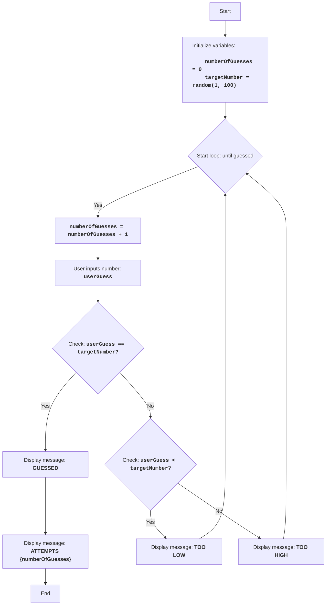

BUZZWD:
=================
Difficulty: 4
-----------------
The game "BUZZWD" is a simple number game where the computer generates a random number, and the player must guess it by entering numbers in turn. After each input, the program reports whether the entered number is "too high", "too low", or if it has been guessed. The game ends when the player correctly guesses the number.

Game rules:
1. The computer selects a random integer from 1 to 100.
2. The player enters their guesses for the hidden number.
3. After each attempt, the computer reports whether the entered number was too low, too high, or guessed.
4. The game continues until the player guesses the hidden number.
-----------------
Algorithm:
1.  Set the attempt counter to 0.
2.  Generate a random number in the range of 1 to 100.
3.  Start a loop "while number is not guessed":
    3.1 Increment the attempt counter by 1.
    3.2 Prompt the player to enter a number.
    3.3 If the entered number is equal to the hidden number, display "GUESSED" and go to step 4.
    3.4 If the entered number is less than the hidden number, display "TOO LOW".
    3.5 If the entered number is greater than the hidden number, display "TOO HIGH".
4. Display "ATTEMPTS {attempt counter}"
5. End of game.
-----------------
Flowchart:

Legend:
    Start - Program start.
    InitializeVariables - Initialize variables: numberOfGuesses (number of attempts) is set to 0, and targetNumber (hidden number) is randomly generated from 1 to 100.
    LoopStart - Start of the loop, which continues until the number is guessed.
    IncreaseGuesses - Increment the attempt counter by 1.
    InputGuess - Prompt the user to enter a number and save it to the userGuess variable.
    CheckGuess - Check if the entered number userGuess is equal to the hidden number targetNumber.
    OutputWin - Display "GUESSED" message if numbers are equal.
    OutputAttempts - Display "ATTEMPTS {numberOfGuesses}" message, indicating the number of attempts.
    End - End of program.
    CheckLow - Check if the entered number userGuess is less than the hidden number targetNumber.
    OutputLow - Display "TOO LOW" message if the entered number is less than the hidden number.
    OutputHigh - Display "TOO HIGH" message if the entered number is greater than the hidden number.