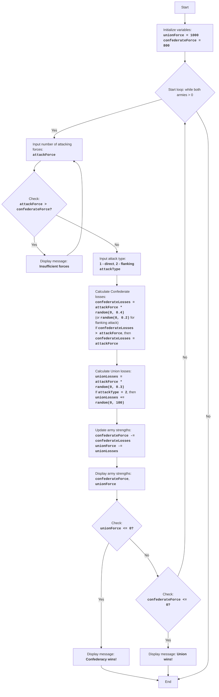

CIVILW:
=================
Difficulty: 7
-----------------
The game "Civil War" is a simulation of a battle between two armies: the Confederacy and the Union. The player controls the Confederate army and makes decisions about the size of their troops and the type of attacks (direct attack or flanking maneuver). The goal of the game is to defeat the Union army while minimizing one's own losses. The game takes into account random factors affecting the outcome of the battle, making each battle unique.

Game rules:
1. The player controls the Confederate army and must defeat the Union army.
2. The player enters the number of soldiers to send into attack.
3. The player chooses the type of attack: direct (1) or flanking (2).
4. Depending on the player's choice and random factors, losses are calculated for both sides.
5. After each battle, the game displays the current troop strength of both sides.
6. The game ends with one side winning when the enemy's troop strength becomes equal to or less than 0.
-----------------
Algorithm:
1. Set the initial strength of the Union army (UnionForce) to 1000 and the Confederate army (ConfederateForce) to 800.
2. Start a loop "while both armies have strength greater than 0":
    2.1. Prompt the player for the number of soldiers they want to send into attack (AttackForce).
        2.1.1. If AttackForce is greater than the available Confederate forces (ConfederateForce), display "Insufficient forces" and return to the beginning of step 2.1.
    2.2. Prompt the player for the type of attack: direct (1) or flanking (2) (AttackType).
    2.3. Calculate Confederate losses (ConfederateLosses) randomly, multiplying AttackForce by a random number from 0 to 0.4 (for direct attack) or by a random number from 0 to 0.2 (for flanking maneuver).
        2.3.1. If ConfederateLosses is greater than AttackForce, set ConfederateLosses equal to AttackForce.
    2.4. Calculate Union losses (UnionLosses) randomly, multiplying AttackForce by a random number from 0 to 0.3.
        2.4.1. If AttackType is 2, increase UnionLosses by a random number from 0 to 100.
    2.5. Update army strengths:
        ConfederateForce = ConfederateForce - ConfederateLosses
        UnionForce = UnionForce - UnionLosses
    2.6. Display the current troop strengths of both sides.
    2.7. Check win condition:
        2.7.1. If UnionForce is less than or equal to 0, display "Confederacy wins!" and end the game.
        2.7.2. If ConfederateForce is less than or equal to 0, display "Union wins!" and end the game.
3. End of game.
-----------------
Flowchart:

Legend:
   Start - Program start.
    InitializeForces - Initialization of initial troop strengths for Union (unionForce = 1000) and Confederacy (confederateForce = 800).
    LoopStart - Start of the loop, which continues as long as both armies have strength greater than 0.
    InputAttackForce - Prompt the player for the number of soldiers for attack (attackForce).
    CheckForce - Check if the Confederacy has enough forces for the attack (attackForce > confederateForce).
    OutputInsufficient - Display "Insufficient forces" message if attacking forces are greater than available forces.
    InputAttackType - Prompt the player to choose the attack type: direct (1) or flanking (2).
    CalculateConfederateLosses - Calculate Confederate losses (confederateLosses) based on attackForce and attack type, considering a random factor. If losses exceed attackForce, losses are set to attackForce.
    CalculateUnionLosses - Calculate Union losses (unionLosses) based on attackForce and attack type, considering a random factor. For flanking attack, Union losses are additionally increased by a random number.
    UpdateForces - Update the strengths of both armies after the battle.
    OutputForces - Display the current strengths of the Confederate and Union armies.
    CheckUnionWin - Check if the Confederacy won (Union army strength <= 0).
    OutputConfederateWin - Display message about Confederacy winning.
    CheckConfederateWin - Check if the Union won (Confederate army strength <= 0).
    OutputUnionWin - Display message about Union winning.
    End - End of program.