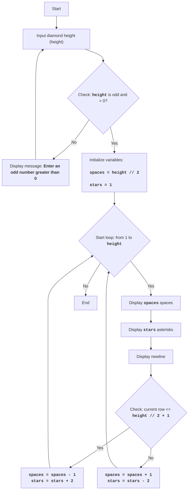

DIAMND:
=================
Difficulty: 7
-----------------
The game DIAMND is a text-based game where the player tries to draw a diamond shape using asterisks by specifying its height.
The game first prompts the user for an odd diamond height. Then, if the entered number is odd, the game constructs a diamond shape using asterisks, using spaces to form the correct geometry of the figure. If the entered number is even or less than 1, an error message is displayed.
Game rules:
1. The player enters an odd number that determines the height of the diamond.
2. If an even number or a number less than 1 is entered, the game displays an error message.
3. If a correct (odd and greater than 0) number is entered, the game displays a diamond shape of the specified height using asterisks.
-----------------
Algorithm:
1. Prompt the user for the diamond's height (H).
2. Check if H is even or less than 1. If yes, display an error message and go to step 1.
3. If H is odd and greater than 0, then:
   3.1. Set the `space` variable to H // 2 (integer division).
   3.2. Set the `stars` variable to 1.
   3.3. Start a loop from 1 to H inclusive:
      3.3.1. Print `space` spaces.
      3.3.2. Print `stars` asterisks.
      3.3.3. Print a newline.
      3.3.4. If the current row number is less than H // 2 + 1:
          3.3.4.1. Decrease `space` by 1.
          3.3.4.2. Increase `stars` by 2.
       3.3.5. Else:
          3.3.5.1. Increase `space` by 1.
          3.3.5.2. Decrease `stars` by 2.
4. End of game.
-----------------
Flowchart:

Legend:
    Start - Program start.
    InputHeight - Prompt the user for the diamond's height and save the value to the `height` variable.
    CheckHeight - Check if the entered height is an odd number greater than 0.
    OutputError - Display an error message if the height does not meet the condition.
    InitializeVars - Initialize variables: `spaces` (number of spaces) is set to `height // 2`, and `stars` (number of asterisks) is set to 1.
    LoopStart - Start of the loop, which repeats `height` times.
    OutputSpaces - Display `spaces` spaces.
    OutputStars - Display `stars` asterisks.
    OutputNewline - Display a newline character.
    CheckRow - Check if the current row is less than or equal to the middle of the diamond (`height // 2 + 1`).
    DecreaseSpaceIncreaseStars - Decrease the number of spaces `spaces` by 1 and increase the number of asterisks `stars` by 2.
    IncreaseSpaceDecreaseStars - Increase the number of spaces `spaces` by 1 and decrease the number of asterisks `stars` by 2.
    End - End of program.