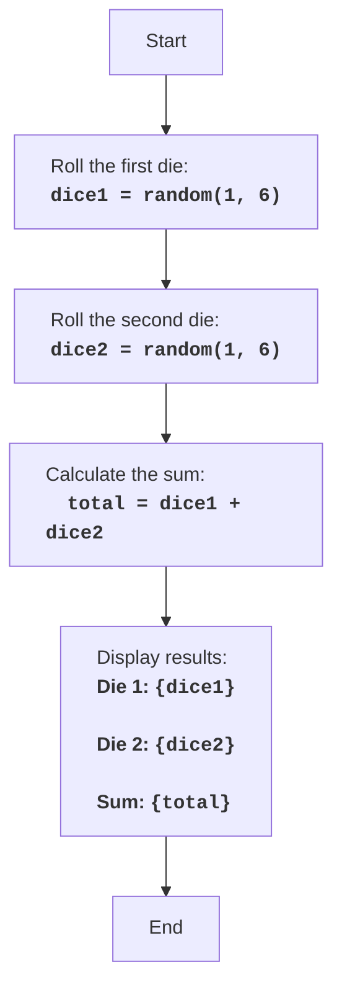

DICE:
=================
Difficulty: 2
-----------------
The game "Dice" is a simple game in which the player rolls two dice, and the computer shows the sum of the rolled values.

Game rules:
1. The computer simulates rolling two six-sided dice.
2. The computer displays the values of each die and their sum.
-----------------
Algorithm:
1. Generate a random number from 1 to 6 for the first die.
2. Generate a random number from 1 to 6 for the second die.
3. Calculate the sum of the values of both dice.
4. Display the value of the first die, the value of the second die, and their sum.
-----------------
Flowchart:

Legend:
    Start - Program start.
    RollDice1 - A random number from 1 to 6 is generated, representing the result of the first die roll, and saved to the dice1 variable.
    RollDice2 - A random number from 1 to 6 is generated, representing the result of the second die roll, and saved to the dice2 variable.
    CalculateSum - The sum of dice1 and dice2 values is calculated, the result is saved to the total variable.
    OutputResults - The values of dice1, dice2 and their sum total are displayed on the screen.
    End - Program end.