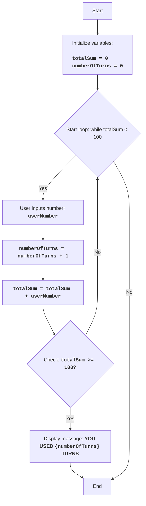

FIPFOP:
=================
Difficulty: 5
-----------------
The game FIPFOP is a puzzle game where the player must, in turn, enter numbers.
The goal of the game is to make all numbers entered by the user sum up to 100.
The game ends when the sum of all entered numbers reaches 100.

Game rules:
1. The player enters integers, one at a time.
2. Each entered number is added to the total sum.
3. The game ends when the total sum reaches 100.
4. After the game ends, the total number of entered numbers (turns) is displayed.
-----------------
Algorithm:
1. Set sum to 0.
2. Set turn counter to 0.
3. Start loop "while sum is less than 100":
    3.1. Prompt the player to enter a number.
    3.2. Increment turn counter by 1.
    3.3. Add the entered number to the total sum.
4. Display message "YOU USED {number of turns} TURNS"
5. End of game.
-----------------
Flowchart:

Legend:
    Start - Program start.
    InitializeVariables - Initialize variables: totalSum (sum of entered numbers) is set to 0, and numberOfTurns (number of turns) is set to 0.
    LoopStart - Start of the loop, which continues as long as totalSum is less than 100.
    InputNumber - Prompt the user to enter a number and save it to the userNumber variable.
    IncreaseTurns - Increment the turn counter by 1.
    AddNumber - Add the entered number userNumber to the total sum totalSum.
    CheckSum - Check if the total sum totalSum is greater than or equal to 100.
    OutputTurns - Display a message about the number of turns used by the user.
    End - End of program.

# Initialize sum and turn counter
totalSum = 0 # Sum of entered numbers
numberOfTurns = 0 # Number of turns

# Main game loop
while totalSum < 100:
    # Prompt user for number input
    try:
        userNumber = int(input("Enter a number: "))
    except ValueError:
         print("Please enter an integer.")
         continue
    
    # Increment turn counter
    numberOfTurns += 1
    # Add entered number to total sum
    totalSum += userNumber

# Display message about number of turns
print(f"YOU USED {numberOfTurns} TURNS")

Explanation of the code:
1. **Variable Initialization:**
   - `totalSum = 0`: Initializes the `totalSum` variable to store the sum of entered numbers, starting from 0.
   - `numberOfTurns = 0`: Initializes the `numberOfTurns` variable to count the number of turns, also starting from 0.
2. **Main loop `while totalSum < 100`:**
   - The loop continues as long as the sum of entered numbers (`totalSum`) is less than 100.
3. **User input:**
    - `try...except ValueError`: The try-except block handles possible input errors. If the user enters a non-integer, an error message will be displayed.
   - `userNumber = int(input("Enter a number: "))`: Prompts the user to enter a number and converts it to an integer, saving the result to the `userNumber` variable.
4. **Incrementing turn counter:**
   - `numberOfTurns += 1`: Increments the turn counter by 1 on each loop iteration.
5.  **Adding number to sum:**
   -  `totalSum += userNumber`: Adds the entered number (`userNumber`) to the total sum (`totalSum`).
6.  **Outputting result:**
    - `print(f"YOU USED {numberOfTurns} TURNS")`: Displays a message on the screen about how many turns were made when the sum of numbers reached 100 or more.
