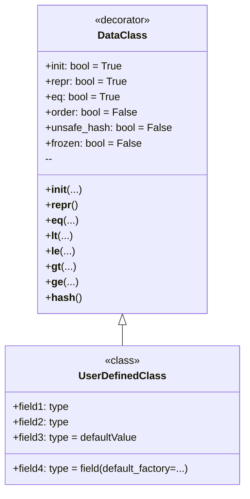

**What is `dataclass`?**

`dataclass` is a decorator introduced in Python 3.7 that automatically generates special methods (such as `__init__`, `__repr__`, `__eq__`, and others) for classes that primarily serve as data containers. This saves you from having to write a lot of boilerplate code.

**Why use `dataclass`?**

1.  **Code Reduction:** Instead of manually defining `__init__`, `__repr__`, `__eq__`, etc., you simply declare the data fields, and `dataclass` does the rest.
2.  **Improved Readability:** Classes become more concise and understandable, as they focus on data rather than technical implementation.
3.  **Reduced Errors:** Automatically generated code is usually more reliable than manually written code.
4.  **Accelerated Development:** You can create data classes faster without spending time on routine tasks.

**How to use `dataclass`?**

First, you need to import the `dataclass` decorator from the `dataclasses` module:

```python
from dataclasses import dataclass
```

Then you mark the class with the `@dataclass` decorator, and define data fields as regular class variables with type annotations:

```python
from dataclasses import dataclass

@dataclass
class Point:
    x: int
    y: int
```

In this example, `Point` is a `dataclass` that has two fields: `x` and `y`, both of integer type. `dataclass` will automatically create:
    * A constructor `__init__`, allowing you to create class instances, for example `Point(1, 2)`.
    *  `__repr__`, returning a string representation of the object, for example `Point(x=1, y=2)`.
    * `__eq__`, allowing you to compare objects, for example `Point(1, 2) == Point(1, 2)`.

**Simple usage example**
```python
from dataclasses import dataclass

@dataclass
class Point:
    x: int
    y: int

# Creating a class instance
point1 = Point(1, 2)
point2 = Point(1, 2)
point3 = Point(3, 4)

# Output
print(point1) # Output: Point(x=1, y=2)
print(point1 == point2) # Output: True
print(point1 == point3) # Output: False
```

**`dataclass` options**

`dataclass` provides several parameters to customize behavior:

*   `init`: If `True` (default), the `__init__` method is generated. If `False`, the `__init__` method is not created.
*   `repr`: If `True` (default), the `__repr__` method is generated. If `False`, the `__repr__` method is not created.
*   `eq`: If `True` (default), the `__eq__` method is generated. If `False`, the `__eq__` method is not created.
*   `order`: If `True`, comparison methods (`__lt__`, `__le__`, `__gt__`, `__ge__`) are generated. Default is `False`.
*   `unsafe_hash`: If `False` (default), the `__hash__` method is not generated. If `True`, the `__hash__` method will be generated, and the `dataclass` will become hashable.
*   `frozen`: If `True`, class instances will be immutable (read-only). Default is `False`.

**Examples of using parameters**
1. Disable `__repr__` method and make the class immutable
```python
from dataclasses import dataclass

@dataclass(repr=False, frozen=True)
class Point:
    x: int
    y: int

# Creating a class instance
point1 = Point(1, 2)
# Output
print(point1) # Output: <__main__.Point object at 0x000001D8322F6770> (since __repr__ is not defined)

# Modifying an instance will raise an error
try:
    point1.x = 10
except Exception as e:
    print (e) # Output: cannot assign to field 'x'
```
2. Set order, add hash method, and make the class immutable
```python
from dataclasses import dataclass

@dataclass(order=True, unsafe_hash=True, frozen=True)
class Point:
    x: int
    y: int

# Creating a class instance
point1 = Point(1, 2)
point2 = Point(3, 4)
point3 = Point(1, 2)
# Output
print(point1 < point2) # Output: True
print(point1 == point3) # Output: True

# Now you can use the class as a dictionary key
my_dict = {point1: "first", point2: "second"}
print(my_dict) # Output: {Point(x=1, y=2): 'first', Point(x=3, y=4): 'second'}
```

**Default values**

You can set default values for fields:

```python
from dataclasses import dataclass

@dataclass
class Point:
    x: int = 0
    y: int = 0

# Creating a class instance
point1 = Point()
point2 = Point(1, 2)

# Output
print(point1) # Output: Point(x=0, y=0)
print(point2) # Output: Point(x=1, y=2)
```
When creating a class instance, if values are not passed, the default value will be used.

**Using `dataclass` with mutable types**

Be careful when using mutable data types (lists, dictionaries) as default values. They will be created only once and will be used by all class instances:

```python
from dataclasses import dataclass
from typing import List

@dataclass
class BadExample:
    items: List[int] = []

bad1 = BadExample()
bad2 = BadExample()

bad1.items.append(1)
print (bad1.items) # Output: [1]
print (bad2.items) # Output: [1] 
```
In the example above, changes in `bad1.items` are also reflected in `bad2.items`. This happens because both class instances use the same default list.

To avoid this, use `dataclasses.field` and `default_factory`:
```python
from dataclasses import dataclass, field
from typing import List

@dataclass
class GoodExample:
    items: List[int] = field(default_factory=list)

good1 = GoodExample()
good2 = GoodExample()

good1.items.append(1)
print (good1.items) # Output: [1]
print (good2.items) # Output: []
```
In this case, `default_factory=list` will create a new empty list for each new class instance.

**Diagram**

Here is a diagram showing the main concepts of `dataclass`:



In this diagram:
*   `DataClass` represents the `@dataclass` decorator and its parameters.
*   `UserDefinedClass` is the class you declare using the `@dataclass` decorator.
*   The arrow from `DataClass` to `UserDefinedClass` shows that `DataClass` is applied to `UserDefinedClass`


## `dict()`, `__dir__()` and other `dataclass` features.

*   `dict()` does not work directly with `dataclass` instances. To convert to a dictionary, you need to use manual methods or third-party libraries.
*   `__dir__()` returns a list of all attributes and methods of the object, including `dataclass` generated methods and fields.
*   `__dataclass_fields__` and `__dataclass_params__` provide metadata about `dataclass` fields and parameters.

**1. `dict()` in the context of `dataclass`**

   - **No automatic support:** The built-in `dict()` function does not work directly with `dataclass` instances, as with regular dictionaries. If you try to call `dict(instance_of_dataclass)`, you will get a `TypeError: cannot convert dictionary update sequence element #0 to a sequence`.
   
   - **Converting to a dictionary:** To convert a `dataclass` instance to a dictionary, you need to do it manually or use a third-party library. Here's how you can do it manually:

     ```python
     from dataclasses import dataclass
     
     @dataclass
     class Person:
         name: str
         age: int
     
     person = Person("Alice", 30)
     
     # Manual conversion to dictionary
     person_dict = {field.name: getattr(person, field.name) for field in dataclasses.fields(Person)}
     print(person_dict)  # Output: {'name': 'Alice', 'age': 30}

     #Alternative:
     person_dict = person.__dict__
     print(person_dict) #Output: {'name': 'Alice', 'age': 30}
     ```
   - **Why is that?** `dataclass` is primarily designed to represent data as classes. Although data is stored as object attributes, `dataclass` does not automatically make them accessible as a dictionary.

**2. `__dir__()` in `dataclass`**

   - **Returns attributes:** The `__dir__()` method returns a list of strings representing the names of the object's attributes and methods. For `dataclass`, `__dir__()` will include:
     - All defined data fields.
     - Automatically generated methods (`__init__`, `__repr__`, `__eq__`, etc., depending on settings).
     - Any other methods added manually.

   - **Example:**
      ```python
      from dataclasses import dataclass
      
      @dataclass
      class Point:
          x: int
          y: int
          
          def distance(self):
                return (self.x**2 + self.y**2)**0.5
      
      point = Point(1, 2)
      print(dir(point))
      #Output:
      #['__class__', '__dataclass_fields__', '__dataclass_params__', '__delattr__', '__dict__', '__dir__', '__doc__', '__eq__', '__format__', '__ge__', '__getattribute__', '__gt__', '__hash__', '__init__', '__init_subclass__', '__le__', '__lt__', '__module__', '__ne__', '__new__', '__reduce__', '__reduce_ex__', '__repr__', '__setattr__', '__sizeof__', '__str__', '__subclasshook__', '__weakref__', 'distance', 'x', 'y']

      ```

   - **Usefulness:** `__dir__()` can be useful for introspection - viewing the available attributes and methods of a `dataclass` instance.
   
**3. Other `dataclass` features**

   - **`__dataclass_fields__`:**
      - This is a class attribute that contains a dictionary where keys are the names of `dataclass` fields, and values are `dataclasses.Field` objects.
      - This attribute allows you to get metadata about `dataclass` fields (e.g., type, default value, etc.).

     ```python
     from dataclasses import dataclass, fields
     
     @dataclass
     class Point:
          x: int = 0
          y: int = 0
     
     print(Point.__dataclass_fields__)
     #Output:
     #{'x': Field(name='x',type=<class 'int'>,default=0,default_factory=MISSING,init=True,repr=True,hash=None,compare=True,metadata=mappingproxy({}),kw_only=False), 'y': Field(name='y',type=<class 'int'>,default=0,default_factory=MISSING,init=True,repr=True,hash=None,compare=True,metadata=mappingproxy({}),kw_only=False)}
     ```
     ```python
     # Use fields() for the same result
     for field in fields(Point):
         print(field.name, field.type, field.default)
     #Output:
     #x <class 'int'> 0
     #y <class 'int'> 0
     ```
  
   - **`__dataclass_params__`:**
      - This is a class attribute that stores information about `dataclass` parameters (e.g., `init`, `repr`, `eq`, `order`, etc.).
      - This allows you to access the settings with which the `dataclass` was created.

      ```python
      from dataclasses import dataclass
      
      @dataclass(order = True, frozen = True)
      class Point:
        x: int
        y: int
      print(Point.__dataclass_params__)
      #Output:
      #dataclass_params(init=True,repr=True,eq=True,order=True,unsafe_hash=False,frozen=True)
      ```

   - **Using with inheritance:** You can create `dataclass` by inheriting from other `dataclass`.
   - **Using with `typing.NamedTuple`:** `dataclass` is a more flexible alternative to `typing.NamedTuple`, as it allows setting default values, adding custom methods, and making the class mutable or immutable.
