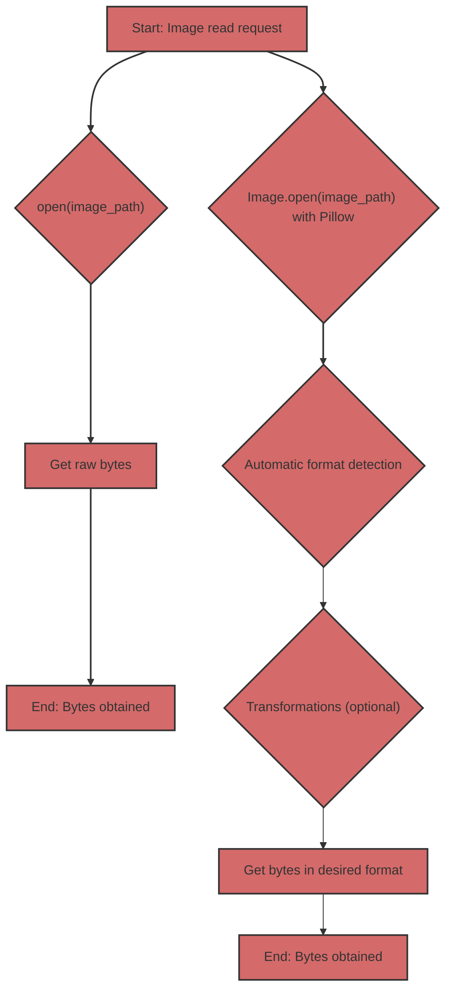

## Reading Images: Raw Bytes vs. Pillow

When it comes to working with images in Python, you have two main approaches:

1.  **Reading raw bytes:** Using `open()` to read the content of an image file as a sequence of bytes.
2.  **Using Pillow:** Using the Pillow library to open and process images.

Let's look at each approach in detail and find out their differences and when to use which approach.

### 1. Reading Raw Bytes with `open()`

#### What is it?

When you open an image file in binary mode (`"rb"`) using `open()`, you get access to the file's content as a sequence of bytes. This means you get "raw" data, without any interpretation or processing.

#### How does it look in code?

```python
from pathlib import Path

def read_image_bytes_direct(image_path: Path) -> bytes | None:
    """
    Reads an image as bytes directly using open().

    Args:
        image_path: Path to the image file.

    Returns:
        bytes: Image bytes.
        None: If an error occurred.
    """
    try:
        with open(image_path, "rb") as image_file:
            image_data = image_file.read()
            return image_data
    except Exception as e:
        print(f"Error reading file: {e}")
        return None


if __name__ == '__main__':
    image_path = Path("test.jpg")  # Replace with the path to your image

    if not image_path.is_file():
        print(f"File {image_path} does not exist")
    else:
       image_bytes_direct = read_image_bytes_direct(image_path)

       if image_bytes_direct:
           print(f"Image read directly, size: {len(image_bytes_direct)} bytes")
           # You can use image_bytes_direct, for example, to send over the network
       else:
           print("Failed to read image.")
```

#### When is it useful?

*   **Network data transfer:** When you just need to transfer image data over a network, without worrying about the format.
*   **Saving to disk:** When you need to save the file content to disk without changes.
*   **Low-level access:** When you need low-level access to file data, and you know how to interpret it yourself.

#### Limitations

*   **No format processing:** You only get bytes, without any information about the image format (JPEG, PNG, GIF, etc.).
*   **No validation:** There is no check whether the file is actually an image.
*   **No metadata:** You do not get access to image metadata (size, color space, etc.).
*   **No convenient transformations:** You cannot resize, format, or apply other transformations without additional processing.

### 2. Using Pillow for Reading Images

#### What is it?

Pillow is a powerful library for working with images. It allows you to open images of different formats, get metadata, resize, convert formats, and much more.

#### How does it look in code?

```python
from pathlib import Path
from PIL import Image
from io import BytesIO

def read_image_pillow(image_path: Path) -> bytes | None:
    """
    Reads an image using Pillow and returns it as JPEG bytes.

    Args:
        image_path: Path to the image file.

    Returns:
         bytes: Image bytes in JPEG format.
         None: If an error occurred.
    """
    try:
        img = Image.open(image_path)
        img_byte_arr = BytesIO()
        img.save(img_byte_arr, format="JPEG")
        return img_byte_arr.getvalue()
    except Exception as e:
        print(f"Error reading image with Pillow: {e}")
        return None

if __name__ == '__main__':
    image_path = Path("test.jpg") # Replace with the path to your image

    if not image_path.is_file():
        print(f"File {image_path} does not exist")
    else:
        image_bytes_pillow = read_image_pillow(image_path)
        if image_bytes_pillow:
           print(f"Image read with Pillow, size: {len(image_bytes_pillow)} bytes")
           # You can use image_bytes_pillow, for example, to send to the Gemini model.
        else:
           print("Failed to read image with Pillow.")
```

#### When is it useful?

*   **Working with images:** When you need to work with images, not just bytes.
*   **Automatic format detection:** Pillow automatically detects the image format.
*   **Format conversion:** You can easily convert images between different formats (JPEG, PNG, GIF, etc.).
*   **Resizing:** You can resize the image before processing.
*   **Metadata:** You can access image metadata (size, color profile, etc.).
*   **Error handling:** Pillow handles errors when opening corrupted files.

#### Advantages

*   **Flexibility:** Pillow provides many features for working with images.
*   **Reliability:** Pillow checks if the file is a valid image.
*   **Convenience:** Pillow simplifies the image processing workflow.

### Comparison Table

| Characteristic             | `open(image_path, "rb")`                                    | Pillow                                                      |
| :------------------------- | :---------------------------------------------------------- | :---------------------------------------------------------- |
| **What it does**            | Reads file as a sequence of bytes                     | Opens and processes image                         |
| **Format**                | Does not recognize format                                        | Automatically detects format                              |
| **Metadata**            | No access to metadata                                     | Provides access to metadata                             |
| **Processing**              | No processing capabilities                                 | Resizing, format conversion, etc.              |
| **Validation**             | No validation                                                | Checks if the file is a valid image          |
| **When to use**    | Simple byte transfer, low-level access              | Image manipulation, transformations, error handling |
| **Example**                | Network byte transfer, saving to disk                  | Preparing images for Gemini, web development           |

### In the context of Gemini

Gemini models expect image data in a specific format (usually JPEG or PNG). Using Pillow ensures that you provide images in the correct format, not just "raw" bytes. Moreover, Pillow allows you to resize the image if necessary.

### Comparison Diagram



If you just need to read a file as bytes, without any processing, `open(image_path, "rb")` will work. However, for image processing, especially for interacting with APIs that expect images in a specific format, using Pillow is a more reliable and flexible solution.
