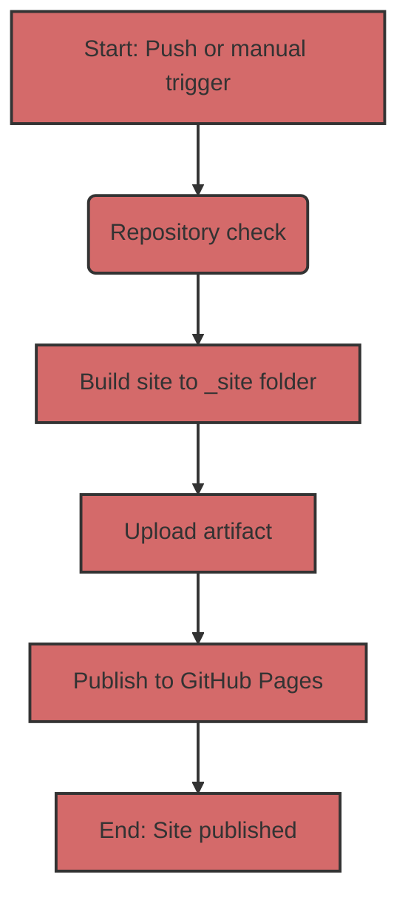

## Automatic Jekyll Site Deployment to GitHub Pages

To automate the deployment process, we will use GitHub Actions, which allow you to perform various tasks, including building and publishing websites, directly in your repository.

### 1: Workflow File Overview
First, let's look at the main workflow file that controls the build and deployment process. This file is written in YAML and is usually located in the `.github/workflows` directory. Here's its content:

```yaml
# Sample workflow for building and deploying a Jekyll site to GitHub Pages
name: Deploy Jekyll with GitHub Pages dependencies preinstalled

on:
  # Runs on pushes targeting the default branch
  push:
    branches: ["master"]

  # Allows you to run this workflow manually from the Actions tab
  workflow_dispatch:

# Sets permissions of the GITHUB_TOKEN to allow deployment to GitHub Pages
permissions:
  contents: read
  pages: write
  id-token: write

# Allow only one concurrent deployment, skipping runs queued between the run in-progress and latest queued.
# However, do NOT cancel in-progress runs as we want to allow these production deployments to complete.
concurrency:
  group: "pages"
  cancel-in-progress: false

jobs:
  # Build job
  build:
    runs-on: ubuntu-latest
    steps:
      - name: Checkout
        uses: actions/checkout@v4
      - name: Setup Pages
        uses: actions/configure-pages@v5
      - name: Build with Jekyll
        uses: actions/jekyll-build-pages@v1
        with:
          source: ./docs/gemini/consultant/ru/src
          destination: ./_site
      - name: Upload artifact
        uses: actions/upload-pages-artifact@v3

  # Deployment job
  deploy:
    environment:
      name: github-pages
      url: ${{ steps.deployment.outputs.page_url }}
    runs-on: ubuntu-latest
    needs: build
    steps:
      - name: Deploy to GitHub Pages
        id: deployment
        uses: actions/deploy-pages@v4
```

### 2: Workflow Structure Breakdown
Now let's break down each section of this file:

#### 2.1. General Information

-   `name: Deploy Jekyll with GitHub Pages dependencies preinstalled`: The name of the workflow that you will see in the Actions list in the repository.
-   `on`: Describes when the workflow should run:
    -   `push`: The workflow runs on every push to the `master` branch.
    -   `workflow_dispatch`: Allows you to manually run the workflow through the GitHub interface.
-   `permissions`: Configures permissions for the workflow:
    -   `contents: read`: Permission to read code from the repository.
    -   `pages: write`: Permission to publish to GitHub Pages.
    -   `id-token: write`: Permission to get an authentication token (required for GitHub Actions).
-   `concurrency`: Configures parallel workflow execution:
    -   `group: "pages"`: Ensures that only one workflow for GitHub Pages runs at a time.
    -   `cancel-in-progress: false`: Prevents cancellation of the current workflow execution when a new one starts.

#### 2.2. `jobs` Section
This section describes which tasks should be performed. We have two jobs: `build` and `deploy`.

##### 2.2.1. `build`: Site Build
    -   `runs-on: ubuntu-latest`: Specifies that the job runs on an Ubuntu server.
    -   `steps`: Lists the steps that are executed during the build:
        -   `name: Checkout`: Checks out the repository source code.
        -   `uses: actions/checkout@v4`: Uses a pre-built action to check out the code.
        -   `name: Setup Pages`: Configures the environment for working with GitHub Pages.
        -    `uses: actions/configure-pages@v5`: Uses a pre-built action for configuration.
        -   `name: Build with Jekyll`: Starts the Jekyll site build.
        -   `uses: actions/jekyll-build-pages@v1`: Uses a pre-built action for building.
        -   `with:`: Configures action parameters:
            -   `source: ./docs/gemini/consultant/ru/src`: Specifies where your site's source files are located. **Note**: the path to your files `docs/gemini/consultant/ru/src`.
            -    `destination: ./_site`: Specifies where to put the built files.
        -   `name: Upload artifact`: Uploads the built files to pass them to the next job.
        -   `uses: actions/upload-pages-artifact@v3`: Uses a pre-built action for uploading artifacts.
    
##### 2.2.2. `deploy`: Site Publication
    -   `environment`: Configures the environment for publication.
        -  `name: github-pages`: Environment name.
        -   `url: ${{ steps.deployment.outputs.page_url }}`: Gets the URL of the published site.
    -   `runs-on: ubuntu-latest`: Specifies that the job runs on an Ubuntu server.
    -   `needs: build`: Specifies that the `deploy` job must run after the `build` job has successfully completed.
    -   `steps`: Lists the steps that are executed during publication:
        -   `name: Deploy to GitHub Pages`: Performs the publication of the site to GitHub Pages.
        -   `id: deployment`: Sets the ID for the action.
        -    `uses: actions/deploy-pages@v4`: Uses a pre-built action for deployment.

### 3: What do Markdown files do?

Files with the `.md` (Markdown) extension are the basis for a Jekyll site. Markdown is a simple markup language that allows you to format text.
Jekyll automatically processes `.md` files, turning them into HTML pages. Your files should be located in the folder specified in the workflow `docs/gemini/consultant/ru/src`.

### 4: Flowchart




### 5: How it works
1.  **Code change:** You make changes to your `.md` or `.html` files, which are located in the `docs/gemini/consultant/ru/src` folder.
2.  **Push:** You push your changes to the `master` branch of your GitHub repository.
3.  **Workflow Run:** GitHub Actions automatically runs the workflow described in the YAML file.
4.  **Build:** The workflow first downloads the code from the repository, then builds the Jekyll site from your source files into the `_site` folder.
5.  **Publish:** The built site is published to GitHub Pages.
6.  **Site ready:** After that, your site is accessible at the URL specified in the GitHub Pages settings.

