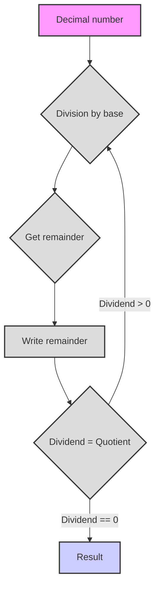

# Number Systems

Hello! Let's dive into the fascinating world of number systems. Get ready, today you'll learn a lot of new and interesting things!

# Number Systems

**1. Abstract Number System**

Imagine that numbers are like words that can be written with different "letters." It doesn't matter how exactly we denote numbers; the main thing is that certain rules are observed:

*   **Base:** This is the number of unique symbols (digits) that we use. Let's denote the base as `b`. For example, in the decimal system, the base is 10.
*   **Digits:** These are the symbols that we use to write numbers. Usually, these are Arabic numerals (0, 1, 2, 3, ...), but other symbols can also be used, for example, Latin letters (I, V, X) or even fruits (🍎, 🍐, 🍉).
*   **Position:** Each digit in the representation of a number has its own position, which affects its value. This means that the same digit can have a different value depending on where it stands in the number.
*   **Place values:** Each position is called a place value (e.g., ones, tens, hundreds, etc.). In each position, the value of the digit is multiplied by the base raised to the power corresponding to its place value number.

**How is a number system constructed?**

1.  **Choosing a base:** We choose an integer `b` that will be the base of our system.
2.  **Choosing digits:** We need `b` unique digits. Usually, these are 0, 1, 2, ..., `b-1`. For example, for the binary system (base 2), we have the digits 0 and 1.
3.  **Writing a number:** A number is written as a sequence of digits. The value of each digit is multiplied by the base, raised to the power equal to its position (starting from 0 on the right).

**Formula for calculating the value of a number:**

If we have a number written as a sequence of digits `dₙ dₙ₋₁ ... d₁ d₀`, then its value in the decimal system can be calculated using the formula:

`value = dₙ * bⁿ + dₙ₋₁ * bⁿ⁻¹ + ... + d₁ * b¹ + d₀ * b⁰`

Where:

*   `dᵢ` - digit in the i-th place value
*   `b` - base of the number system
*   `i` - place value number (from right to left, starting from 0)

**Example:**

Suppose we have the number 123 in the decimal system (base 10). According to the formula:

`1 * 10² + 2 * 10¹ + 3 * 10⁰ = 100 + 20 + 3 = 123`

**Number orders (place values):**

Orders, as we have already said, are the positions of digits in a number, each position has its own weight, which is determined by the base raised to the power of its ordinal number.
*   `d₀`: ones (`b⁰`)
*   `d₁`: `b` (`b¹`)
*   `d₂`: `b²`
*   `d₃`: `b³`
*   and so on

**Rules:**

1.  **Digit range:** Digits from 0 to `b-1` are used.
2.  **Positional principle:** The value of a digit depends on its position.
3.  **Transition to the next place value:** When the value `b` is reached in a place value, a carry occurs to the next place value (analogous to how after 9 in the decimal system, 1 is added to the next place value and 10 is obtained)

## Example: Fruit Number System

Let's consider an example of an abstract number system with fruits:

*   🍎 (apple)
*   🍐 (pear)
*   🍉 (melon)
*   🧺 (basket)

**Rules:**

1.  3 🍎 = 1 🍐
2.  5 🍐 = 3 🍉
3.  2 🍉 = 1 🧺

**Number representation:**

We will represent the number of fruits as a string, where each unicode symbol corresponds to one fruit. For example, "🍎🍎🍎" is 3 apples, and "🍉🍉" is 2 melons.

**Arithmetic operations:**

We can perform addition and subtraction operations. First, let's do addition.

**Python Code:**

```python
def normalize_fruits(fruits: str) -> str:
    """
    Normalizes a string of fruits, bringing it to its minimal representation,
    using fruit exchange rules.

    Args:
        fruits: String of fruits (🍎, 🍐, 🍉, 🧺).

    Returns:
        String with normalized fruit count.
    """
    apples = fruits.count('🍎')
    pears = fruits.count('🍐')
    melons = fruits.count('🍉')
    baskets = fruits.count('🧺')

    # Convert apples to pears
    pears += apples // 3
    apples %= 3

    # Convert pears to melons
    melons += (pears * 3) // 5
    pears %= 5

    # Convert melons to baskets
    baskets += melons // 2
    melons %= 2

    # Reassemble the string, first baskets, then melons, pears, apples
    return (
        "🧺" * baskets
        + "🍉" * melons
        + "🍐" * pears
        + "🍎" * apples
    )


def add_fruits(fruits1: str, fruits2: str) -> str:
    """
    Adds two strings of fruits.

    Args:
        fruits1: String of fruits.
        fruits2: String of fruits.

    Returns:
        String with the sum of fruits.
    """
    return normalize_fruits(fruits1 + fruits2)


def sub_fruits(fruits1: str, fruits2: str) -> str:
    """
    Subtracts the second string of fruits from the first, if possible.

    Args:
        fruits1: String of fruits to subtract from.
        fruits2: String of fruits to subtract.

    Returns:
        String with the difference of fruits or "Cannot subtract" if the result is negative.
    """

    apples1 = fruits1.count('🍎')
    pears1 = fruits1.count('🍐')
    melons1 = fruits1.count('🍉')
    baskets1 = fruits1.count('🧺')

    apples2 = fruits2.count('🍎')
    pears2 = fruits2.count('🍐')
    melons2 = fruits2.count('🍉')
    baskets2 = fruits2.count('🧺')


    # Temporary representation as total number of apples
    total_apples1 = apples1 + pears1 * 3 + melons1 * 15 // 3 + baskets1 * 30
    total_apples2 = apples2 + pears2 * 3 + melons2 * 15 // 3 + baskets2 * 30

    if total_apples1 < total_apples2:
        return "Cannot subtract"
    else:
        total_apples = total_apples1 - total_apples2

    # Return normalized representation of the sum of apples
    result_fruits = ""
    baskets = total_apples // 30
    result_fruits += "🧺" * baskets
    total_apples %= 30
    melons = (total_apples*3) // 15
    result_fruits += "🍉" * melons
    total_apples %= 15
    pears = total_apples // 3
    result_fruits += "🍐" * pears
    total_apples %= 3
    result_fruits += "🍎" * total_apples

    return normalize_fruits(result_fruits)


# Examples:
fruits1 = "🍎🍎🍎🍎🍎" # 5 apples
fruits2 = "🍎🍎🍎" # 3 apples
print(f"{fruits1} + {fruits2} = {add_fruits(fruits1, fruits2)}")

fruits3 = "🍐🍐"  # 2 pears
fruits4 = "🍎🍎🍎🍎" # 4 apples
print(f"{fruits3} + {fruits4} = {add_fruits(fruits3, fruits4)}")

fruits5 = "🍉🍉" # 2 melons
fruits6 = "🍎🍎🍎🍎🍎🍎🍎🍎🍎🍎🍎🍎🍎🍎🍎" # 15 apples
print(f"{fruits5} + {fruits6} = {add_fruits(fruits5, fruits6)}")

fruits7 = "🧺🧺" # 2 baskets
fruits8 = "🍉🍉🍉" # 3 melons
print(f"{fruits7} + {fruits8} = {add_fruits(fruits7, fruits8)}")

fruits9 = "🧺🍉🍐🍎" # 1 basket, 1 melon, 1 pear, 1 apple
fruits10 = "🍉🍐🍎" # 1 melon, 1 pear, 1 apple
print(f"{fruits9} - {fruits10} = {sub_fruits(fruits9, fruits10)}")

fruits11 = "🧺🍉" # 1 basket, 1 melon
fruits12 = "🧺🍉🍎🍎🍎" # 1 basket, 1 melon, 3 apples
print(f"{fruits11} - {fruits12} = {sub_fruits(fruits11, fruits12)}")

fruits13 = "🍉🍉🍉" # 3 melons
fruits14 = "🍎🍎🍎🍎" # 4 apples
print(f"{fruits13} - {fruits14} = {sub_fruits(fruits13, fruits14)}")

fruits15 = "🍐🍐🍐🍐🍐" # 5 pears
fruits16 = "🍉" # 1 melon
print(f"{fruits15} - {fruits16} = {sub_fruits(fruits15, fruits16)}")
```

**Code explanation:**

1.  **`normalize_fruits(fruits)`:** This function normalizes a string of fruits, bringing it to its minimal representation, using fruit exchange rules. It first counts the number of each fruit, and then, using the exchange rules, converts them to larger units (apples to pears, pears to melons, melons to baskets), and after conversion, glues them back into a string with the minimal set of fruits.
2.  **`add_fruits(fruits1, fruits2)`:** This function performs the addition of two strings of fruits. It simply concatenates the two strings and then normalizes the result.
3.  **`sub_fruits(fruits1, fruits2)`:** This is a function for subtracting one string of fruits from another. It converts everything to "number of apples" and then performs the subtraction, and then converts the apples back to a normalized form, while checking the possibility of subtraction.
4.  **Examples:** At the end of the code, examples of addition and subtraction with various combinations of fruits and the output of the results are given.

**Tasks:**

1.  Try adding a function to the code to multiply fruits by an integer (e.g., `multiply_fruits(fruits, n)`).
2.  Implement a `compare_fruits(fruits1, fruits2)` function that compares two strings of fruits and returns "greater", "less", or "equal".
3.  Come up with your own fruit exchange rules and modify the code accordingly.
4.  Add input data validation (so that the string consists only of allowed unicode characters).
5.  Implement more advanced subtraction, for example, do not issue an error "Cannot subtract", but output the result with a minus sign (advanced task).

## 2. Specific Number Systems

Now let's move on to specific examples of number systems that are often used in computer science and everyday life.

### 2.1. Binary system (base 2)

*   **Digits:** 0, 1
*   **Used in computers:** All data in computers is represented in binary code (bits).

**Example:**

*   The number `1011₂` (read as "one zero one one base 2"). Conversion to decimal system:
    `1 * 2³ + 0 * 2² + 1 * 2¹ + 1 * 2⁰ = 8 + 0 + 2 + 1 = 11₁₀`

**Python:**

```python
def bin_to_dec(binary: str) -> int:
    """
    Converts a binary number (string) to decimal.

    Args:
        binary: Binary number as a string.

    Returns:
        Decimal representation of the number (integer).
    """
    decimal = 0  # Initialize decimal value
    power = 0  # Initialize power of two (place value exponent)
    for digit in reversed(binary):  # Iterate over the digits of the binary number in reverse order
        if digit == '1':
            decimal += 2 ** power  # If the digit is '1', add 2 to the power of the place value
        power += 1  # Increment the power for the next place value
    return decimal  # Return the decimal value

binary_number = "1011"
decimal_number = bin_to_dec(binary_number)
print(f"Binary {binary_number} = Decimal {decimal_number}")


def dec_to_bin(decimal: int) -> str:
    """
    Converts a decimal number (integer) to its binary representation (string).

    Args:
        decimal: Decimal number.

    Returns:
        Binary representation of the number (string).
    """
    if decimal == 0:  # If the decimal number is 0
        return "0"  # Return the string "0"
    binary = ""  # Initialize string for binary number
    while decimal > 0:  # While the decimal number is greater than 0
        binary = str(decimal % 2) + binary  # Add the remainder of the division by 2 to the beginning of the binary string
        decimal = decimal // 2  # Integer divide the decimal number by 2
    return binary  # Return the binary string
```

### 2.2. Ternary system (base 3)

*   **Digits:** 0, 1, 2
*   **Theoretically interesting:** Used in some areas of mathematics and computer science.

**Example:**

*   The number `210₃` (read as "two one zero base 3"). Conversion to decimal system:
    `2 * 3² + 1 * 3¹ + 0 * 3⁰ = 18 + 3 + 0 = 21₁₀`

**Python:**

```python
def ternary_to_dec(ternary: str) -> int:
    """
    Converts a ternary number (string) to decimal.

    Args:
        ternary: Ternary number as a string.

    Returns:
        Decimal representation of the number (integer).
    """
    decimal = 0  # Initialize decimal value
    power = 0  # Initialize power of three (place value exponent)
    for digit in reversed(ternary):  # Iterate over the digits of the ternary number in reverse order
        decimal += int(digit) * (3 ** power)  # Add the digit * 3 to the power of the place value
        power += 1  # Increment the power for the next place value
    return decimal  # Return the decimal value


ternary_number = "210"
decimal_number = ternary_to_dec(ternary_number)
print(f"Ternary {ternary_number} = Decimal {decimal_number}")

def dec_to_ternary(decimal: int) -> str:
    """
    Converts a decimal number (integer) to its ternary representation (string).

    Args:
        decimal: Decimal number.

    Returns:
        Ternary representation of the number (string).
    """
    if decimal == 0:  # If the decimal number is 0
        return "0"  # Return the string "0"
    ternary = ""  # Initialize string for ternary number
    while decimal > 0:  # While the decimal number is greater than 0
        ternary = str(decimal % 3) + ternary  # Add the remainder of the division by 3 to the beginning of the ternary string
        decimal = decimal // 3  # Integer divide the decimal number by 3
    return ternary  # Return the ternary string
```

### 2.3. Septenary system (base 7)

*   **Digits:** 0, 1, 2, 3, 4, 5, 6
*   **Less common:** Used in some narrow areas, for example, in some encoding systems. Also has practical application in days of the week.

**Example:**

*   The number `345₇` (read as "three four five base 7"). Conversion to decimal system:
    `3 * 7² + 4 * 7¹ + 5 * 7⁰ = 147 + 28 + 5 = 180₁₀`

**Python:**

```python
def septenary_to_dec(septenary: str) -> int:
    """
    Converts a septenary number (string) to decimal.

    Args:
        septenary: Septenary number as a string.

    Returns:
        Decimal representation of the number (integer).
    """
    decimal = 0  # Initialize decimal value
    power = 0  # Initialize power of seven (place value exponent)
    for digit in reversed(septenary):  # Iterate over the digits of the septenary number in reverse order
        decimal += int(digit) * (7 ** power)  # Add the digit * 7 to the power of the place value
        power += 1  # Increment the power for the next place value
    return decimal  # Return the decimal value


septenary_number = "345"
decimal_number = septenary_to_dec(septenary_number)
print(f"Septenary {septenary_number} = Decimal {decimal_number}")

def dec_to_septenary(decimal: int) -> str:
    """
    Converts a decimal number (integer) to its septenary representation (string).

    Args:
        decimal: Decimal number.

    Returns:
        Septenary representation of the number (string).
    """
    if decimal == 0: # If the decimal number is 0
        return "0" # Return the string "0"
    septenary = ""  # Initialize string for septenary number
    while decimal > 0:  # While the decimal number is greater than 0
        septenary = str(decimal % 7) + septenary  # Add the remainder of the division by 7 to the beginning of the septenary string
        decimal = decimal // 7  # Integer divide the decimal number by 7
    return septenary  # Return the septenary string
```

### 2.4. Decimal system (base 10)

*   **Digits:** 0, 1, 2, 3, 4, 5, 6, 7, 8, 9
*   **Everyday:** The most common system we use every day.

**Example:**

*   The number `789₁₀`. Conversion to decimal system: (no point, it's already decimal)
    `7 * 10² + 8 * 10¹ + 9 * 10⁰ = 700 + 80 + 9 = 789₁₀`

### 2.5. Hexadecimal system (base 16)

*   **Digits:** 0, 1, 2, 3, 4, 5, 6, 7, 8, 9, A, B, C, D, E, F
    *   A = 10, B = 11, C = 12, D = 13, E = 14, F = 15
*   **Widely used in programming:** For representing colors, memory addresses, machine codes, etc. Often used to shorten the writing of binary numbers.

**Example:**

*   The number `2AF₁₆` (read as "two a f base 16"). Conversion to decimal system:
    `2 * 16² + 10 * 16¹ + 15 * 16⁰ = 512 + 160 + 15 = 687₁₀`

**Python:**

```python
def hex_to_dec(hexadecimal: str) -> int:
    """
    Converts a hexadecimal number (string) to decimal.

    Args:
        hexadecimal: Hexadecimal number as a string.

    Returns:
        Decimal representation of the number (integer).
    """
    decimal = 0  # Initialize decimal value
    power = 0  # Initialize power of 16 (place value exponent)
    for digit in reversed(hexadecimal):  # Iterate over the digits of the hexadecimal number in reverse order
        if digit.isdigit():  # If the digit is a number
            decimal += int(digit) * (16 ** power)  # Add the digit * 16 to the power of the place value
        elif digit.upper() == 'A':  # If the digit is 'A'
            decimal += 10 * (16 ** power)  # Add 10 * 16 to the power of the place value
        elif digit.upper() == 'B':  # If the digit is 'B'
            decimal += 11 * (16 ** power)  # Add 11 * 16 to the power of the place value
        elif digit.upper() == 'C':  # If the digit is 'C'
            decimal += 12 * (16 ** power)  # Add 12 * 16 to the power of the place value
        elif digit.upper() == 'D':  # If the digit is 'D'
            decimal += 13 * (16 ** power)  # Add 13 * 16 to the power of the place value
        elif digit.upper() == 'E':  # If the digit is 'E'
            decimal += 14 * (16 ** power)  # Add 14 * 16 to the power of the place value
        elif digit.upper() == 'F':  # If the digit is 'F'
            decimal += 15 * (16 ** power)  # Add 15 * 16 to the power of the place value
        power += 1  # Increment the power for the next place value
    return decimal  # Return the decimal value


hex_number = "2AF"
decimal_number = hex_to_dec(hex_number)
print(f"Hexadecimal {hex_number} = Decimal {decimal_number}")

def dec_to_hex(decimal: int) -> str:
    """
    Converts a decimal number (integer) to its hexadecimal representation (string).

    Args:
        decimal: Decimal number.

    Returns:
        Hexadecimal representation of the number (string).
    """
    if decimal == 0:  # If the decimal number is 0
        return "0"  # Return the string "0"
    hex_digits = "0123456789ABCDEF"  # String for mapping remainders and hexadecimal digits
    hexadecimal = ""  # Initialize string for hexadecimal number
    while decimal > 0:  # While the decimal number is greater than 0
        remainder = decimal % 16  # Get the remainder of the division by 16
        hexadecimal = hex_digits[remainder] + hexadecimal  # Add the corresponding digit to the beginning of the hexadecimal string
        decimal = decimal // 16  # Integer divide the decimal number by 16
    return hexadecimal  # Return the hexadecimal string
```

### 2.6. Sexagesimal system (base 60)

*   **Digits:** 0-59 (in practical application, combinations of symbols are used)
*   **Historical:** Used in ancient Babylon, and now for measuring time (hours, minutes, seconds) and angles.

**Example:**

*   Let's represent the number `25:30:15₆₀` (25 degrees, 30 minutes, 15 seconds) or
    `25 * 60² + 30 * 60¹ + 15 * 60⁰ = 25 * 3600 + 30 * 60 + 15 * 1 = 90000 + 1800 + 15 = 91815₁₀` (total number of seconds)

## 3. Examples of number systems in everyday life

Number systems are not only abstract mathematical concepts, but also real-world ways of encoding information. Here are some examples:

### 3.1. Roman numerals
The Roman numeral system is a non-positional system that uses Latin letters to write numbers. This system is still used, for example, for numbering chapters in books or for denoting centuries.

**Python Code:**
```python
import sys

def roman_to_int(roman_str: str) -> int:
    """
    Converts a Roman numeral (string) to decimal.

    Args:
        roman_str: Roman numeral as a string.

    Returns:
        Decimal representation of the number (integer).
    """
    roman_dict = {
        'I': 1,
        'V': 5,
        'X': 10,
        'L': 50,
        'C': 100,
        'D': 500,
        'M': 1000
    }

    number = 0
    roman_str = roman_str.replace("IV","IIII")
    roman_str = roman_str.replace("IX","VIIII")
    roman_str = roman_str.replace("XL","XXXX")
    roman_str = roman_str.replace("XC","LXXXX")
    roman_str = roman_str.replace("CD","CCCC")
    roman_str = roman_str.replace("CM","DCCCC")
    for char in roman_str:
        number += roman_dict[char]

    return number

# Example of use
if __name__ == '__main__':
    roman_number = sys.argv[1] # Get Roman numeral from command line arguments
    decimal_number = roman_to_int(roman_number)
    print(f"Roman {roman_number} = Decimal {decimal_number}")
```

### 3.2. Morse code
Morse code is a system for encoding characters using a combination of short and long signals (dots and dashes). It was used to transmit messages by telegraph.

**Python Code:**

```python
import time
import platform

# Morse code dictionary with cyrillic alphabet
morse_code_dict = {
    'A': '.-',    'А': '.-',
    'B': '-...',   'Б': '-...',
    'C': '-.-.',   'В': '.--',
    'D': '-..',    'Г': '--.',
    'E': '.',      'Д': '-..',
    'F': '..-.',   'Е': '.',
    'G': '--.',    'Ж': '...-',
    'H': '....',   'З': '--..',
    'I': '..',     'И': '..',
    'J': '.---',   'Й': '.---',
    'K': '-.-',    'К': '-.-',
    'L': '.-..',   'Л': '.-..',
    'M': '--',     'М': '--',
    'N': '-.',     'Н': '-.',
    'O': '---',    'О': '---',
    'P': '.--.',   'П': '.--.',
    'Q': '--.-',   'Р': '.-.',
    'R': '.-.',    'С': '...',
    'S': '...',    'Т': '-',
    'T': '-',      'У': '..-',
    'U': '..-',    'Ф': '..-.',
    'V': '...-',   'Х': '....-',
    'W': '.--',    'Ц': '-.-.',
    'X': '-..-',   'Ч': '---.',
    'Y': '-.--',   'Ш': '----',
    'Z': '--..',   'Щ': '--.-',
    '0': '-----',   'Ъ': '--.--',
    '1': '.----',  'Ы': '-.--',
    '2': '..---',  'Ь': '-..-',
    '3': '...--',  'Э': '..-..',
    '4': '....-',  'Ю': '..--',
    '5': '.....',  'Я': '.-.-',
    '6': '-....',
    '7': '--...',
    '8': '---..',
    '9': '----.',
    '.': '.-.-.-',
    ',': '--..--',
    '?': '..--..',
    "'": '.----.',
    '!': '-.-.--',
    '/': '-..-.',
    '(': '-.--.',
    ')': '-.--.-',
    '&': '.-...',
    ':': '---...',
    ';': '-.-.-.',
    '=': '-...-',
    '+': '.-.-.',
    '-': '-....-',
    '_': '..--.-',
    '"': '.-..-.',
    '$': '...-..-',
    '@': '.--.-.',
    ' ': '/'
}

def play_sound(duration):
    """
    Produces a sound signal of a given duration.
    """
    # For Windows
    if platform.system() == 'Windows':
        import winsound
        winsound.Beep(1000, duration)  # Beep at 1000 Hz for 'duration' milliseconds
    # For Linux/macOS
    else:
        import os
        os.system('printf "\a"')  # Produces system beep

def text_to_morse(text):
    """
    Converts text to Morse code.

    Args:
        text: String of text.

    Returns:
        String with Morse code.
    """
    morse_code = ''
    for char in text.upper():
        if char in morse_code_dict:
            morse_code += morse_code_dict[char] + ' '
        else:
            morse_code += '/ '  # If character is not found, consider it as a space
    return morse_code

def morse_to_sound(morse_code):
    """
    Plays Morse code as sound signals.

    Args:
        morse_code: String with Morse code.
    """
    for symbol in morse_code:
        if symbol == '.':
            play_sound(100)  # Dot duration: 100 milliseconds
        elif symbol == '-':
            play_sound(300)  # Dash duration: 300 milliseconds
        elif symbol == ' ':
            time.sleep(0.3)  # Pause between characters: 300 milliseconds
        elif symbol == '/':
            time.sleep(0.7)  # Pause between words: 700 milliseconds

if __name__ == '__main__':
    # Get input from user
    text = input("Enter text to convert to Morse code: ")
    
    # Convert text to Morse code
    morse = text_to_morse(text)
    print("Morse Code:", morse)
    
    # Convert Morse code to sound
    morse_to_sound(morse)
```
## 4. Tasks

**Task 1:**


Convert the following numbers from one system to another:

*   `11011₂` to decimal
*   `201₃` to decimal
*   `563₇` to decimal
*   `2AF₁₆` to decimal
*   `45₁₀` to binary
*   `34₁₀` to ternary
*   `150₁₀` to septenary
*   `687₁₀` to hexadecimal

**Task 2:**

Come up with your own number system with a base, for example, 5 (quinary). Write a few numbers in this system and convert them to decimal.

**Task 3:**

Implement functions for converting from decimal to binary, ternary, septenary, hexadecimal and back (as in the examples above). You can organize these functions into one class, for example `NumberConverter`.

**Task 4:**

Write a function to add two binary numbers represented as strings. (Advanced).

**Task 5:**

Try converting some time in seconds, represented as "h:m:s" to decimal and back.

**Task 6:**

Write a function that will take two days of the week and a period of days (as in the example above), if the period is less than a week, it returns how many days are between them, if more, it returns how many full weeks and the remainder, as days.

**Task 7:**

Improve the `calculate_day_of_week` function so that it correctly handles a negative number of past days (i.e., when we count days backward).

## 5. Additional material: Days of the week and the septenary system

Days of the week can be considered as an example of using the septenary system, where each day is a digit from 0 to 6. However, since we usually do not start counting days of the week from zero, but rather from Monday, it can be said that this is a shifted septenary system.

**Simple code example for counting days of the week:**

```python
def calculate_day_of_week(start_day: int, days_passed: float) -> int:
    """
    Calculates the day of the week after a given number of days.

    Args:
        start_day: Starting day of the week (0 - Monday, 6 - Sunday).
        days_passed: Number of days passed.

    Returns:
        Day of the week after a given number of days (0 - Monday, 6 - Sunday).
    """
    if not isinstance(start_day, int) or not (0 <= start_day <= 6):
        raise ValueError("Starting day of the week must be an integer from 0 to 6 (Mon-Sun)")
    if not isinstance(days_passed, (int, float)):
        raise ValueError("Number of days passed must be a number")
    
    days_passed = int(days_passed)
    new_day = (start_day + days_passed) % 7
    return new_day

def day_number_to_name(day_number: int) -> str:
    """
    Converts a day of the week number (0-6) to its name.

    Args:
        day_number: Day of the week number (0 - Monday, 6 - Sunday).

    Returns:
        Day of the week name (string).
    """
    days = ["Monday", "Tuesday", "Wednesday", "Thursday", "Friday", "Saturday", "Sunday"]
    return days[day_number]

# Examples:
start_day = 0  # Monday
days = 10.5 #One and a half weeks
new_day = calculate_day_of_week(start_day, days)
print(f"{days} days after {day_number_to_name(start_day)}: {day_number_to_name(new_day)}")
days = 120 # Four months (approximately)
new_day = calculate_day_of_week(start_day, days)
print(f"{days} days after {day_number_to_name(start_day)}: {day_number_to_name(new_day)}")

# you can start counting from another day
start_day = 4  # Friday
days = 365 # Year
new_day = calculate_day_of_week(start_day, days)
print(f"{days} days after {day_number_to_name(start_day)}: {day_number_to_name(new_day)}")
```

**Explanations:**

1.  `calculate_day_of_week` function takes the starting day of the week (0-Monday, 6-Sunday) and the number of days passed (can be fractional).
2.  `new_day = (start_day + days_passed) % 7`: We sum the days and take the remainder of the division by 7, since there are 7 days in a week. The `% 7` operation ensures the "looping" when days go past Sunday.
3.  `day_number_to_name` helper function for convenience of perceiving results.

## 6. Diagram

To visually represent the process of converting numbers from one number system to another, you can use a diagram. Here is an example of a diagram describing the process of converting from the decimal system to any other (including binary, ternary, septenary, hexadecimal):



**Legend:**

1.  **Decimal number:** The original number in the decimal system.
2.  **Division by base:** We divide the original number by the base of the target number system (2, 3, 7, 16, etc.)
3.  **Get remainder:** We remember the remainder of the division, as it will be one of the digits in the number of the target number system.
4.  **Write remainder:** The remainder is added to the result in reverse order, i.e., from end to beginning.
5.  **Dividend = Quotient:** After that, we move to a new dividend, which is equal to the quotient of the previous division.
6.  **Check for 0:** If our dividend is not equal to 0, we repeat the loop, starting from point 2.
7.  **Result:** When the dividend is 0, we have obtained the result - the number in the target number system.

This diagram describes the general principle of converting numbers from the decimal system to any other. A similar diagram can be built for converting from an arbitrary number system to decimal (summing the products of digits by the base to the power).


**Tips:**

*   Practice number system conversions. The more you practice, the better you will understand the principles of number systems.
*   Try creating your own number systems.
*   Use Python to check your solutions and automate conversions.

