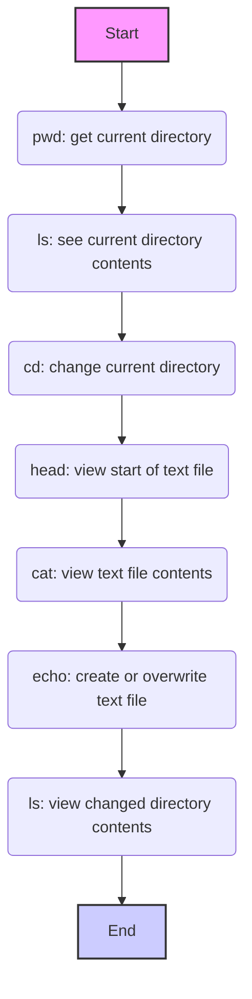

What is Google Colab?

Google Colab is a cloud-based platform created by Google for working with interactive Jupyter Notebooks.
It provides powerful tools for writing and executing Python code, analyzing data, training machine learning models, and collaborating on projects.

Colab provides access to powerful computing resources, including graphics processing units (GPUs) and tensor processing units (TPUs).
This allows you to solve complex problems, such as processing large datasets or training neural networks, without the need to purchase expensive hardware. Colab is built on Jupyter Notebook, providing a convenient interface for working with code, text, and visualizations. You can execute code cells, insert explanatory text, create charts and visualizations directly in your browser. You can use Colab immediately after opening it. There is no need to install additional programs, libraries, or drivers. Everything is already configured for use. You can connect your Google Drive, which allows you to easily upload data, save projects, and access files from anywhere. Colab supports collaborative work. You can share your projects with colleagues, edit notebooks simultaneously, and discuss changes in real time.


### How does Google Colab work?
- You launch a Jupyter notebook in your browser, eliminating the need to install a local environment.
- Code is executed on remote Google servers, and the results are displayed in your notebook.
- Data can be loaded from a local device or from the cloud, such as Google Drive.
- You can use Colab to write Python code, work with machine learning libraries (e.g., TensorFlow, PyTorch), analyze data using Pandas, or create visualizations via Matplotlib and Seaborn.


What does Google Colab look like?


The Colab interface consists of several main parts:

Code cells: These are the cells where you will write and execute your Python code.

Text cells: Here you can add descriptions, explanations, and notes to your code.

Menu: At the top there is a menu with various options for working with the notebook (file, edit, view, tools, etc.).

File manager: On the left there is a file manager panel where you can view files and folders in your Colab environment.


In Google Colab, you work in a cloud environment,
where the file system is organized like on a regular computer with folders and files.
Colab provides tools for navigating, creating, viewing, and editing files.
You can interact with the file system using **Jupyter magic commands** (starting with `%`)
and **bash commands** (starting with `!`).

**List of basic commands:**

1.  **`%pwd`** (print working directory):
    *   **Description**: Shows the current working directory (where you are currently "located" in the file system).
    *   **Example**: `%pwd`
    *   **Result**: `/content` (or another current directory)

2.  **`%ls`** (list):
    *   **Description**: Lists files and folders in the current directory.
    *   **Example**: `%ls`
    *   **Result**: List of files and folders, for example: `sample_data/  my_file.txt`

3.  **`%cd <path>`** (change directory):
    *   **Description**: Changes to the specified directory.
    *   **Example**: `%cd sample_data`
    *   **Result**: The current working directory changes to `/content/sample_data`

4.  **`!head -<number of lines> <filename>`** :
    *   **Description**: Outputs the first few lines of the specified text file.
    *   **Example**: `!head -5 README.md`
    *   **Result**: The first 5 lines of the `README.md` file.

5.  **`!cat <filename>`** :
    *   **Description**: Outputs the content of the specified text file.
    *   **Example**: `!cat sample_file.txt`
    *   **Result**: All content of the `sample_file.txt` file.

6.   **`!echo "<text>" > <filename>`**
    *   **Description:** Creates a new file with the specified name and writes text to it. If the file already exists, it will be overwritten
    *   **Example:** `!echo "This is my new file!" > new_file.txt`
    *   **Result:** Creates `new_file.txt` with the content `This is my new file!`. 

**Key points:**

*   **Magic commands** (`%`) - these are special Jupyter commands for working with the Colab environment.
*   **Bash commands** (`!`) - these are commands that are executed in the Linux command line.
*   **File path**: The file path indicates exactly where the file is located in the file system (e.g., `/content/sample_data/my_file.txt`).
*   **Current directory**: Your position in the file system (changed by the `%cd` command).

**Diagram illustrating the command sequence:**



**Uploading files to Google Colab**

There are several ways to upload files to Colab, and we will look at the most common ones.

1.  **Upload via file manager (GUI)**
    *   **Description:** The easiest way to upload files, especially small ones, is to use the graphical interface of the Colab file manager.
    *   **How to do it:**
        1.  Open the file manager panel on the left (folder icon).
        2.  Click the upload icon (usually a plus sign or an up arrow).
        3.  In the window that opens, select the files on your computer that you want to upload.
        4.  Click "Open" or "Upload".
    *   **Pros:** Simplicity, clarity, no code required.
    *   **Cons:** Suitable for small files, needs to be done manually.


2.  **Upload via Python code (`google.colab.files.upload()`)**
    *   **Description**: This method allows you to upload files using Python code, which provides more flexibility.
    *   **How to do it:**
        1.  Import the `files` module from the `google.colab` library.
           ```python
           from google.colab import files
           ```
        2.  Call the `files.upload()` function
             ```python
             uploaded = files.upload()
             ```
        3.  When you run this code, a dialog box will appear where you can select files to upload.
    *   **Pros:** Can be used in code, allows programmatic processing of uploaded files.
    *   **Cons:** Requires writing code, slightly less intuitive than the file manager.

    After executing this code, the uploaded files will be available as an `uploaded` dictionary, where keys are filenames and values are their content as byte strings.
    ```python
    # Example of using uploaded files
    for file_name, file_data in uploaded.items():
       print(f"File: {file_name}")
       # File data processing
       # For example:
       # import pandas as pd
       # df = pd.read_csv(io.BytesIO(file_data))
       # print(df.head())
    ```


3.  **Cloning a GitHub repository (`git clone`)**
    *   **Description**: If your files are in a GitHub repository, you can upload them by cloning the repository to Colab.
    *   **How to do it:**
        1.  Use the `git clone` command with the repository URL.
            ```python
            !git clone <repository_URL>
            ```
            For example:
           ```python
           !git clone https://github.com/username/my_repository.git
           ```
        2. After cloning the repository, the content will be available in a folder named the same as the repository.
    *   **Pros:** Easy to upload all files from a repository, convenient way for version-controlled projects.
    *   **Cons:** Only suitable for files in GitHub repositories.


   ```html
<div align="center">
  
  <p><em>Cloning GitHub repository in Colab</em></p>
</div>
```

4.  **Downloading a single file from GitHub**
     *   **Description**: If you only need one or a few files from a GitHub repository, you can download them directly.
     *   **How to do it:**
         1.  Open the desired file in the GitHub repository.
         2.  Click the "View raw" button.
         3.  Copy the URL of this file.
        4.  Use `wget` or `curl` to download the file.
            ```python
            !wget <file_URL>
            ```
           or
             ```python
            !curl <file_URL> -o <filename_in_colab>
             ```
    *   **Pros**: Easy to download only the necessary files, without cloning the entire repository.
    *   **Cons**: Requires knowing the direct link to the file.


**Which method to choose?**

*   For small files that need to be uploaded quickly and manually, the **file manager** is suitable.
*   If you need to programmatically process uploaded files, use **`files.upload()`**.
*   For uploading entire projects, use **`git clone`**.
*  For downloading individual files, use **`wget` or `curl`**
