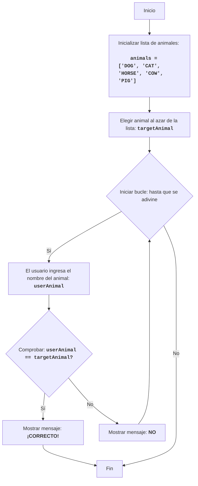

ANIMAL:
=================
Dificultad: 4
-----------------
El juego "ANIMAL" es un juego de adivinanzas de animales en el que la computadora selecciona un animal al azar de una lista, y el jugador intenta adivinarlo ingresando sus suposiciones. El juego continúa hasta que el jugador adivina el animal.

Reglas del juego:
1.  La computadora selecciona un animal al azar de una lista predefinida.
2.  El jugador ingresa sus suposiciones para el animal oculto.
3.  Después de cada intento, la computadora informa si el jugador adivinó el animal o no.
4.  El juego continúa hasta que el jugador adivina el animal oculto.
-----------------
Algoritmo:
1.  Definir una lista de animales.
2.  Seleccionar un animal al azar de la lista.
3.  Iniciar un bucle "mientras el animal no sea adivinado":
    3.1 Solicitar al jugador que ingrese el nombre del animal.
    3.2 Si el nombre ingresado coincide con el animal oculto, ir al paso 4.
    3.3 De lo contrario, mostrar "NO".
4. Mostrar "¡CORRECTO!".
5. Fin del juego.
-----------------
Diagrama de flujo:

Leyenda:
    Start - Inicio del programa.
    InitializeAnimals - Inicialización de la lista de animales.
    ChooseRandomAnimal - Selección de un animal al azar de la lista y guardarlo en la variable targetAnimal.
    LoopStart - Inicio del bucle, que continúa hasta que se adivina el animal.
    InputAnimal - Solicitar al usuario que ingrese el nombre del animal y guardarlo en la variable userAnimal.
    CheckAnimal - Comprobar si el nombre del animal ingresado userAnimal coincide con el animal oculto targetAnimal.
    OutputWin - Mostrar un mensaje de victoria si los nombres de los animales coinciden.
    End - Fin del programa.
    OutputWrong - Mostrar el mensaje "NO" si el nombre del animal ingresado no coincide con el animal oculto.

import random

# Lista de animales para el juego
animals = ['DOG', 'CAT', 'HORSE', 'COW', 'PIG']

# Elegir un animal al azar de la lista
targetAnimal = random.choice(animals)

# Iniciar el bucle hasta que se adivine el animal
while True:
    # Solicitar al usuario que ingrese el nombre del animal
    userAnimal = input("Adivina el animal (DOG, CAT, HORSE, COW, PIG): ").upper()

    # Comprobar si el usuario adivinó el animal
    if userAnimal == targetAnimal:
        print("¡CORRECTO!") # Mostrar mensaje correcto
        break # Terminar el bucle si se adivina el animal
    else:
        print("NO") # Mostrar mensaje incorrecto

Explicación del código:

1.  **Importar módulo `random`**:
    -   `import random`: Importa el módulo `random`, que se utiliza para seleccionar un animal al azar.

2.  **Lista de animales**:
    -   `animals = ['DOG', 'CAT', 'HORSE', 'COW', 'PIG']`: Crea una lista de cadenas con nombres de animales.

3.  **Selección de animal al azar**:
    -   `targetAnimal = random.choice(animals)`: Selecciona un animal al azar de la lista `animals` y lo guarda en la variable `targetAnimal`.

4.  **Bucle principal del juego `while True:`**:
    -   Un bucle infinito que continúa hasta que el jugador adivina el animal.
    -   **Entrada**:
        -   `userAnimal = input("Adivina el animal (DOG, CAT, HORSE, COW, PIG): ").upper()`: Solicita al usuario que ingrese el nombre del animal y lo convierte a mayúsculas para una comparación sin distinción entre mayúsculas y minúsculas.
    -   **Condición de victoria**:
        -   `if userAnimal == targetAnimal:`: Comprueba si el nombre del animal ingresado por el usuario coincide con el oculto.
        -   `print("¡CORRECTO!")`: Muestra un mensaje de victoria si se adivina el animal.
        -   `break`: Termina el bucle (y el juego) si se adivina el animal.
    -   **Mensaje de respuesta incorrecta**:
        -   `else:`: Se ejecuta si el nombre del animal ingresado no coincide con el oculto.
        -   `print("NO")`: Muestra el mensaje "NO" si la respuesta es incorrecta.