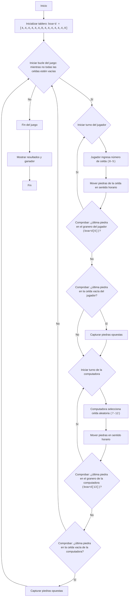

AWARI:
=================
Dificultad: 6
-----------------
El juego "Awari" es un juego de mesa que simula el juego tradicional Mancala, donde dos jugadores se turnan para mover "piedras" (en este caso, números) de las celdas del tablero, intentando capturar la mayor cantidad de piedras posible en sus "graneros". Esta es una versión simplificada del juego donde el jugador juega contra la computadora.

Reglas del juego:
1. El tablero de juego consta de 14 celdas, numeradas del 0 al 13. Las celdas 6 y 13 son los "graneros" de los jugadores.
2. Al comienzo del juego, cada una de las 12 celdas (0-5 y 7-12) contiene 4 piedras.
3. El jugador (humano) comienza el juego.
4. Selecciona una celda con sus piedras (0-5).
5. Todas las piedras de la celda seleccionada se mueven una por una a cada celda siguiente en el sentido de las agujas del reloj, incluyendo su propio "granero".
6. Si la última piedra cae en el granero del jugador, el jugador tiene derecho a hacer otro movimiento.
7. Si la última piedra cae en una celda vacía del lado del jugador, y hay piedras frente a esa celda, el jugador toma las piedras de esa celda y de la celda opuesta a su granero.
8. La computadora se mueve de manera similar.
9. El juego termina cuando todas las celdas con piedras quedan vacías.
10. El jugador con más piedras en su granero gana.
-----------------
Algoritmo:
1. Inicializar el tablero (matriz) de 14 celdas con 4 piedras en cada una, excepto las celdas 6 y 13, que son 0.
2. Iniciar un bucle "mientras el juego no haya terminado"
3. Turno del jugador:
    3.1 Solicitar al jugador que ingrese el número de celda (0 a 5).
    3.2 Mover las piedras de la celda seleccionada en el sentido de las agujas del reloj.
    3.3 Comprobar si la última piedra cayó en el granero del jugador (celda 6). Si es así, darle al jugador otro turno.
    3.4 Comprobar si la última piedra cayó en una celda vacía del lado del jugador. Si es así, capturar las piedras de esa celda y de la celda opuesta.
4. Turno de la computadora (similar al turno del jugador, pero la selección de la celda es aleatoria de 7 a 12).
5. Si todas las celdas con piedras están vacías, terminar el juego.
6. Mostrar el resultado (número de piedras en los graneros del jugador y de la computadora).
7. Determinar el ganador (quién tiene más piedras en su granero).
-----------------
Diagrama de flujo:

Leyenda:
   Start - Inicio del programa.
    InitializeBoard - Inicializar el tablero de juego con 14 celdas. Las primeras 6 (0-5) y las últimas 6 (7-12) representan celdas con piedras, 6 y 13 son los graneros de los jugadores.
    GameLoopStart - Inicio del bucle del juego, que continúa hasta que el juego termina.
    PlayerTurnStart - Inicio del turno del jugador.
    PlayerInputCell - Solicitar al jugador el número de celda desde la que mover las piedras.
    PlayerMoveStones - Mover las piedras de la celda seleccionada en sentido horario.
    PlayerCheckExtraTurn - Comprobar si la última piedra cayó en el granero del jugador. Si es así, el jugador obtiene otro turno.
    PlayerCheckCapture - Comprobar si la última piedra cayó en una celda vacía del lado del jugador.
    PlayerCaptureStones - Capturar piedras de la celda opuesta si la última piedra cayó en una celda vacía del lado del jugador.
    ComputerTurnStart - Inicio del turno de la computadora.
    ComputerSelectCell - La computadora selecciona una celda aleatoria para su movimiento.
    ComputerMoveStones - La computadora mueve las piedras en sentido horario.
    ComputerCheckExtraTurn - Comprobar si la última piedra cayó en el granero de la computadora. Si es así, la computadora obtiene otro turno.
    ComputerCheckCapture - Comprobar si la última piedra cayó en una celda vacía del lado de la computadora. Si es así, la computadora captura las piedras de la celda opuesta.
    ComputerCaptureStones - Capturar piedras de la celda opuesta si la última piedra cayó en una celda vacía del lado de la computadora.
    EndGame - Fin del juego.
    OutputResult - Mostrar resultados y determinar el ganador.
    End - Fin del programa.

import random

# Inicializar tablero.
# Celdas 0-5 - celdas del jugador, 6 - granero del jugador
# Celdas 7-12 - celdas de la computadora, 13 - granero de la computadora
board = [4, 4, 4, 4, 4, 4, 0, 4, 4, 4, 4, 4, 4, 0]

def display_board():
    """Muestra el estado actual del tablero de juego."""
    print("----------------------------------------------------")
    print(f"  {board[12]:2}  {board[11]:2}  {board[10]:2}  {board[9]:2}  {board[8]:2}  {board[7]:2}   ")
    print("----------------------------------------------------")
    print(f"{board[13]:2}                                 {board[6]:2}")
    print("----------------------------------------------------")
    print(f"  {board[0]:2}  {board[1]:2}  {board[2]:2}  {board[3]:2}  {board[4]:2}  {board[5]:2}  ")
    print("----------------------------------------------------")

def player_turn():
    """Maneja el turno del jugador."""
    while True:
        try:
            cell = int(input("Seleccione una celda (0-5): "))
            if 0 <= cell <= 5 and board[cell] > 0:
                break
            else:
                print("Elección inválida. Seleccione una celda con piedras del 0 al 5.")
        except ValueError:
            print("Entrada inválida. Por favor, ingrese un número.")
    
    stones = board[cell]
    board[cell] = 0
    current_cell = cell
    
    while stones > 0:
        current_cell = (current_cell + 1) % 14
        board[current_cell] += 1
        stones -= 1

    # Comprobar turno extra si la última piedra cayó en el granero del jugador
    if current_cell == 6:
        print("El jugador obtiene un turno extra.")
        display_board()
        player_turn()
        return
        
    # Capturar piedras
    if 0 <= current_cell <= 5 and board[current_cell] == 1:
        opposite_cell = 12 - current_cell
        if board[opposite_cell] > 0:
             board[6] += board[opposite_cell] + 1
             board[opposite_cell]=0
             board[current_cell] = 0
             print(f"El jugador captura piedras de las celdas {current_cell} y {opposite_cell}")
         
        
def computer_turn():
    """Maneja el turno de la computadora."""
    possible_moves = [i for i in range(7, 13) if board[i] > 0]
    if not possible_moves:
        return  # Si no hay movimientos disponibles para la computadora, salir
    
    cell = random.choice(possible_moves)
    print(f"La computadora selecciona la celda {cell}")
    stones = board[cell]
    board[cell] = 0
    current_cell = cell

    while stones > 0:
         current_cell = (current_cell + 1) % 14
         board[current_cell] += 1
         stones -= 1

    # Comprobar turno extra si la última piedra cayó en el granero de la computadora
    if current_cell == 13:
        print("La computadora obtiene un turno extra.")
        display_board()
        computer_turn()
        return

    # Capturar piedras
    if 7 <= current_cell <= 12 and board[current_cell] == 1:
          opposite_cell = 12 - current_cell
          if board[opposite_cell] > 0:
             board[13] += board[opposite_cell] + 1
             board[opposite_cell]=0
             board[current_cell] = 0
             print(f"La computadora captura piedras de las celdas {current_cell} y {opposite_cell}")

def is_game_over():
    """Comprueba si el juego ha terminado."""
    player_side_empty = all(board[i] == 0 for i in range(0, 6))
    computer_side_empty = all(board[i] == 0 for i in range(7, 13))
    return player_side_empty or computer_side_empty

def calculate_winner():
    """Determina el ganador y muestra los resultados."""
    player_score = board[6]
    computer_score = board[13]

    print(f"Jugador: {player_score} puntos")
    print(f"Computadora: {computer_score} puntos")

    if player_score > computer_score:
        print("¡Usted gana!")
    elif computer_score > player_score:
        print("¡La computadora gana!")
    else:
        print("¡Es un empate!")

# Bucle principal del juego
while True:
    display_board()
    player_turn()
    if is_game_over():
        break
    display_board()
    computer_turn()
    if is_game_over():
       break
    

# Después de que el juego termina
display_board()
calculate_winner()

Explicación del código:
1. **Inicialización del tablero (`board`)**:
   - `board = [4, 4, 4, 4, 4, 4, 0, 4, 4, 4, 4, 4, 4, 0]`: Se crea una lista que representa el tablero de juego. 
     Las primeras 6 celdas (0-5) son las celdas del jugador, 7-12 son las celdas de la computadora, 6 es el granero del jugador, 13 es el granero de la computadora. 
     Al comienzo del juego, cada celda tiene 4 piedras, y los graneros tienen 0.

2. **Función `display_board()`**:
   - Muestra el estado actual del tablero de juego en la pantalla.

3. **Función `player_turn()`**:
   - Maneja el turno del jugador:
     - Solicita la entrada del número de celda (0-5).
     - Comprueba la validez de la entrada (número del 0 al 5 y celda no vacía).
     - Toma las piedras de la celda seleccionada.
     - Distribuye las piedras una por una en cada celda siguiente en el sentido de las agujas del reloj.
     - Comprueba si la última piedra cayó en el granero del jugador (celda 6). Si es así, el jugador obtiene otro turno.
     - Comprueba si la última piedra cayó en una celda vacía del lado del jugador, si es así, captura las piedras opuestas.
4. **Función `computer_turn()`**:
   - Maneja el turno de la computadora:
     - Selecciona una celda aleatoria no vacía (7-12).
     - Distribuye las piedras una por una en cada celda siguiente en el sentido de las agujas del reloj.
     - Comprueba si la última piedra cayó en el granero de la computadora (celda 13). Si es así, la computadora obtiene otro turno.
     - Comprueba si la última piedra cayó en una celda vacía del lado de la computadora, si es así, captura las piedras opuestas.

5.  **Función `is_game_over()`**:
    - Comprueba si el juego ha terminado. El juego termina cuando todas las celdas del lado del jugador o de la computadora están vacías.
6.  **Función `calculate_winner()`**:
    - Muestra la puntuación de cada jugador.
    - Determina el ganador.

7.  **Bucle principal del juego (`while True`)**:
    - Muestra el tablero.
    - Le da un turno al jugador.
    - Comprueba si el juego ha terminado. Si es así, sale del bucle.
    - Le da un turno a la computadora.
    - Comprueba si el juego ha terminado. Si es así, sale del bucle.

8.  **Mostrar resultados**:
    - Después de que el juego termina, muestra el tablero y los resultados.
