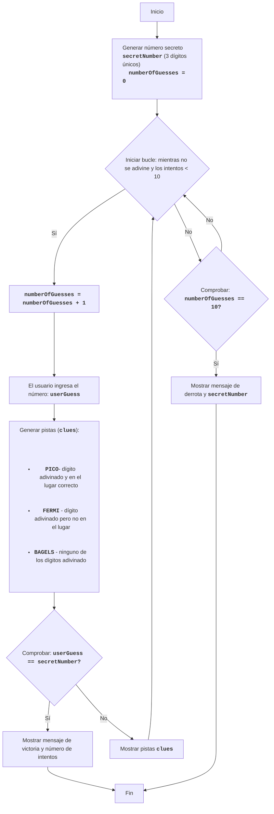

BAGLES:
=================
Dificultad: 6
-----------------
El juego "Bagels" es un juego de lógica y rompecabezas en el que el jugador intenta adivinar un número de tres dígitos compuesto por dígitos únicos. Después de cada intento, el jugador recibe pistas: "PICO" significa que uno de los dígitos ha sido adivinado y está en la posición correcta, "FERMI" significa que uno de los dígitos ha sido adivinado pero no está en la posición correcta, "BAGELS" significa que ninguno de los dígitos ha sido adivinado.

Reglas del juego:
1. La computadora genera un número aleatorio de tres dígitos compuesto por dígitos únicos.
2. El jugador ingresa sus suposiciones como un número de tres dígitos.
3. La computadora proporciona pistas:
    - "PICO" - un dígito ha sido adivinado y está en la posición correcta.
    - "FERMI" - un dígito ha sido adivinado pero no está en la posición correcta.
    - "BAGELS" - ninguno de los dígitos ha sido adivinado.
4. Las pistas se dan en el orden de los dígitos en el número oculto, por ejemplo, si el número oculto es `123` y el jugador ingresó `142`, las pistas serán `PICO FERMI`.
5. El juego continúa hasta que el jugador adivina el número.
6. Si después de 10 intentos el jugador no adivina el número, el juego termina y se muestra el número oculto.
-----------------
Algoritmo:
1. Generar un número aleatorio de tres dígitos que conste de dígitos únicos (por ejemplo, 123).
2. Establecer el número de intentos en 0.
3. Bucle "mientras el número no sea adivinado o el número de intentos sea menor que 10":
    3.1. Incrementar el número de intentos en 1.
    3.2. Solicitar al jugador un número de tres dígitos.
    3.3. Comparar el número ingresado con el oculto y generar pistas "PICO", "FERMI" y "BAGELS".
    3.4. Si se adivina el número, mostrar un mensaje de victoria y el número de intentos.
    3.5. Si no se adivina el número, mostrar las pistas generadas.
4. Si después de 10 intentos el número no se adivina, mostrar el número oculto y un mensaje de derrota.
5. Fin del juego.
-----------------
Diagrama de flujo:

Leyenda:
    Start - Inicio del juego.
    GenerateSecretNumber - Generar número secreto secretNumber a partir de 3 dígitos únicos e inicializar numberOfGuesses = 0.
    LoopStart - Inicio del bucle, que continúa hasta que se adivina el número y el número de intentos es menor que 10.
    IncreaseGuesses - Incrementar el contador de intentos en 1.
    InputGuess - Solicitar al usuario que ingrese un número y guardarlo en la variable userGuess.
    GenerateClues - Generar pistas basándose en la comparación de userGuess y secretNumber.
    CheckWin - Comprobar si el número ingresado userGuess es igual al número secreto secretNumber.
    OutputWin - Mostrar un mensaje de victoria y el número de intentos.
    End - Fin del juego.
    OutputClues - Mostrar las pistas generadas.
    CheckLose - Comprobar si el número de intentos ha llegado a 10.
    OutputLose - Mostrar un mensaje de derrota y el número secreto secretNumber.
