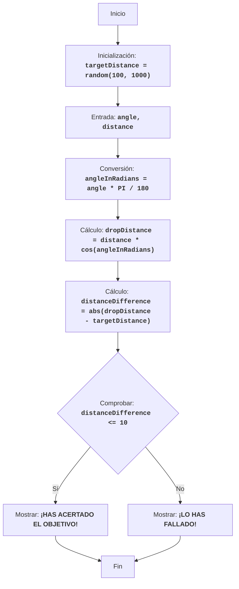

BOMBER:
=================
Dificultad: 5
-----------------
El juego "Bomber" es un juego de rompecabezas en el que el jugador intenta lanzar una bomba sobre un objetivo ubicado a una distancia generada aleatoriamente. El jugador ingresa el ángulo de lanzamiento y la distancia, y la computadora calcula la trayectoria de la bomba. El objetivo del juego es acertar el objetivo con la mayor precisión posible.

Reglas del juego:
1. La computadora genera una distancia objetivo aleatoria en el rango de 100 a 1000.
2. El jugador ingresa el ángulo de lanzamiento de la bomba y la distancia de lanzamiento.
3. La computadora calcula la distancia a la que caerá la bomba.
4. Si la distancia de caída de la bomba está dentro de las 10 unidades de la distancia objetivo, el jugador gana.
5. Si la distancia de caída de la bomba no está dentro del rango, el jugador pierde.
-----------------
Algoritmo:
1. Generar una distancia objetivo aleatoria en el rango de 100 a 1000 y asignarla a la variable `targetDistance`.
2. Solicitar al jugador el ángulo de lanzamiento de la bomba en grados (ángulo) y la distancia de lanzamiento (distancia).
3. Convertir el ángulo de grados a radianes `angleInRadians = angle * 3.14159 / 180`.
4. Calcular la distancia de caída de la bomba usando la fórmula: `dropDistance = distance * cos(angleInRadians)`.
5. Calcular la diferencia entre la distancia de caída de la bomba y la distancia objetivo: `distanceDifference = abs(dropDistance - targetDistance)`.
6. Si la diferencia de distancia es menor o igual a 10, mostrar un mensaje de victoria.
7. De lo contrario, mostrar un mensaje de derrota.
8. Fin del juego.
-----------------
Diagrama de flujo:

Leyenda:
   Start - Inicio del programa.
    InitializeTargetDistance - Inicialización: se genera una distancia objetivo aleatoria (targetDistance) de 100 a 1000.
    InputAngleDistance - Solicitar al usuario el ángulo de lanzamiento (angle) y la distancia de lanzamiento (distance).
    ConvertAngle - Convertir el ángulo de grados a radianes (angleInRadians).
    CalculateDropDistance - Calcular la distancia de caída de la bomba (dropDistance) basándose en los datos introducidos.
    CalculateDistanceDifference - Calcular la diferencia absoluta entre la distancia de caída de la bomba (dropDistance) y la distancia objetivo (targetDistance).
    CheckDistanceDifference - Comprobar si la diferencia de distancia es menor o igual a 10 unidades (distanceDifference <= 10).
    OutputWin - Mostrar un mensaje de victoria si la diferencia es menor o igual a 10 unidades.
    End - Fin del programa.
    OutputLose - Mostrar un mensaje de derrota si la diferencia es mayor de 10 unidades.