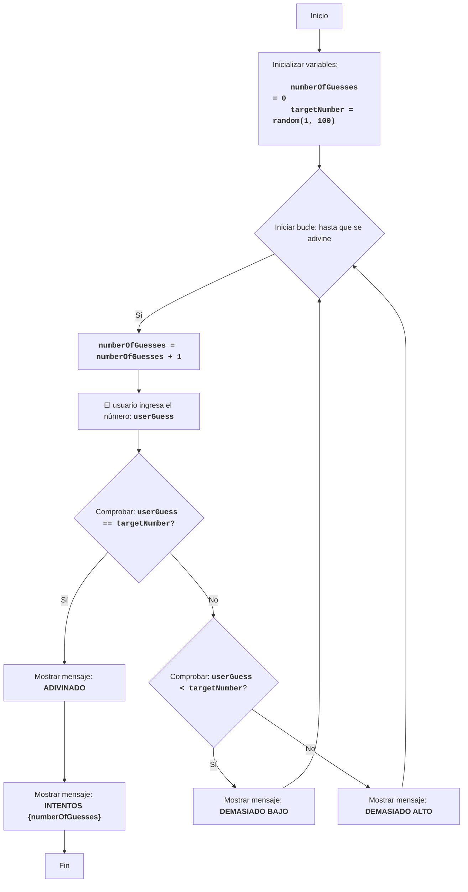

BUZZWD:
=================
Dificultad: 4
-----------------
El juego "BUZZWD" es un juego de números simple donde la computadora genera un número aleatorio, y el jugador debe adivinarlo ingresando números por turno. Después de cada entrada, el programa informa si el número ingresado es "demasiado alto", "demasiado bajo" o si ha sido adivinado. El juego termina cuando el jugador adivina correctamente el número.

Reglas del juego:
1. La computadora selecciona un número entero aleatorio del 1 al 100.
2. El jugador ingresa sus suposiciones para el número oculto.
3. Después de cada intento, la computadora informa si el número ingresado fue demasiado bajo, demasiado alto o adivinado.
4. El juego continúa hasta que el jugador adivina el número oculto.
-----------------
Algoritmo:
1.  Establecer el contador de intentos en 0.
2.  Generar un número aleatorio en el rango del 1 al 100.
3.  Iniciar un bucle "mientras el número no sea adivinado":
    3.1 Incrementar el contador de intentos en 1.
    3.2 Solicitar al jugador que ingrese un número.
    3.3 Si el número ingresado es igual al número oculto, mostrar "ADIVINADO" e ir al paso 4.
    3.4 Si el número ingresado es menor que el número oculto, mostrar "DEMASIADO BAJO".
    3.5 Si el número ingresado es mayor que el número oculto, mostrar "DEMASIADO ALTO".
4. Mostrar "INTENTOS {contador de intentos}"
5. Fin del juego.
-----------------
Diagrama de flujo:

Leyenda:
    Start - Inicio del programa.
    InitializeVariables - Inicializar variables: numberOfGuesses (número de intentos) se establece en 0, y targetNumber (número oculto) se genera aleatoriamente del 1 al 100.
    LoopStart - Inicio del bucle, que continúa hasta que se adivina el número.
    IncreaseGuesses - Incrementar el contador de intentos en 1.
    InputGuess - Solicitar al usuario que ingrese un número y guardarlo en la variable userGuess.
    CheckGuess - Comprobar si el número ingresado userGuess es igual al número oculto targetNumber.
    OutputWin - Mostrar mensaje "ADIVINADO" si los números son iguales.
    OutputAttempts - Mostrar mensaje "INTENTOS {numberOfGuesses}", indicando el número de intentos.
    End - Fin del programa.
    CheckLow - Comprobar si el número ingresado userGuess es menor que el número oculto targetNumber.
    OutputLow - Mostrar mensaje "DEMASIADO BAJO" si el número ingresado es menor que el número oculto.
    OutputHigh - Mostrar mensaje "DEMASIADO ALTO" si el número ingresado es mayor que el número oculto.