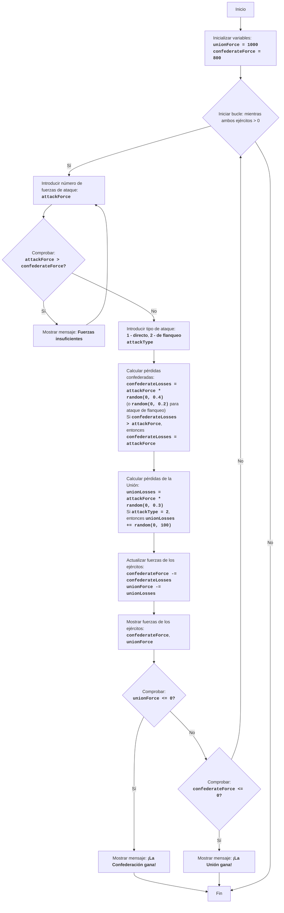

CIVILW:
=================
Dificultad: 7
-----------------
El juego "Guerra Civil" es una simulación de una batalla entre dos ejércitos: la Confederación y la Unión. El jugador controla la Confederación y toma decisiones sobre el número de sus tropas y el tipo de ataques (ataque directo o maniobra de flanqueo). El objetivo del juego es derrotar al ejército de la Unión, minimizando sus propias pérdidas. El juego tiene en cuenta factores aleatorios que afectan el resultado de la batalla, lo que hace que cada batalla sea única.

Reglas del juego:
1.  El jugador controla el ejército de la Confederación y debe derrotar al ejército de la Unión.
2.  El jugador ingresa el número de soldados que quiere enviar al ataque.
3.  El jugador elige el tipo de ataque: directo (1) o de flanqueo (2).
4.  Dependiendo de la elección del jugador y de factores aleatorios, se calculan las pérdidas para ambos bandos.
5.  Después de cada batalla, el juego muestra la fuerza actual de las tropas de ambos bandos.
6.  El juego termina con la victoria de uno de los bandos cuando la fuerza de las tropas del enemigo es igual o menor que 0.
-----------------
Algoritmo:
1. Establecer la fuerza inicial del ejército de la Unión (UnionForce) en 1000 y del ejército de la Confederación (ConfederateForce) en 800.
2. Iniciar un bucle "mientras ambos ejércitos tengan una fuerza mayor que 0":
    2.1. Solicitar al jugador el número de soldados que quiere enviar al ataque (AttackForce).
        2.1.1. Si AttackForce es mayor que las fuerzas confederadas disponibles (ConfederateForce), mostrar "Fuerzas insuficientes" y volver al principio del paso 2.1.
    2.2. Solicitar al jugador el tipo de ataque: directo (1) o de flanqueo (2) (AttackType).
    2.3. Calcular las pérdidas confederadas (ConfederateLosses) aleatoriamente, multiplicando AttackForce por un número aleatorio de 0 a 0.4 (para ataque directo) o por un número aleatorio de 0 a 0.2 (para maniobra de flanqueo).
        2.3.1. Si ConfederateLosses es mayor que AttackForce, establecer ConfederateLosses igual a AttackForce.
    2.4. Calcular las pérdidas de la Unión (UnionLosses) aleatoriamente, multiplicando AttackForce por un número aleatorio de 0 a 0.3.
        2.4.1. Si AttackType es 2, aumentar UnionLosses en un número aleatorio de 0 a 100.
    2.5. Actualizar las fuerzas de los ejércitos:
        ConfederateForce = ConfederateForce - ConfederateLosses
        UnionForce = UnionForce - UnionLosses
    2.6. Mostrar la fuerza actual de las tropas de ambos bandos.
    2.7. Comprobar la condición de victoria:
        2.7.1. Si UnionForce es menor o igual a 0, mostrar "¡La Confederación gana!" y terminar el juego.
        2.7.2. Si ConfederateForce es menor o igual a 0, mostrar "¡La Unión gana!" y terminar el juego.
3. Fin del juego.
-----------------
Diagrama de flujo:

    
Leyenda:
    Start - Inicio del programa.
    InitializeForces - Inicialización de las fuerzas iniciales de las tropas de la Unión (unionForce = 1000) y de la Confederación (confederateForce = 800).
    LoopStart - Inicio del bucle, que continúa mientras ambos ejércitos tengan una fuerza mayor que 0.
    InputAttackForce - Solicitar al jugador el número de soldados para el ataque (attackForce).
    CheckForce - Comprobar si la Confederación tiene suficientes fuerzas para el ataque (attackForce > confederateForce).
    OutputInsufficient - Mostrar mensaje "Fuerzas insuficientes", si las fuerzas atacantes son mayores que las fuerzas disponibles.
    InputAttackType - Solicitar al jugador que elija el tipo de ataque: directo (1) o de flanqueo (2).
    CalculateConfederateLosses - Cálculo de las pérdidas confederadas (confederateLosses) basado en attackForce y el tipo de ataque, considerando un factor aleatorio. Si las pérdidas exceden attackForce, las pérdidas se establecen igual a attackForce.
    CalculateUnionLosses - Cálculo de las pérdidas de la Unión (unionLosses) basado en attackForce y el tipo de ataque, considerando un factor aleatorio. Para un ataque de flanqueo, las pérdidas de la Unión se incrementan adicionalmente en un número aleatorio.
    UpdateForces - Actualización de las fuerzas de ambos ejércitos después de la batalla.
    OutputForces - Mostrar las fuerzas actuales de los ejércitos confederado y de la Unión.
    CheckUnionWin - Comprobar si la Confederación ganó (fuerza del ejército de la Unión <= 0).
    OutputConfederateWin - Mostrar mensaje sobre la victoria de la Confederación.
    CheckConfederateWin - Comprobar si la Unión ganó (fuerza del ejército de la Confederación <= 0).
    OutputUnionWin - Mostrar mensaje sobre la victoria de la Unión.
    End - Fin del programa.