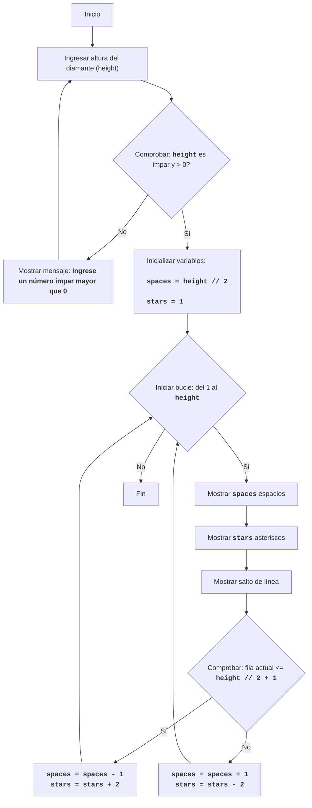

DIAMND:
=================
Dificultad: 7
-----------------
El juego DIAMND es un juego basado en texto donde el jugador intenta dibujar un diamante de asteriscos especificando su altura.
El juego primero le pide al usuario una altura de diamante impar. Luego, si el número ingresado es impar, el juego construye un diamante de asteriscos, usando espacios para formar la geometría correcta de la figura. Si el número ingresado es par o menor que 1, se muestra un mensaje de error.
Reglas del juego:
1. El jugador ingresa un número impar que determina la altura del diamante.
2. Si se ingresa un número par o un número menor que 1, el juego muestra un mensaje de error.
3. Si se ingresa un número correcto (impar y mayor que 0), el juego muestra un diamante de asteriscos de la altura especificada.
-----------------
Algoritmo:
1. Solicitar al usuario la altura del diamante (H).
2. Comprobar si H es par o menor que 1. Si es así, mostrar un mensaje de error y pasar al paso 1.
3. Si H es impar y mayor que 0, entonces:
   3.1. Establecer la variable `space` en H // 2 (división entera).
   3.2. Establecer la variable `stars` en 1.
   3.3. Iniciar un bucle del 1 al H inclusive:
      3.3.1. Imprimir `space` espacios.
      3.3.2. Imprimir `stars` asteriscos.
      3.3.3. Imprimir un salto de línea.
      3.3.4. Si el número de fila actual es menor que H // 2 + 1:
          3.3.4.1. Disminuir `space` en 1.
          3.3.4.2. Aumentar `stars` en 2.
       3.3.5. De lo contrario:
          3.3.5.1. Aumentar `space` en 1.
          3.3.5.2. Disminuir `stars` en 2.
4. Fin del juego.
-----------------
Diagrama de flujo:

Leyenda:
    Start - Inicio del programa.
    InputHeight - Solicitar al usuario la altura del diamante y guardar el valor en la variable `height`.
    CheckHeight - Comprobar si la altura ingresada es un número impar mayor que 0.
    OutputError - Mostrar un mensaje de error si la altura no cumple la condición.
    InitializeVars - Inicializar variables: `spaces` (número de espacios) se establece en `height // 2`, y `stars` (número de asteriscos) se establece en 1.
    LoopStart - Inicio del bucle, que se repite `height` veces.
    OutputSpaces - Mostrar `spaces` espacios.
    OutputStars - Mostrar `stars` asteriscos.
    OutputNewline - Mostrar un carácter de nueva línea.
    CheckRow - Comprobar si la fila actual es menor o igual a la mitad del diamante (`height // 2 + 1`).
    DecreaseSpaceIncreaseStars - Disminuir el número de espacios `spaces` en 1 y aumentar el número de asteriscos `stars` en 2.
    IncreaseSpaceDecreaseStars - Aumentar el número de espacios `spaces` en 1 y disminuir el número de asteriscos `stars` en 2.
    End - Fin del programa.