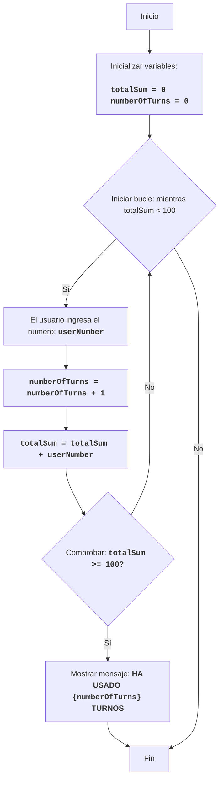

FIPFOP:
=================
Dificultad: 5
-----------------
El juego FIPFOP es un juego de rompecabezas donde el jugador debe, a su vez, ingresar números.
El objetivo del juego es lograr que todos los números ingresados por el usuario sumen 100.
El juego termina cuando la suma de todos los números ingresados llega a 100.

Reglas del juego:
1. El jugador ingresa números enteros, uno a la vez.
2. Cada número ingresado se agrega a la suma total.
3. El juego termina cuando la suma total llega a 100.
4. Una vez finalizado el juego, se muestra el número total de números ingresados (turnos).
-----------------
Algoritmo:
1. Establecer la suma en 0.
2. Establecer el contador de turnos en 0.
3. Iniciar el bucle "mientras la suma sea menor que 100":
    3.1 Solicitar al jugador que ingrese un número.
    3.2 Incrementar el contador de turnos en 1.
    3.3 Sumar el número ingresado a la suma total.
4. Mostrar el mensaje "HA USADO {número de turnos} TURNOS"
5. Fin del juego.
-----------------
Diagrama de flujo:

Leyenda:
    Start - Inicio del programa.
    InitializeVariables - Inicializar variables: totalSum (suma de los números ingresados) se establece en 0, y numberOfTurns (número de turnos) se establece en 0.
    LoopStart - Inicio del bucle, que continúa mientras totalSum sea menor que 100.
    InputNumber - Solicitar al usuario que ingrese un número y guardarlo en la variable userNumber.
    IncreaseTurns - Incrementar el contador de turnos en 1.
    AddNumber - Sumar el número ingresado userNumber a la suma total totalSum.
    CheckSum - Comprobar si la suma total totalSum es mayor o igual a 100.
    OutputTurns - Mostrar un mensaje sobre el número de turnos utilizados por el usuario.
    End - Fin del programa.

# Inicialización de la suma y el contador de turnos
totalSum = 0 # Suma de los números ingresados
numberOfTurns = 0 # Número de turnos

# Bucle principal del juego
while totalSum < 100:
    # Solicitar entrada de número al usuario
    try:
        userNumber = int(input("Ingrese un número: "))
    except ValueError:
         print("Por favor, ingrese un número entero.")
         continue
    
    # Incrementar el contador de turnos
    numberOfTurns += 1
    # Sumar el número ingresado a la suma total
    totalSum += userNumber

# Mostrar mensaje sobre el número de turnos
print(f"HA USADO {numberOfTurns} TURNOS")

Explicación del código:
1. **Inicialización de variables:**
   - `totalSum = 0`: Inicializa la variable `totalSum` para almacenar la suma de los números ingresados, comenzando desde 0.
   - `numberOfTurns = 0`: Inicializa la variable `numberOfTurns` para contar el número de turnos, también comenzando desde 0.
2. **Bucle principal `while totalSum < 100`:**
   -  El bucle continúa mientras la suma de los números ingresados (`totalSum`) sea menor que 100.
3. **Entrada de datos del usuario:**
    - `try...except ValueError`: El bloque try-except maneja posibles errores de entrada. Si el usuario ingresa un valor no entero, se mostrará un mensaje de error.
   - `userNumber = int(input("Ingrese un número: "))`: Solicita al usuario que ingrese un número y lo convierte a un número entero, guardando el resultado en la variable `userNumber`.
4. **Incremento del contador de turnos:**
   - `numberOfTurns += 1`: Incrementa el contador de turnos en 1 en cada iteración del bucle.
5.  **Agregar número a la suma:**
   -  `totalSum += userNumber`: Suma el número ingresado (`userNumber`) a la suma total (`totalSum`).
6.  **Mostrar resultado:**
    - `print(f"HA USADO {numberOfTurns} TURNOS")`: Muestra un mensaje en la pantalla sobre cuántos turnos se realizaron cuando la suma de los números alcanzó 100 o más.
