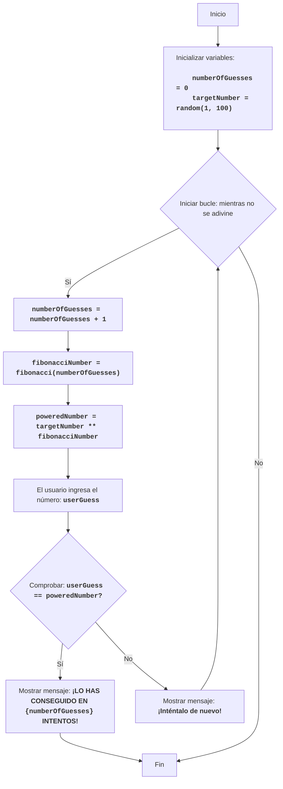

FIPOWR:
=================
Dificultad: 6
-----------------
El juego "Potencia de Fibonacci" es un juego matemático donde la computadora elige un número aleatorio en el rango de 1 a 100, y el jugador ingresa un número.
La computadora eleva el número elegido aleatoriamente a la potencia del número de Fibonacci correspondiente al número de intento, y lo compara con el número del usuario.
El juego continúa hasta que los números son iguales.
Reglas del juego:
1. La computadora elige un número entero aleatorio del 1 al 100.
2. El jugador ingresa su número.
3. La computadora calcula el número de Fibonacci correspondiente al número de intento, y eleva el número aleatorio a esa potencia.
4. Compara el resultado obtenido con el número del jugador.
5. El juego continúa hasta que los números son iguales.
-----------------
Algoritmo:
1. Establecer el contador de intentos en 0.
2. Generar un número aleatorio en el rango de 1 a 100.
3. Iniciar un bucle "mientras el número del jugador no sea igual al número elevado a la potencia de Fibonacci":
    3.1. Incrementar el contador de intentos en 1.
    3.2. Calcular el número de Fibonacci correspondiente al número de intento.
    3.3. Elevar el número aleatorio a la potencia del número de Fibonacci.
    3.4. Solicitar al jugador un número.
    3.5. Si el número del jugador es igual al número calculado, ir al paso 4.
    3.6. Si el número del jugador no es igual al número calculado, mostrar un mensaje sobre el estado actual.
4. Mostrar el mensaje "¡LO HAS CONSEGUIDO EN {número de intentos} INTENTOS!"
5. Fin del juego.
-----------------
Diagrama de flujo:

Leyenda:
    Start - Inicio del programa.
    InitializeVariables - Inicializar variables: numberOfGuesses (número de intentos) se establece en 0, y targetNumber (número oculto) se genera aleatoriamente del 1 al 100.
    LoopStart - Inicio del bucle, que continúa hasta que se adivina el número.
    IncreaseGuesses - Incrementar el contador de intentos en 1.
    CalculateFibonacci - Calcular el número de Fibonacci correspondiente al intento actual.
    CalculatePower - Elevar el número oculto a la potencia del número de Fibonacci.
    InputGuess - Solicitar al usuario que ingrese un número y guardarlo en la variable userGuess.
    CheckGuess - Comprobar si el número ingresado userGuess es igual al número calculado poweredNumber.
    OutputWin - Mostrar un mensaje de victoria si los números son iguales, indicando el número de intentos.
    End - Fin del programa.
    OutputTryAgain - Mostrar mensaje "¡Inténtalo de nuevo!" si el número ingresado no es igual al número calculado.

import random

# Función para calcular el número de Fibonacci
def fibonacci(n):
    if n <= 0:
        return 0
    elif n == 1:
        return 1
    else:
        a, b = 0, 1
        for _ in range(2, n + 1):
            a, b = b, a + b
        return b

# Inicializar contador de intentos
numberOfGuesses = 0
# Generar un número aleatorio del 1 al 100
targetNumber = random.randint(1, 100)

# Bucle principal del juego
while True:
    # Incrementar contador de intentos
    numberOfGuesses += 1
    # Calcular número de Fibonacci para el intento actual
    fibonacciNumber = fibonacci(numberOfGuesses)
    # Elevar el número oculto a la potencia del número de Fibonacci
    poweredNumber = targetNumber ** fibonacciNumber

    # Solicitar entrada de número al usuario
    try:
        userGuess = int(input(f"Intento {numberOfGuesses}: Ingrese un número: "))
    except ValueError:
         print("Por favor, ingrese un número entero.")
         continue

    # Comprobar si el número es adivinado
    if userGuess == poweredNumber:
        print(f"¡FELICIDADES! ¡Adivinaste el número en {numberOfGuesses} intentos!")
        break  # Terminar el bucle si se adivina el número
    else:
         print("¡Inténtalo de nuevo!") # Mostrar mensaje para intentarlo de nuevo

Explicación del código:
1.  **Importar módulo `random`**:
   -  `import random`: Importa el módulo `random`, que se utiliza para generar un número aleatorio.
2.  **Función `fibonacci(n)`**:
    -   Define la función `fibonacci(n)`, que calcula el n-ésimo número de Fibonacci.
    -   Utiliza un enfoque iterativo para calcular los números de Fibonacci.
3.  **Inicialización de variables**:
    -   `numberOfGuesses = 0`: Inicializa la variable `numberOfGuesses` para contar los intentos del jugador.
    -   `targetNumber = random.randint(1, 100)`: Genera un número entero aleatorio en el rango de 1 a 100 y lo guarda en `targetNumber`.
4. **Bucle principal `while True:`**:
    - Un bucle infinito que continúa hasta que el jugador adivina el número (se ejecutará el comando `break`).
    - `numberOfGuesses += 1`: Incrementa el contador de intentos en 1 en cada nueva iteración del bucle.
    - `fibonacciNumber = fibonacci(numberOfGuesses)`: Llama a la función `fibonacci` para obtener el número de Fibonacci correspondiente al intento actual.
    - `poweredNumber = targetNumber ** fibonacciNumber`: Calcula el número oculto elevado a la potencia del número de Fibonacci.
    - **Entrada**:
       - `try...except ValueError`: El bloque try-except maneja posibles errores de entrada. Si el usuario ingresa un valor no entero, se mostrará un mensaje de error.
       - `userGuess = int(input(f"Intento {numberOfGuesses}: Ingrese un número: "))`: Solicita al usuario un número y lo convierte a un número entero, guardando el resultado en `userGuess`.
    - **Condición de victoria**:
      -  `if userGuess == poweredNumber:`: Comprueba si el número ingresado es igual al valor calculado.
      -  `print(f"¡FELICIDADES! ¡Adivinaste el número en {numberOfGuesses} intentos!")`: Muestra un mensaje de victoria y el número de intentos.
      - `break`: Termina el bucle (y el juego) si se adivina el número.
    -  **Pista**:
       - `else:`: Si el número no se adivina, se muestra el mensaje "¡Inténtalo de nuevo!".
