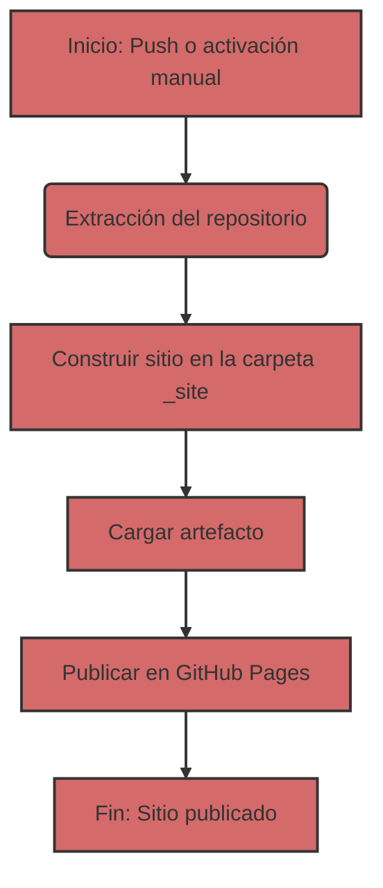

## Despliegue automatizado de Jekyll en GitHub Pages

Para automatizar el proceso de despliegue, utilizaremos GitHub Actions, que le permiten realizar diversas tareas, incluida la construcción y publicación de sitios web, directamente en su repositorio.

### 1: Resumen del archivo de flujo de trabajo
Primero, veamos el archivo de flujo de trabajo principal que controla el proceso de construcción y despliegue. Este archivo está escrito en YAML y generalmente se encuentra en el directorio `.github/workflows`. Aquí está su contenido:

```yaml
# Sample workflow for building and deploying a Jekyll site to GitHub Pages
name: Deploy Jekyll with GitHub Pages dependencies preinstalled

on:
  # Runs on pushes targeting the default branch
  push:
    branches: ["master"]

  # Allows you to run this workflow manually from the Actions tab
  workflow_dispatch:

# Sets permissions of the GITHUB_TOKEN to allow deployment to GitHub Pages
permissions:
  contents: read
  pages: write
  id-token: write

# Allow only one concurrent deployment, skipping runs queued between the run in-progress and latest queued.
# However, do NOT cancel in-progress runs as we want to allow these production deployments to complete.
concurrency:
  group: "pages"
  cancel-in-progress: false

jobs:
  # Build job
  build:
    runs-on: ubuntu-latest
    steps:
      - name: Checkout
        uses: actions/checkout@v4
      - name: Setup Pages
        uses: actions/configure-pages@v5
      - name: Build with Jekyll
        uses: actions/jekyll-build-pages@v1
        with:
          source: ./docs/gemini/consultant/ru/src
          destination: ./_site
      - name: Upload artifact
        uses: actions/upload-pages-artifact@v3

  # Deployment job
  deploy:
    environment:
      name: github-pages
      url: ${{ steps.deployment.outputs.page_url }}
    runs-on: ubuntu-latest
    needs: build
    steps:
      - name: Deploy to GitHub Pages
        id: deployment
        uses: actions/deploy-pages@v4
```

### 2: Desglose de la estructura del flujo de trabajo
Ahora, desglosemos cada sección de este archivo:

#### 2.1. Información general

-   `name: Deploy Jekyll with GitHub Pages dependencies preinstalled`: El nombre del flujo de trabajo que verá en la lista de Acciones en el repositorio.
-   `on`: Describe cuándo debe ejecutarse el flujo de trabajo:
    -   `push`: El flujo de trabajo se ejecuta en cada push a la rama `master`.
    -   `workflow_dispatch`: Le permite ejecutar manualmente el flujo de trabajo a través de la interfaz de GitHub.
-   `permissions`: Configura los permisos para la ejecución del flujo de trabajo:
    -   `contents: read`: Permiso para leer código del repositorio.
    -   `pages: write`: Permiso para publicar en GitHub Pages.
    -   `id-token: write`: Permiso para obtener un token de autenticación (requerido para GitHub Actions).
-   `concurrency`: Configura la ejecución concurrente del flujo de trabajo:
    -   `group: "pages"`: Asegura que solo un flujo de trabajo para GitHub Pages se ejecute a la vez.
    -   `cancel-in-progress: false`: Evita cancelar la ejecución actual del flujo de trabajo cuando se inicia uno nuevo.

#### 2.2. Sección `jobs`
Esta sección describe qué tareas deben realizarse. Tenemos dos trabajos: `build` y `deploy`.

##### 2.2.1. `build`: Construcción del sitio
    -   `runs-on: ubuntu-latest`: Especifica que el trabajo se ejecuta en un servidor Ubuntu.
    -   `steps`: Enumera los pasos que se realizan durante la construcción:
        -   `name: Checkout`: Extrae el código fuente del repositorio.
        -   `uses: actions/checkout@v4`: Utiliza una acción preconstruida para extraer el código.
        -   `name: Setup Pages`: Configura el entorno para trabajar con GitHub Pages.
        -    `uses: actions/configure-pages@v5`: Utiliza una acción preconstruida para la configuración.
        -   `name: Build with Jekyll`: Inicia la construcción del sitio Jekyll.
        -   `uses: actions/jekyll-build-pages@v1`: Utiliza una acción preconstruida para la construcción.
        -   `with:`: Configura los parámetros de la acción:
            -   `source: ./docs/gemini/consultant/ru/src`: Especifica dónde se encuentran los archivos fuente de su sitio. **Nota**: la ruta a sus archivos `docs/gemini/consultant/ru/src`.
            -    `destination: ./_site`: Especifica dónde colocar los archivos construidos.
        -   `name: Upload artifact`: Carga los archivos construidos para pasarlos al siguiente trabajo.
        -   `uses: actions/upload-pages-artifact@v3`: Utiliza una acción preconstruida para cargar artefactos.
    
##### 2.2.2. `deploy`: Publicación del sitio
    -   `environment`: Configura el entorno de publicación.
        -  `name: github-pages`: Nombre del entorno.
        -   `url: ${{ steps.deployment.outputs.page_url }}`: Obtiene la URL del sitio publicado.
    -   `runs-on: ubuntu-latest`: Especifica que el trabajo se ejecuta en un servidor Ubuntu.
    -   `needs: build`: Especifica que el trabajo `deploy` debe ejecutarse después de que el trabajo `build` se complete con éxito.
    -   `steps`: Enumera los pasos que se realizan durante la publicación:
        -   `name: Deploy to GitHub Pages`: Publica el sitio en GitHub Pages.
        -   `id: deployment`: Establece el ID para la acción.
        -    `uses: actions/deploy-pages@v4`: Utiliza una acción preconstruida para el despliegue.

### 3: ¿Qué hacen los archivos Markdown?

Los archivos `.md` (Markdown) son la base de un sitio Jekyll. Markdown es un lenguaje de marcado simple que le permite formatear texto.
Jekyll procesa automáticamente los archivos `.md`, convirtiéndolos en páginas HTML. Sus archivos deben estar ubicados en la carpeta `docs/gemini/consultant/ru/src` especificada en el flujo de trabajo.

### 4: Diagrama de flujo




### 5: Cómo funciona
1.  **Cambio de código:** Realiza cambios en sus archivos `.md` o `.html` ubicados en la carpeta `docs/gemini/consultant/ru/src`.
2.  **Push:** Envía (push) sus cambios a la rama `master` de su repositorio de GitHub.
3.  **Activación del flujo de trabajo:** GitHub Actions activa automáticamente el flujo de trabajo descrito en el archivo YAML.
4.  **Construcción:** El flujo de trabajo primero descarga el código del repositorio, luego construye el sitio Jekyll a partir de sus archivos fuente en la carpeta `_site`.
5.  **Publicación:** El sitio construido se publica en GitHub Pages.
6.  **Sitio listo:** Su sitio estará disponible en la URL especificada en la configuración de sus GitHub Pages.
