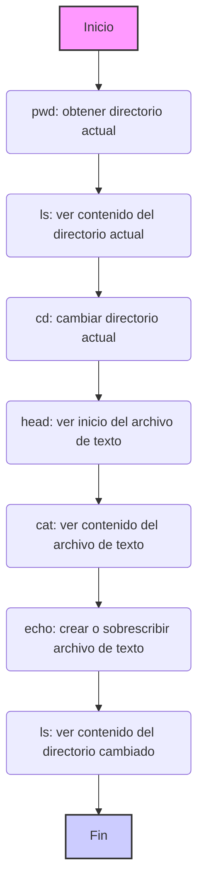

¿Qué es Google Colab?

Google Colab es una plataforma basada en la nube, creada por Google, para trabajar con cuadernos interactivos de Jupyter.
Proporciona potentes herramientas para escribir y ejecutar código Python, analizar datos, entrenar modelos de aprendizaje automático y colaborar en proyectos.

Colab proporciona acceso a potentes recursos informáticos, incluidas unidades de procesamiento gráfico (GPU) y unidades de procesamiento de tensores (TPU).
Esto le permite resolver problemas complejos, como el procesamiento de grandes volúmenes de datos o el entrenamiento de redes neuronales, sin necesidad de adquirir hardware costoso. Colab está construido sobre Jupyter Notebook, lo que proporciona una interfaz conveniente para trabajar con código, texto y visualizaciones. Puede ejecutar celdas de código, insertar texto explicativo, crear gráficos y visualizaciones directamente en su navegador. Puede usar Colab inmediatamente después de abrirlo. No es necesario instalar programas, bibliotecas o controladores adicionales. Todo ya está configurado para funcionar. Puede conectar su Google Drive, lo que le permite cargar datos fácilmente, guardar proyectos y acceder a archivos desde cualquier lugar. Colab admite el trabajo colaborativo. Puede compartir sus proyectos con colegas, editar cuadernos simultáneamente y discutir cambios en tiempo real.


### ¿Cómo funciona Google Colab?
- Ejecuta un cuaderno de Jupyter en su navegador, lo que elimina la necesidad de instalar un entorno local.
- El código se ejecuta en los servidores remotos de Google y los resultados se muestran en su cuaderno.
- Los datos se pueden cargar desde un dispositivo local o desde la nube, como Google Drive.
- Puede usar Colab para escribir código Python, trabajar con bibliotecas de aprendizaje automático (por ejemplo, TensorFlow, PyTorch), analizar datos usando Pandas o crear visualizaciones a través de Matplotlib y Seaborn.


¿Cómo se ve Google Colab?


La interfaz de Colab consta de varias partes principales:

Celdas de código: Estas son las celdas donde escribirá y ejecutará su código Python.

Celdas de texto: Aquí puede agregar descripciones, explicaciones y notas a su código.

Menú: En la parte superior hay un menú con varias opciones para trabajar con el cuaderno (archivo, editar, ver, herramientas, etc.).

Administrador de archivos: A la izquierda hay un panel de administrador de archivos donde puede ver archivos y carpetas en su entorno de Colab.


En Google Colab, trabaja en un entorno en la nube,
donde el sistema de archivos está organizado como en una computadora normal con carpetas y archivos.
Colab proporciona herramientas para navegar, crear, ver y editar archivos.
Puede interactuar con el sistema de archivos usando **comandos mágicos de Jupyter** (que comienzan con `%`)
y **comandos bash** (que comienzan con `!`).

**Lista de comandos básicos:**

1.  **`%pwd`** (print working directory):
    *   **Descripción**: Muestra el directorio de trabajo actual (donde se encuentra actualmente en el sistema de archivos).
    *   **Ejemplo**: `%pwd`
    *   **Resultado**: `/content` (o cualquier otro directorio actual)

2.  **`%ls`** (list):
    *   **Descripción**: Lista archivos y carpetas en el directorio actual.
    *   **Ejemplo**: `%ls`
    *   **Resultado**: Lista de archivos y carpetas, por ejemplo: `sample_data/  my_file.txt`

3.  **`%cd <ruta>`** (change directory):
    *   **Descripción**: Cambia al directorio especificado.
    *   **Ejemplo**: `%cd sample_data`
    *   **Resultado**: El directorio de trabajo actual cambia a `/content/sample_data`

4.  **`!head -<número de líneas> <nombre_archivo>`**:
    *   **Descripción**: Muestra las primeras líneas del archivo de texto especificado.
    *   **Ejemplo**: `!head -5 README.md`
    *   **Resultado**: Las primeras 5 líneas del archivo `README.md`.

5.  **`!cat <nombre_archivo>`**:
    *   **Descripción**: Muestra el contenido del archivo de texto especificado.
    *   **Ejemplo**: `!cat sample_file.txt`
    *   **Resultado**: Todo el contenido del archivo `sample_file.txt`.

6.   **`!echo "<texto>" > <nombre_archivo>`**
    *   **Descripción:** Crea un nuevo archivo con el nombre especificado y escribe texto en él. Si el archivo ya existe, se sobrescribirá.
    *   **Ejemplo:** `!echo "¡Este es mi nuevo archivo!" > new_file.txt`
    *   **Resultado:** Crea `new_file.txt` con el contenido `¡Este es mi nuevo archivo!`.

**Puntos clave:**

*   **Comandos mágicos** (`%`) - estos son comandos especiales de Jupyter para trabajar con el entorno de Colab.
*   **Comandos bash** (`!`) - estos son comandos que se ejecutan en la línea de comandos de Linux.
*   **Ruta del archivo**: La ruta del archivo indica dónde se encuentra exactamente el archivo en el sistema de archivos (por ejemplo, `/content/sample_data/my_file.txt`).
*   **Directorio actual**: Su posición en el sistema de archivos (cambiada por el comando `%cd`).

**Diagrama que ilustra la secuencia de comandos:**



**Carga de archivos a Google Colab**

Hay varias formas de cargar archivos a Colab, y veremos las más comunes.

1.  **Carga a través del administrador de archivos (GUI)**
    *   **Descripción:** La forma más sencilla de cargar archivos, especialmente los pequeños, es usar la interfaz gráfica del administrador de archivos de Colab.
    *   **Cómo hacerlo:**
        1.  Abra el panel del administrador de archivos a la izquierda (icono de carpeta).
        2.  Haga clic en el icono de carga (generalmente un signo más o una flecha hacia arriba).
        3.  En la ventana abierta, seleccione los archivos en su computadora que desea cargar.
        4.  Haga clic en "Abrir" o "Cargar".
    *   **Ventajas:** Simplicidad, claridad, no requiere código.
    *   **Desventajas:** Adecuado para archivos pequeños, debe hacerse manualmente.
   


2.  **Carga a través de código Python (`google.colab.files.upload()`)**
    *   **Descripción**: Este método le permite cargar archivos usando código Python, lo que proporciona más flexibilidad.
    *   **Cómo hacerlo:**
        1.  Importe el módulo `files` de la biblioteca `google.colab`.
           ```python
           from google.colab import files
           ```
        2.  Llame a la función `files.upload()`.
             ```python
             uploaded = files.upload()
             ```
        3.  Cuando ejecute este código, aparecerá un cuadro de diálogo donde podrá seleccionar los archivos para cargar.
    *   **Ventajas:** Se puede usar en código, permite el procesamiento programático de archivos cargados.
    *   **Desventajas:** Requiere escribir código, un poco menos intuitivo que el administrador de archivos.

    Después de ejecutar este código, los archivos cargados estarán disponibles como un diccionario `uploaded`, donde las claves son los nombres de archivo y los valores son su contenido como cadenas de bytes.
    ```python
    # Ejemplo de uso de archivos cargados
    for file_name, file_data in uploaded.items():
       print(f"Archivo: {file_name}")
       # Procesar datos del archivo
       # Por ejemplo:
       # import pandas as pd
       # df = pd.read_csv(io.BytesIO(file_data))
       # print(df.head())
    ```
    


3.  **Clonar repositorio de GitHub (`git clone`)**
    *   **Descripción**: Si sus archivos están en un repositorio de GitHub, puede descargarlos clonando el repositorio en Colab.
    *   **Cómo hacerlo:**
        1.  Use el comando `git clone` con la URL del repositorio.
            ```python
            !git clone <URL_repositorio>
            ```
            Por ejemplo:
           ```python
           !git clone https://github.com/username/my_repository.git
           ```
        2. Después de clonar el repositorio, el contenido estará disponible en una carpeta con el mismo nombre que el repositorio.
    *   **Ventajas:** Fácil de descargar todos los archivos del repositorio, conveniente para proyectos con control de versiones.
    *   **Desventajas:** Solo apto para archivos en repositorios de GitHub.

    
   ```html
<div align="center">
  
  <p><em>Clonación de repositorio de GitHub en Colab</em></p>
</div>
```

4.  **Descargar un solo archivo de GitHub**
     *   **Descripción**: Si solo necesita uno o unos pocos archivos de un repositorio de GitHub, puede descargarlos a través de un enlace directo.
     *   **Cómo hacerlo:**
         1.  Abra el archivo deseado en el repositorio de GitHub.
         2.  Haga clic en el botón "View raw" (o "Vista sin formato").
         3.  Copie la URL de este archivo.
        4.  Use `wget` o `curl` para descargar el archivo.
            ```python
            !wget <URL_archivo>
            ```
           o
             ```python
            !curl <URL_archivo> -o <nombre_archivo_en_colab>
             ```
    *   **Ventajas**: Fácil de descargar solo los archivos necesarios, sin clonar todo el repositorio.
    *   **Desventajas**: Requiere conocer el enlace directo al archivo.


**¿Qué método elegir?**

*   Para archivos pequeños que deben cargarse rápidamente y manualmente, el **administrador de archivos** es adecuado.
*   Si necesita procesar archivos cargados mediante programación, use **`files.upload()`**.
*   Para cargar proyectos completos, use **`git clone`**.
*  Para descargar archivos individuales, use **`wget` o `curl`**
