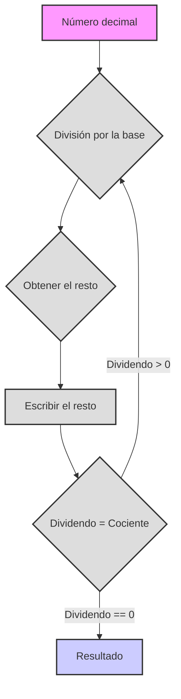

# Sistemas de numeración

¡Hola! Comenzamos nuestra inmersión en el fascinante mundo de los sistemas de numeración. ¡Prepárese, hoy aprenderá muchas cosas nuevas e interesantes!

# Sistemas de numeración

**1. Sistema de numeración abstracto**

Imagine que los números son como palabras que se pueden escribir con diferentes "letras". No importa exactamente cómo denotemos los números, lo principal es que se observen ciertas reglas:

*   **Base:** Es la cantidad de símbolos (dígitos) únicos que usamos. Denotemos la base como `b`. Por ejemplo, en el sistema decimal la base es 10.
*   **Dígitos:** Son los símbolos que usamos para escribir números. Por lo general, son dígitos arábigos (0, 1, 2, 3, ...), pero también pueden ser otros símbolos, por ejemplo, letras latinas (I, V, X) o incluso frutas (🍎, 🍐, 🍉).
*   **Posición:** Cada dígito en la representación de un número tiene su propia posición, lo que afecta su valor. Esto significa que el mismo dígito puede tener un valor diferente dependiendo de dónde se encuentre en el número.
*   **Valores posicionales:** Cada posición se denomina valor posicional (por ejemplo, unidades, decenas, centenas, etc.). En cada posición, el valor del dígito se multiplica por la base elevada a la potencia correspondiente al número del valor posicional.

**¿Cómo se construye un sistema de numeración?**

1.  **Elección de una base:** Elegimos un número entero `b` que será la base de nuestro sistema.
2.  **Elección de dígitos:** Necesitamos `b` dígitos únicos. Por lo general, son 0, 1, 2, ..., `b-1`. Por ejemplo, para el sistema binario (base 2), tenemos los dígitos 0 y 1.
3.  **Escritura de un número:** Un número se escribe como una secuencia de dígitos. El valor de cada dígito se multiplica por la base elevada a la potencia igual a su posición (comenzando desde 0 a la derecha).

**Fórmula para calcular el valor de un número:**

Si tenemos un número escrito como una secuencia de dígitos `dₙ dₙ₋₁ ... d₁ d₀`, su valor en el sistema decimal se puede calcular usando la fórmula:

`valor = dₙ * bⁿ + dₙ₋₁ * bⁿ⁻¹ + ... + d₁ * b¹ + d₀ * b⁰`

Donde:

*   `dᵢ` - dígito en la i-ésima posición
*   `b` - base del sistema de numeración
*   `i` - número de posición (de derecha a izquierda, comenzando desde 0)

**Ejemplo:**

Supongamos que tenemos el número 123 en el sistema decimal (base 10). Según la fórmula:

`1 * 10² + 2 * 10¹ + 3 * 10⁰ = 100 + 20 + 3 = 123₁₀`

**Órdenes de magnitud (posiciones):**

Los órdenes de magnitud, como ya hemos dicho, son las posiciones de los dígitos en un número, cada posición tiene su propio peso, que se determina por la base elevada a la potencia de su número ordinal.
*   `d₀`: unidades (`b⁰`)
*   `d₁`: `b` (`b¹`)
*   `d₂`: `b²`
*   `d₃`: `b³`
*   y así sucesivamente

**Reglas:**

1.  **Rango de dígitos:** Se utilizan dígitos del 0 al `b-1`.
2.  **Principio posicional:** El valor de un dígito depende de su posición.
3.  **Transición al siguiente orden:** Cuando un orden alcanza el valor `b`, se produce un acarreo al siguiente orden (análogo a cómo después de 9 en el sistema decimal, se suma 1 al siguiente orden y se obtiene 10).

## Ejemplo: Sistema de numeración de frutas

Consideremos un ejemplo de un sistema de numeración abstracto con frutas:

*   🍎 (manzana)
*   🍐 (pera)
*   🍉 (melón)
*   🧺 (cesta)

**Reglas:**

1.  3 🍎 = 1 🍐
2.  5 🍐 = 3 🍉
3.  2 🍉 = 1 🧺

**Representación de números:**

Representaremos el número de frutas como una cadena, donde cada carácter Unicode corresponde a una fruta. Por ejemplo, "🍎🍎🍎" son 3 manzanas, y "🍉🍉" son 2 melones.

**Operaciones aritméticas:**

Podemos realizar operaciones de suma y resta. Primero, hagamos la suma.

**Código Python:**

```python
def normalize_fruits(fruits: str) -> str:
    """
    Normaliza una cadena de frutas, reduciéndola a su representación mínima,
    usando reglas de intercambio de frutas.

    Args:
        fruits: Cadena de frutas (🍎, 🍐, 🍉, 🧺).

    Returns:
        Cadena con el recuento de frutas normalizado.
    """
    apples = fruits.count('🍎')
    pears = fruits.count('🍐')
    melons = fruits.count('🍉')
    baskets = fruits.count('🧺')

    # Convertir manzanas a peras
    pears += apples // 3
    apples %= 3

    # Convertir peras a melones
    melons += (pears * 3) // 5
    pears %= 5

    # Convertir melones a cestas
    baskets += melons // 2
    melons %= 2

    # Reensamblar la cadena, cestas primero, luego melones, peras, manzanas
    return (
        "🧺" * baskets
        + "🍉" * melons
        + "🍐" * pears
        + "🍎" * apples
    )


def add_fruits(fruits1: str, fruits2: str) -> str:
    """
    Suma dos cadenas de frutas.

    Args:
        fruits1: Cadena de frutas.
        fruits2: Cadena de frutas.

    Returns:
        Cadena con la suma de las frutas.
    """
    return normalize_fruits(fruits1 + fruits2)


def sub_fruits(fruits1: str, fruits2: str) -> str:
    """
    Resta la segunda cadena de frutas de la primera, si es posible.

    Args:
        fruits1: Cadena de frutas de la que restar.
        fruits2: Cadena de frutas a restar.

    Returns:
        Cadena con la diferencia de frutas o "No se puede restar" si el resultado es negativo.
    """

    apples1 = fruits1.count('🍎')
    pears1 = fruits1.count('🍐')
    melons1 = fruits1.count('🍉')
    baskets1 = fruits1.count('🧺')

    apples2 = fruits2.count('🍎')
    pears2 = fruits2.count('🍐')
    melons2 = fruits2.count('🍉')
    baskets2 = fruits2.count('🧺')


    # Representación temporal como número total de manzanas
    total_apples1 = apples1 + pears1 * 3 + melons1 * 15 // 3 + baskets1 * 30
    total_apples2 = apples2 + pears2 * 3 + melons2 * 15 // 3 + baskets2 * 30

    if total_apples1 < total_apples2:
        return "No se puede restar"
    else:
        total_apples = total_apples1 - total_apples2

    # Devolver la representación normalizada de la suma de manzanas
    result_fruits = ""
    baskets = total_apples // 30
    result_fruits += "🧺" * baskets
    total_apples %= 30
    melons = (total_apples*3) // 15
    result_fruits += "🍉" * melons
    total_apples %= 15
    pears = total_apples // 3
    result_fruits += "🍐" * pears
    total_apples %= 3
    result_fruits += "🍎" * total_apples

    return normalize_fruits(result_fruits)


# Ejemplos:
fruits1 = "🍎🍎🍎🍎🍎" # 5 manzanas
fruits2 = "🍎🍎🍎" # 3 manzanas
print(f"{fruits1} + {fruits2} = {add_fruits(fruits1, fruits2)}")

fruits3 = "🍐🍐"  # 2 peras
fruits4 = "🍎🍎🍎🍎" # 4 manzanas
print(f"{fruits3} + {fruits4} = {add_fruits(fruits3, fruits4)}")

fruits5 = "🍉🍉" # 2 melones
fruits6 = "🍎🍎🍎🍎🍎🍎🍎🍎🍎🍎🍎🍎🍎🍎🍎" # 15 manzanas
print(f"{fruits5} + {fruits6} = {add_fruits(fruits5, fruits6)}")

fruits7 = "🧺🧺" # 2 cestas
fruits8 = "🍉🍉🍉" # 3 melones
print(f"{fruits7} + {fruits8} = {add_fruits(fruits7, fruits8)}")

fruits9 = "🧺🍉🍐🍎" # 1 cesta, 1 melón, 1 pera, 1 manzana
fruits10 = "🍉🍐🍎" # 1 melón, 1 pera, 1 manzana
print(f"{fruits9} - {fruits10} = {sub_fruits(fruits9, fruits10)}")

fruits11 = "🧺🍉" # 1 cesta, 1 melón
fruits12 = "🧺🍉🍎🍎🍎" # 1 cesta, 1 melón, 3 manzanas
print(f"{fruits11} - {fruits12} = {sub_fruits(fruits11, fruits12)}")

fruits13 = "🍉🍉🍉" # 3 melones
fruits14 = "🍎🍎🍎🍎" # 4 manzanas
print(f"{fruits13} - {fruits14} = {sub_fruits(fruits13, fruits14)}")

fruits15 = "🍐🍐🍐🍐🍐" # 5 peras
fruits16 = "🍉" # 1 melón
print(f"{fruits15} - {fruits16} = {sub_fruits(fruits15, fruits16)}")
```

**Explicación del código:**

1.  **`normalize_fruits(fruits)`:** Esta función convierte una cadena de frutas a su forma mínima. Primero cuenta la cantidad de cada fruta, luego, usando las reglas de intercambio, las convierte a unidades más grandes (manzanas a peras, peras a melones, melones a cestas), y después de la conversión, las concatena de nuevo en una cadena con el conjunto mínimo de frutas.
2.  **`add_fruits(fruits1, fruits2)`:** Esta función realiza la suma de dos cadenas de frutas. Simplemente concatena las dos cadenas y luego normaliza el resultado.
3.  **`sub_fruits(fruits1, fruits2)`:** Esta función es para restar una cadena de frutas de otra. Convierte todo a "número de manzanas" y luego realiza la resta, y luego convierte las manzanas de nuevo a una forma normalizada, mientras verifica la posibilidad de la resta.
4.  **Ejemplos:** Al final del código, se dan ejemplos de suma y resta con varias combinaciones de frutas y la salida de los resultados.

**Tareas:**

1.  Intente agregar una función al código para multiplicar frutas por un número entero (por ejemplo, `multiply_fruits(fruits, n)`).
2.  Implemente la función `compare_fruits(fruits1, fruits2)`, que compara dos cadenas de frutas y devuelve "mayor", "menor" o "igual".
3.  Invente sus propias reglas de intercambio de frutas y modifique el código en consecuencia.
4.  Agregue validación de datos de entrada (para asegurarse de que la cadena contenga solo caracteres Unicode permitidos).
5.  Implemente una resta más avanzada, por ejemplo, no emita un error "No se puede restar", sino que muestre el resultado con un signo menos (tarea avanzada).

## 2. Sistemas de numeración específicos

Ahora pasemos a ejemplos específicos de sistemas de numeración que se utilizan a menudo en la informática y la vida cotidiana.

### 2.1. Sistema binario (base 2)

*   **Dígitos:** 0, 1
*   **Utilizado en computadoras:** Todos los datos en las computadoras se representan en código binario (bits).

**Ejemplo:**

*   Número `1011₂` (se lee "uno cero uno uno base 2"). Conversión al sistema decimal:
    `1 * 2³ + 0 * 2² + 1 * 2¹ + 1 * 2⁰ = 8 + 0 + 2 + 1 = 11₁₀`

**Python:**

```python
def bin_to_dec(binary: str) -> int:
    """
    Convierte un número binario (cadena) a decimal.

    Args:
        binary: Número binario como cadena.

    Returns:
        Representación decimal del número (entero).
    """
    decimal = 0  # Inicializar valor decimal
    power = 0  # Inicializar potencia de dos (exponente de valor posicional)
    for digit in reversed(binary):  # Iterar sobre los dígitos del número binario en orden inverso
        if digit == '1':
            decimal += 2 ** power  # Si el dígito es '1', sumar 2 a la potencia del valor posicional
        power += 1  # Incrementar la potencia para el siguiente valor posicional
    return decimal  # Devolver valor decimal


binary_number = "1011"
decimal_number = bin_to_dec(binary_number)
print(f"Binario {binary_number} = Decimal {decimal_number}")

def dec_to_bin(decimal: int) -> str:
    """
    Convierte un número decimal (entero) a representación binaria (cadena).

    Args:
        decimal: Número decimal.

    Returns:
        Representación binaria del número (cadena).
    """
    if decimal == 0:  # Si el número decimal es 0
        return "0"  # Devolver cadena "0"
    binary = ""  # Inicializar cadena para número binario
    while decimal > 0:  # Mientras el número decimal sea mayor que 0
        binary = str(decimal % 2) + binary  # Agregar el resto de la división por 2 al principio de la cadena binaria
        decimal = decimal // 2  # Dividir el número decimal por 2 (división entera)
    return binary  # Devolver cadena binaria


decimal_number = 11
binary_number = dec_to_bin(decimal_number)
print(f"Decimal {decimal_number} = Binario {binary_number}")
```

### 2.2. Sistema ternario (base 3)

*   **Dígitos:** 0, 1, 2
*   **Teóricamente interesante:** Se utiliza en algunas áreas de las matemáticas y la informática.

**Ejemplo:**

*   Número `210₃` (se lee "dos uno cero base 3"). Conversión al sistema decimal:
    `2 * 3² + 1 * 3¹ + 0 * 3⁰ = 18 + 3 + 0 = 21₁₀`

**Python:**

```python
def ternary_to_dec(ternary: str) -> int:
    """
    Convierte un número ternario (cadena) a decimal.

    Args:
        ternary: Número ternario como cadena.

    Returns:
        Representación decimal del número (entero).
    """
    decimal = 0  # Inicializar valor decimal
    power = 0  # Inicializar potencia de tres (exponente de valor posicional)
    for digit in reversed(ternary):  # Iterar sobre los dígitos del número ternario en orden inverso
        decimal += int(digit) * (3 ** power)  # Agregar dígito * 3 a la potencia del valor posicional
        power += 1  # Incrementar la potencia para el siguiente valor posicional
    return decimal  # Devolver valor decimal


ternary_number = "210"
decimal_number = ternary_to_dec(ternary_number)
print(f"Ternario {ternary_number} = Decimal {decimal_number}")

def dec_to_ternary(decimal: int) -> str:
    """
    Convierte un número decimal (entero) a representación ternaria (cadena).

    Args:
        decimal: Número decimal.

    Returns:
        Representación ternaria del número (cadena).
    """
    if decimal == 0:  # Si el número decimal es 0
        return "0"  # Devolver cadena "0"
    ternary = ""  # Inicializar cadena para número ternario
    while decimal > 0:  # Mientras el número decimal sea mayor que 0
        ternary = str(decimal % 3) + ternary  # Agregar el resto de la división por 3 al principio de la cadena ternaria
        decimal = decimal // 3  # Dividir el número decimal por 3 (división entera)
    return ternary  # Devolver cadena ternaria


decimal_number = 21
ternary_number = dec_to_ternary(decimal_number)
print(f"Decimal {decimal_number} = Ternario {ternary_number}")
```

### 2.3. Sistema septenario (base 7)

*   **Dígitos:** 0, 1, 2, 3, 4, 5, 6
*   **Menos común:** Se utiliza en algunas áreas restringidas, por ejemplo, en algunos sistemas de codificación. También tiene aplicación práctica en los días de la semana.

**Ejemplo:**

*   Número `345₇` (se lee "tres cuatro cinco base 7"). Conversión al sistema decimal:
    `3 * 7² + 4 * 7¹ + 5 * 7⁰ = 147 + 28 + 5 = 180₁₀`

**Python:**

```python
def septenary_to_dec(septenary: str) -> int:
    """
    Convierte un número septenario (cadena) a decimal.

    Args:
        septenary: Número septenario como cadena.

    Returns:
        Representación decimal del número (entero).
    """
    decimal = 0  # Inicializar valor decimal
    power = 0  # Inicializar potencia de siete (exponente de valor posicional)
    for digit in reversed(septenary):  # Iterar sobre los dígitos del número septenario en orden inverso
        decimal += int(digit) * (7 ** power)  # Agregar dígito * 7 a la potencia del valor posicional
        power += 1  # Incrementar la potencia para el siguiente valor posicional
    return decimal  # Devolver valor decimal


septenary_number = "345"
decimal_number = septenary_to_dec(septenary_number)
print(f"Septenario {septenary_number} = Decimal {decimal_number}")

def dec_to_septenary(decimal: int) -> str:
    """
    Convierte un número decimal (entero) a representación septenaria (cadena).

    Args:
        decimal: Número decimal.

    Returns:
        Representación septenaria del número (cadena).
    """
    if decimal == 0: # Si el número decimal es 0
        return "0" # Devolver cadena "0"
    septenary = ""  # Inicializar cadena para número septenario
    while decimal > 0:  # Mientras el número decimal sea mayor que 0
        septenary = str(decimal % 7) + septenary  # Agregar el resto de la división por 7 al principio de la cadena septenaria
        decimal = decimal // 7  # Dividir el número decimal por 7 (división entera)
    return septenary  # Devolver cadena septenaria


decimal_number = 180
septenary_number = dec_to_septenary(decimal_number)
print(f"Decimal {decimal_number} = Septenario {septenary_number}")
```

### 2.4. Sistema decimal (base 10)

*   **Dígitos:** 0, 1, 2, 3, 4, 5, 6, 7, 8, 9
*   **Cotidiano:** El sistema más común que usamos todos los días.

**Ejemplo:**

*   Número `789₁₀`. Conversión al sistema decimal: (no tiene sentido, ya es decimal)
    `7 * 10² + 8 * 10¹ + 9 * 10⁰ = 700 + 80 + 9 = 789₁₀`

### 2.5. Sistema hexadecimal (base 16)

*   **Dígitos:** 0, 1, 2, 3, 4, 5, 6, 7, 8, 9, A, B, C, D, E, F
    *   A = 10, B = 11, C = 12, D = 13, E = 14, F = 15
*   **Ampliamente utilizado en programación:** Para representar colores, direcciones de memoria, códigos de máquina, etc. A menudo se utiliza para acortar la representación de números binarios.

**Ejemplo:**

*   Número `2AF₁₆` (se lee "dos a efe base 16"). Conversión al sistema decimal:
    `2 * 16² + 10 * 16¹ + 15 * 16⁰ = 512 + 160 + 15 = 687₁₀`

**Python:**

```python
def hex_to_dec(hexadecimal: str) -> int:
    """
    Convierte un número hexadecimal (cadena) a decimal.

    Args:
        hexadecimal: Número hexadecimal como cadena.

    Returns:
        Representación decimal del número (entero).
    """
    decimal = 0  # Inicializar valor decimal
    power = 0  # Inicializar potencia de 16 (exponente de valor posicional)
    for digit in reversed(hexadecimal):  # Iterar sobre los dígitos del número hexadecimal en orden inverso
        if digit.isdigit():  # Si el dígito es un número
            decimal += int(digit) * (16 ** power)  # Agregar dígito * 16 a la potencia del valor posicional
        elif digit.upper() == 'A':  # Si el dígito es 'A'
            decimal += 10 * (16 ** power)  # Agregar 10 * 16 a la potencia del valor posicional
        elif digit.upper() == 'B':  # Si el dígito es 'B'
            decimal += 11 * (16 ** power)  # Agregar 11 * 16 a la potencia del valor posicional
        elif digit.upper() == 'C':  # Si el dígito es 'C'
            decimal += 12 * (16 ** power)  # Agregar 12 * 16 a la potencia del valor posicional
        elif digit.upper() == 'D':  # Si el dígito es 'D'
            decimal += 13 * (16 ** power)  # Agregar 13 * 16 a la potencia del valor posicional
        elif digit.upper() == 'E':  # Si el dígito es 'E'
            decimal += 14 * (16 ** power)  # Agregar 14 * 16 a la potencia del valor posicional
        elif digit.upper() == 'F':  # Si el dígito es 'F'
            decimal += 15 * (16 ** power)  # Agregar 15 * 16 a la potencia del valor posicional
        power += 1  # Incrementar la potencia para el siguiente valor posicional
    return decimal  # Devolver valor decimal


hex_number = "2AF"
decimal_number = hex_to_dec(hex_number)
print(f"Hexadecimal {hex_number} = Decimal {decimal_number}")

def dec_to_hex(decimal: int) -> str:
    """
    Convierte un número decimal (entero) a representación hexadecimal (cadena).

    Args:
        decimal: Número decimal.

    Returns:
        Representación hexadecimal del número (cadena).
    """
    if decimal == 0:  # Si el número decimal es 0
        return "0"  # Devolver cadena "0"
    hex_digits = "0123456789ABCDEF"  # Cadena para mapear restos y dígitos hexadecimales
    hexadecimal = ""  # Inicializar cadena para número hexadecimal
    while decimal > 0:  # Mientras el número decimal sea mayor que 0
        remainder = decimal % 16  # Obtener el resto de la división por 16
        hexadecimal = hex_digits[remainder] + hexadecimal  # Agregar el dígito correspondiente al principio de la cadena hexadecimal
        decimal = decimal // 16  # Dividir el número decimal por 16 (división entera)
    return hexadecimal  # Devolver cadena hexadecimal


decimal_number = 687
hex_number = dec_to_hex(decimal_number)
print(f"Decimal {decimal_number} = Hexadecimal {hex_number}")
```

### 2.6. Sistema sexagesimal (base 60)

*   **Dígitos:** 0-59 (en aplicación práctica, se utilizan combinaciones de símbolos)
*   **Histórico:** Utilizado en la antigua Babilonia, y ahora para medir el tiempo (horas, minutos, segundos) y ángulos.

**Ejemplo:**

*   Representemos el número `25:30:15₆₀` (25 grados, 30 minutos, 15 segundos) o
    `25 * 60² + 30 * 60¹ + 15 * 60⁰ = 25 * 3600 + 30 * 60 + 15 * 1 = 90000 + 1800 + 15 = 91815₁₀` (número total de segundos)

## 3. Ejemplos de sistemas de numeración en la vida cotidiana

Los sistemas de numeración no son solo conceptos matemáticos abstractos, sino también métodos reales de codificación de información. Aquí hay algunos ejemplos:

### 3.1. Números romanos
El sistema de numeración romano es un sistema no posicional que utiliza letras latinas para escribir números. Este sistema todavía se utiliza, por ejemplo, para numerar capítulos en libros o para denotar siglos.

**Código Python:**
```python
import sys

def roman_to_int(roman_str: str) -> int:
    """
    Convierte un número romano (cadena) a decimal.

    Args:
        roman_str: Número romano como cadena.

    Returns:
        Representación decimal del número (entero).
    """
    roman_dict = {
        'I': 1,
        'V': 5,
        'X': 10,
        'L': 50,
        'C': 100,
        'D': 500,
        'M': 1000
    }

    number = 0
    roman_str = roman_str.replace("IV","IIII")
    roman_str = roman_str.replace("IX","VIIII")
    roman_str = roman_str.replace("XL","XXXX")
    roman_str = roman_str.replace("XC","LXXXX")
    roman_str = roman_str.replace("CD","CCCC")
    roman_str = roman_str.replace("CM","DCCCC")
    for char in roman_str:
        number += roman_dict[char]

    return number

# Ejemplo de uso
if __name__ == '__main__':
    roman_number = sys.argv[1] # Obtener número romano de los argumentos de la línea de comandos
    decimal_number = roman_to_int(roman_number)
    print(f"Romano {roman_number} = Decimal {decimal_number}")
```

### 3.2. Código Morse
El código Morse es un sistema para codificar caracteres usando una combinación de señales cortas y largas (puntos y guiones). Se usaba para transmitir mensajes por telégrafo.

**Código Python:**

```python
import time
import platform

# Diccionario de código Morse con alfabeto cirílico
morse_code_dict = {
    'A': '.-',    'А': '.-',
    'B': '-...',   'Б': '-...',
    'C': '-.-.',   'В': '.--',
    'D': '-..',    'Г': '--.',
    'E': '.',      'Д': '-..',
    'F': '..-.',   'Е': '.',
    'G': '--.',    'Ж': '...-',
    'H': '....',   'З': '--..',
    'I': '..',     'И': '..',
    'J': '.---',   'Й': '.---',
    'K': '-.-',    'К': '-.-',
    'L': '.-..',   'Л': '.-..',
    'M': '--',     'М': '--',
    'N': '-.',     'Н': '-.',
    'O': '---',    'О': '---',
    'P': '.--.',   'П': '.--.',
    'Q': '--.-',   'Р': '.-.',
    'R': '.-.',    'С': '...',
    'S': '...',    'Т': '-',
    'T': '-',      'У': '..-',
    'U': '.-',    'Ф': '..-.',
    'V': '...-',   'Х': '....-',
    'W': '.--',    'Ц': '-.-.',
    'X': '-..-',   'Ч': '---.',
    'Y': '-.--',   'Ш': '----',
    'Z': '--..',   'Щ': '--.-',
    '0': '-----',   'Ъ': '--.--',
    '1': '.----',  'Ы': '-.--',
    '2': '..---',  'Ь': '-..-',
    '3': '...--',  'Э': '..-..',
    '4': '....-',  'Ю': '..--',
    '5': '.....',  'Я': '.-.-',
    '6': '-....',
    '7': '--...',
    '8': '....-',
    '9': '----.',
    '.': '.-.-.-',
    ',': '--..--',
    '?': '..--..',
    "'": '.----.',
    '!': '-.-.--',
    '/': '-..-.',
    '(': '-.--.',
    ')': '-.--.-',
    '&': '.-...',
    ':': '---...',
    ';': '-.-.-.',
    '=': '-...-',
    '+': '.-.-.',
    '-': '-....-',
    '_': '..--.-',
    '"': '.-..-.',
    '$': '...-..-',
    '@': '.--.-.',
    ' ': '/'
}

def play_sound(duration):
    """
    Produce una señal de sonido de una duración determinada.
    """
    # Para Windows
    if platform.system() == 'Windows':
        import winsound
        winsound.Beep(1000, duration)  # Pitido a 1000 Hz durante 'duration' milisegundos
    # Para Linux/macOS
    else:
        import os
        os.system('printf "\a"')  # Produce un pitido del sistema

def text_to_morse(text):
    """
    Convierte texto a código Morse.

    Args:
        text: Cadena de texto.

    Returns:
        Cadena con código Morse.
    """
    morse_code = ''
    for char in text.upper():
        if char in morse_code_dict:
            morse_code += morse_code_dict[char] + ' '
        else:
            morse_code += '/ '  # Si el carácter no se encuentra, considérelo como un espacio
    return morse_code

def morse_to_sound(morse_code):
    """
    Reproduce el código Morse como señales de sonido.

    Args:
        morse_code: Cadena con código Morse.
    """
    for symbol in morse_code:
        if symbol == '.':
            play_sound(100)  # Duración del punto: 100 milisegundos
        elif symbol == '-':
            play_sound(300)  # Duración del guion: 300 milisegundos
        elif symbol == ' ':
            time.sleep(0.3)  # Pausa entre caracteres: 300 milisegundos
        elif symbol == '/':
            time.sleep(0.7)  # Pausa entre palabras: 700 milisegundos

if __name__ == '__main__':
    # Obtener entrada del usuario
    text = input("Ingrese texto para convertir a código Morse: ")
    
    # Convertir texto a código Morse
    morse = text_to_morse(text)
    print("Código Morse:", morse)
    
    # Convertir código Morse a sonido
    morse_to_sound(morse)
```
## 4. Tareas

**Tarea 1:**


Convierta los siguientes números de un sistema a otro:

*   `11011₂` a decimal
*   `201₃` a decimal
*   `563₇` a decimal
*   `2AF₁₆` a decimal
*   `45₁₀` a binario
*   `34₁₀` a ternario
*   `150₁₀` a septenario
*   `687₁₀` a hexadecimal

**Tarea 2:**

Invente su propio sistema de numeración con una base, por ejemplo, 5 (quinario). Escriba algunos números en este sistema y conviértalos a decimal.

**Tarea 3:**

Implemente funciones para convertir de decimal a binario, ternario, septenario, hexadecimal y viceversa (como en los ejemplos anteriores). Puede organizar estas funciones en una sola clase, por ejemplo `NumberConverter`.

**Tarea 4:**

Escriba una función para sumar dos números binarios representados como cadenas. (Avanzado).

**Tarea 5:**

Intente convertir un tiempo en segundos, representado como "h:m:s" a sistema decimal y viceversa.

**Tarea 6:**

Escriba una función que tome dos días de la semana y un rango de días (como en el ejemplo anterior), si el rango es menor a una semana, devuelve cuántos días hay entre ellos, si es mayor, devuelve cuántas semanas completas y el resto como días.

**Tarea 7:**

Mejore la función `calculate_day_of_week` para que maneje correctamente un número negativo de días transcurridos (es decir, cuando contamos los días hacia atrás).

## 5. Material adicional: Días de la semana y sistema septenario

Los días de la semana pueden considerarse un ejemplo del uso del sistema septenario, donde cada día es un dígito del 0 al 6. Sin embargo, dado que normalmente no comenzamos a contar los días de la semana desde cero, sino desde el lunes, se puede decir que este es un sistema septenario desplazado.

**Ejemplo de código simple para contar los días de la semana:**

```python
def calculate_day_of_week(start_day: int, days_passed: float) -> int:
    """
    Calcula el día de la semana después de un número determinado de días.

    Args:
        start_day: Día de inicio de la semana (0 - lunes, 6 - domingo).
        days_passed: Número de días transcurridos.

    Returns:
        Día de la semana después del número de días dado (0 - lunes, 6 - domingo).
    """
    if not isinstance(start_day, int) or not (0 <= start_day <= 6):
        raise ValueError("El día de inicio de la semana debe ser un número entero del 0 al 6 (lun-dom)")
    if not isinstance(days_passed, (int, float)):
        raise ValueError("El número de días transcurridos debe ser un número")
    
    days_passed = int(days_passed)
    new_day = (start_day + days_passed) % 7
    return new_day

def day_number_to_name(day_number: int) -> str:
    """
    Convierte un número de día de la semana (0-6) a su nombre.

    Args:
        day_number: Número de día de la semana (0 - lunes, 6 - domingo).

    Returns:
        Nombre del día de la semana (cadena).
    """
    days = ["lunes", "martes", "miércoles", "jueves", "viernes", "sábado", "domingo"]
    return days[day_number]

# Ejemplos:
start_day = 0  # Lunes
days = 10.5 # Una semana y media
new_day = calculate_day_of_week(start_day, days)
print(f"{days} días después de {day_number_to_name(start_day)}: {day_number_to_name(new_day)}")
days = 120 # Cuatro meses (aproximadamente)
new_day = calculate_day_of_week(start_day, days)
print(f"{days} días después de {day_number_to_name(start_day)}: {day_number_to_name(new_day)}")

# se puede empezar a contar desde otro día
start_day = 4  # Viernes
days = 365 # Año
new_day = calculate_day_of_week(start_day, days)
print(f"{days} días después de {day_number_to_name(start_day)}: {day_number_to_name(new_day)}")
```

**Explicaciones:**

1.  La función `calculate_day_of_week` toma el día de inicio de la semana (0-lunes, 6-domingo) y el número de días transcurridos (puede ser fraccionario).
2.  `new_day = (start_day + days_passed) % 7`: Suma los días y toma el resto de la división por 7, porque hay 7 días en una semana. La operación `% 7` asegura el "bucle" cuando los días pasan del domingo.
3.  `day_number_to_name` función auxiliar para una mejor comprensión de los resultados.

## 6. Diagrama

Para una comprensión más clara del proceso de conversión de números de un sistema de numeración a otro, puede usar un diagrama. Aquí hay un ejemplo de diagrama que describe el proceso de conversión del sistema decimal a cualquier otro (incluido binario, ternario, septenario, hexadecimal):



**Leyenda:**

1.  **Número decimal:** El número original en el sistema decimal.
2.  **División por la base:** Dividimos el número original por la base del sistema de numeración objetivo (2, 3, 7, 16, etc.).
3.  **Obtener el resto:** Recordamos el resto de la división, ya que será uno de los dígitos en el número del sistema de numeración objetivo.
4.  **Escribir el resto:** El resto se agrega al resultado en orden inverso, es decir, de fin a principio.
5.  **Dividendo = cociente:** Después de eso, pasamos a un nuevo dividendo, que es igual al cociente de la división anterior.
6.  **Comprobar si es 0:** Si nuestro dividendo no es igual a 0, repetimos el bucle, comenzando desde el punto 2.
7.  **Resultado:** Cuando el dividendo es 0, hemos obtenido el resultado: el número en el sistema de numeración objetivo.

Este diagrama describe el principio general de conversión de números del sistema decimal a cualquier otro. Se puede construir un diagrama similar para convertir de un sistema de numeración arbitrario a decimal (sumando los productos de los dígitos por la base elevada a una potencia).


**Consejos:**

*   Practique la conversión de sistemas de numeración. Cuanto más practique, mejor comprenderá los principios de los sistemas de numeración.
*   Intente crear sus propios sistemas de numeración.
*   Use Python para verificar sus soluciones y automatizar las conversiones.
