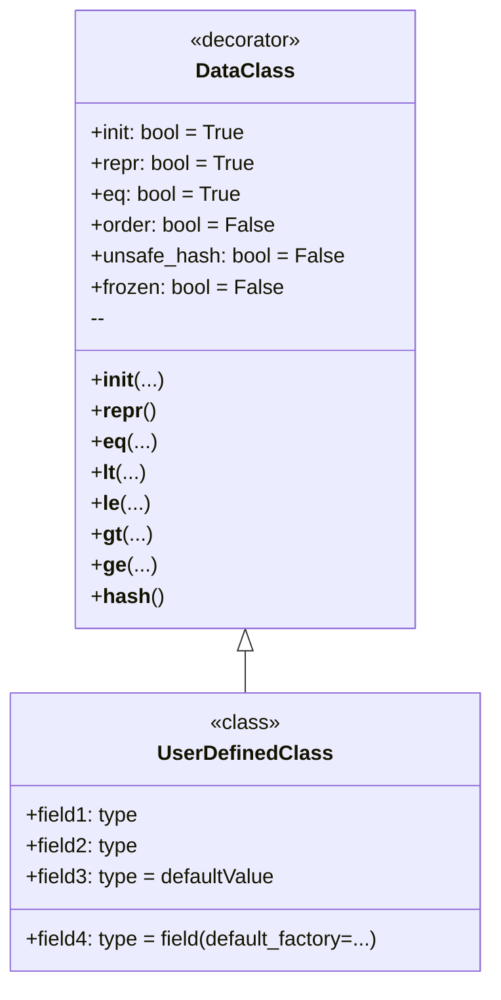

**¿Qué es `dataclass`?**

`dataclass` es un decorador introducido en Python 3.7 que genera automáticamente métodos especiales (como `__init__`, `__repr__`, `__eq__` y otros) para clases que principalmente sirven como contenedores de datos. Esto le evita tener que escribir mucho código repetitivo.

**¿Por qué usar `dataclass`?**

1.  **Reducción de código:** En lugar de definir manualmente los métodos `__init__`, `__repr__`, `__eq__`, etc., simplemente declara los campos de datos, y `dataclass` hace el resto.
2.  **Mejora de la legibilidad:** Las clases se vuelven más concisas y comprensibles, ya que se centran en los datos en lugar de la implementación técnica.
3.  **Reducción de errores:** El código generado automáticamente suele ser más fiable que el código escrito manualmente.
4.  **Desarrollo acelerado:** Puede crear clases de datos más rápido sin perder tiempo en tareas rutinarias.

**¿Cómo usar `dataclass`?**

Primero, debe importar el decorador `dataclass` del módulo `dataclasses`:

```python
from dataclasses import dataclass
```

Luego, marca la clase con el decorador `@dataclass` y define los campos de datos como variables de clase regulares con anotaciones de tipo:

```python
from dataclasses import dataclass

@dataclass
class Point:
    x: int
    y: int
```

En este ejemplo, `Point` es una `dataclass` que tiene dos campos: `x` e `y`, ambos de tipo entero. `dataclass` creará automáticamente:
    * Un constructor `__init__`, que le permite crear instancias de clase, por ejemplo `Point(1, 2)`.
    *  `__repr__`, que devuelve una representación de cadena del objeto, por ejemplo `Point(x=1, y=2)`.
    * `__eq__`, que le permite comparar objetos, por ejemplo `Point(1, 2) == Point(1, 2)`.

**Ejemplo de uso simple**
```python
from dataclasses import dataclass

@dataclass
class Point:
    x: int
    y: int

# Creación de una instancia de clase
point1 = Point(1, 2)
point2 = Point(1, 2)
point3 = Point(3, 4)

# Salida
print(point1) # Salida: Point(x=1, y=2)
print(point1 == point2) # Salida: True
print(point1 == point3) # Salida: False
```

**Opciones de `dataclass`**

`dataclass` proporciona varios parámetros para personalizar el comportamiento:

*   `init`: Si `True` (predeterminado), se genera el método `__init__`. Si `False`, el método `__init__` no se crea.
*   `repr`: Si `True` (predeterminado), se genera el método `__repr__`. Si `False`, el método `__repr__` no se crea.
*   `eq`: Si `True` (predeterminado), se genera el método `__eq__`. Si `False`, el método `__eq__` no se crea.
*   `order`: Si `True`, se generan los métodos de comparación (`__lt__`, `__le__`, `__gt__`, `__ge__`). El valor predeterminado es `False`.
*   `unsafe_hash`: Si `False` (predeterminado), el método `__hash__` no se genera. Si `True`, el método `__hash__` se generará y la `dataclass` se volverá hasheable.
*   `frozen`: Si `True`, las instancias de clase serán inmutables (solo lectura). El valor predeterminado es `False`.

**Ejemplos de uso de parámetros**
1. Deshabilitar el método `__repr__` y hacer la clase inmutable
```python
from dataclasses import dataclass

@dataclass(repr=False, frozen=True)
class Point:
    x: int
    y: int

# Creación de una instancia de clase
point1 = Point(1, 2)
# Salida
print(point1) # Salida: <__main__.Point object at 0x000001D8322F6770> (ya que __repr__ no está definido)

# La modificación de una instancia generará un error
try:
    point1.x = 10
except Exception as e:
    print (e) # Salida: cannot assign to field 'x'
```
2. Establecer el orden, agregar el método hash y hacer la clase inmutable
```python
from dataclasses import dataclass

@dataclass(order=True, unsafe_hash=True, frozen=True)
class Point:
    x: int
    y: int

# Creación de una instancia de clase
point1 = Point(1, 2)
point2 = Point(3, 4)
point3 = Point(1, 2)
# Salida
print(point1 < point2) # Salida: True
print(point1 == point3) # Salida: True

# Ahora puede usar la clase como clave de diccionario
my_dict = {point1: "first", point2: "second"}
print(my_dict) # Salida: {Point(x=1, y=2): 'first', Point(x=3, y=4): 'second'}
```

**Valores predeterminados**

Puede establecer valores predeterminados para los campos:

```python
from dataclasses import dataclass

@dataclass
class Point:
    x: int = 0
    y: int = 0

# Creación de una instancia de clase
point1 = Point()
point2 = Point(1, 2)

# Salida
print(point1) # Salida: Point(x=0, y=0)
print(point2) # Salida: Point(x=1, y=2)
```
Al crear una instancia de clase, si no se pasan valores, se utilizará el valor predeterminado.

**Uso de `dataclass` con tipos mutables**

Tenga cuidado al usar tipos de datos mutables (listas, diccionarios) como valores predeterminados. Se crearán solo una vez y serán utilizados por todas las instancias de clase:

```python
from dataclasses import dataclass
from typing import List

@dataclass
class BadExample:
    items: List[int] = []

bad1 = BadExample()
bad2 = BadExample()

bad1.items.append(1)
print (bad1.items) # Salida: [1]
print (bad2.items) # Salida: [1] 
```
En el ejemplo anterior, los cambios en `bad1.items` también se reflejan en `bad2.items`. Esto sucede porque ambas instancias de clase usan la misma lista predeterminada.

Para evitar esto, use `dataclasses.field` y `default_factory`:
```python
from dataclasses import dataclass, field
from typing import List

@dataclass
class GoodExample:
    items: List[int] = field(default_factory=list)

good1 = GoodExample()
good2 = GoodExample()

good1.items.append(1)
print (good1.items) # Salida: [1]
print (good2.items) # Salida: []
```
En este caso, `default_factory=list` creará una nueva lista vacía para cada nueva instancia de clase.

**Diagrama**

Aquí hay un diagrama que muestra los conceptos principales de `dataclass`:



En este diagrama:
*   `DataClass` representa el decorador `@dataclass` y sus parámetros.
*   `UserDefinedClass` es la clase que declara usando el decorador `@dataclass`.
*   La flecha de `DataClass` a `UserDefinedClass` muestra que `DataClass` se aplica a `UserDefinedClass`.


## `dict()`, `__dir__()` y otras características de `dataclass`.

*   `dict()` no funciona directamente con instancias de `dataclass`. Para convertir a un diccionario, debe usar métodos manuales o bibliotecas de terceros.
*   `__dir__()` devuelve una lista de todos los atributos y métodos del objeto, incluidos los métodos y campos generados por `dataclass`.
*   `__dataclass_fields__` y `__dataclass_params__` proporcionan metadatos sobre los campos y parámetros de `dataclass`.

**1. `dict()` en el contexto de `dataclass`**

   - **Sin soporte automático:** La función incorporada `dict()` no funciona directamente con instancias de `dataclass`, como con los diccionarios normales. Si intenta llamar a `dict(instance_of_dataclass)`, obtendrá un `TypeError: cannot convert dictionary update sequence element #0 to a sequence`.
   
   - **Conversión a un diccionario:** Para convertir una instancia de `dataclass` a un diccionario, debe hacerlo manualmente o usar una biblioteca de terceros. Así es como puede hacerlo manualmente:

     ```python
     from dataclasses import dataclass
     
     @dataclass
     class Person:
         name: str
         age: int
     
     person = Person("Alice", 30)
     
     # Conversión manual a diccionario
     person_dict = {field.name: getattr(person, field.name) for field in dataclasses.fields(Person)}
     print(person_dict)  # Salida: {'name': 'Alice', 'age': 30}

     #Opción alternativa:
     person_dict = person.__dict__
     print(person_dict) #Salida: {'name': 'Alice', 'age': 30}
     ```
   - **¿Por qué?** `dataclass` está diseñado principalmente para representar datos como clases. Aunque los datos se almacenan como atributos de objeto, `dataclass` no los hace automáticamente accesibles como un diccionario.

**2. `__dir__()` en `dataclass`**

   - **Devuelve atributos:** El método `__dir__()` devuelve una lista de cadenas que representan los nombres de los atributos y métodos del objeto. Para `dataclass`, `__dir__()` incluirá:
     - Todos los campos de datos definidos.
     - Métodos generados automáticamente (`__init__`, `__repr__`, `__eq__`, etc., según la configuración).
     - Cualquier otro método agregado manualmente.

   - **Ejemplo:**
      ```python
      from dataclasses import dataclass
      
      @dataclass
      class Point:
          x: int
          y: int
          
          def distance(self):
                return (self.x**2 + self.y**2)**0.5
      
      point = Point(1, 2)
      print(dir(point))
      #Salida:
      #['__class__', '__dataclass_fields__', '__dataclass_params__', '__delattr__', '__dict__', '__dir__', '__doc__', '__eq__', '__format__', '__ge__', '__getattribute__', '__gt__', '__hash__', '__init__', '__init_subclass__', '__le__', '__lt__', '__module__', '__ne__', '__new__', '__reduce__', '__reduce_ex__', '__repr__', '__setattr__', '__sizeof__', '__str__', '__subclasshook__', '__weakref__', 'distance', 'x', 'y']

      ```

   - **Utilidad:** `__dir__()` puede ser útil para la introspección: ver los atributos y métodos disponibles de una instancia de `dataclass`.
   
**3. Otras características de `dataclass`**

   - **`__dataclass_fields__`:**
      - Este es un atributo de clase que contiene un diccionario donde las claves son los nombres de los campos de `dataclass`, y los valores son objetos `dataclasses.Field`.
      - Este atributo le permite obtener metadatos sobre los campos de `dataclass` (por ejemplo, tipo, valor predeterminado, etc.).

     ```python
     from dataclasses import dataclass, fields
     
     @dataclass
     class Point:
          x: int = 0
          y: int = 0
     
     print(Point.__dataclass_fields__)
     #Salida:
     #{'x': Field(name='x',type=<class 'int'>,default=0,default_factory=MISSING,init=True,repr=True,hash=None,compare=True,metadata=mappingproxy({}),kw_only=False), 'y': Field(name='y',type=<class 'int'>,default=0,default_factory=MISSING,init=True,repr=True,hash=None,compare=True,metadata=mappingproxy({}),kw_only=False)}
     ```
     ```python
     # Usar fields() para el mismo resultado
     for field in fields(Point):
         print(field.name, field.type, field.default)
     #Salida:
     #x <class 'int'> 0
     #y <class 'int'> 0
     ```
  
   - **`__dataclass_params__`:**
      - Este es un atributo de clase que almacena información sobre los parámetros de `dataclass` (por ejemplo, `init`, `repr`, `eq`, `order`, etc.).
      - Esto le permite acceder a la configuración con la que se creó la `dataclass`.

      ```python
      from dataclasses import dataclass
      
      @dataclass(order = True, frozen = True)
      class Point:
        x: int
        y: int
      print(Point.__dataclass_params__)
      #Salida:
      #dataclass_params(init=True,repr=True,eq=True,order=True,unsafe_hash=False,frozen=True)
      ```

   - **Uso con herencia:** Puede crear `dataclass` heredando de otras `dataclass`.
   - **Uso con `typing.NamedTuple`:** `dataclass` es una alternativa más flexible a `typing.NamedTuple`, ya que permite establecer valores predeterminados, agregar métodos personalizados y hacer que la clase sea mutable o inmutable.
