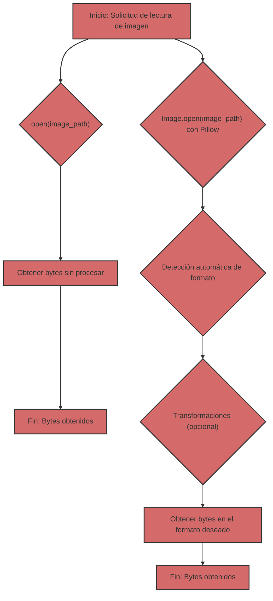

## Lectura de imágenes: bytes sin procesar vs. Pillow

Cuando se trata de trabajar con imágenes en Python, tiene dos enfoques principales:

1.  **Lectura de bytes sin procesar:** Usar `open()` para leer el contenido de un archivo de imagen como una secuencia de bytes.
2.  **Uso de Pillow:** Usar la biblioteca Pillow para abrir y procesar imágenes.

Veamos cada enfoque en detalle y descubramos sus diferencias y cuándo usar cada uno.

### 1. Lectura de bytes sin procesar con `open()`

#### ¿Qué es?

Cuando abre un archivo de imagen en modo binario (`"rb"`) usando `open()`, obtiene acceso al contenido del archivo como una secuencia de bytes. Esto significa que obtiene datos "sin procesar", sin ninguna interpretación o procesamiento.

#### ¿Cómo se ve en el código?

```python
from pathlib import Path

def read_image_bytes_direct(image_path: Path) -> bytes | None:
    """
    Lee una imagen como bytes directamente usando open().

    Args:
        image_path: Ruta al archivo de imagen.

    Returns:
        bytes: Bytes de la imagen.
        None: Si ocurrió un error.
    """
    try:
        with open(image_path, "rb") as image_file:
            image_data = image_file.read()
            return image_data
    except Exception as e:
        print(f"Error al leer el archivo: {e}")
        return None


if __name__ == '__main__':
    image_path = Path("test.jpg")  # Reemplace con la ruta a su imagen

    if not image_path.is_file():
        print(f"El archivo {image_path} no existe")
    else:
       image_bytes_direct = read_image_bytes_direct(image_path)

       if image_bytes_direct:
           print(f"Imagen leída directamente, tamaño: {len(image_bytes_direct)} bytes")
           # Puede usar image_bytes_direct, por ejemplo, para enviar a través de la red
       else:
           print("No se pudo leer la imagen.")
```

#### ¿Cuándo es útil?

*   **Transferencia de datos de red:** Cuando solo necesita transferir datos de imagen a través de una red, sin preocuparse por el formato.
*   **Guardar en disco:** Cuando necesita guardar el contenido del archivo en el disco sin cambios.
*   **Acceso de bajo nivel:** Cuando necesita acceso de bajo nivel a los datos del archivo y sabe cómo interpretarlos usted mismo.

#### Limitaciones

*   **Sin procesamiento de formato:** Solo obtiene bytes, sin ninguna información sobre el formato de la imagen (JPEG, PNG, GIF, etc.).
*   **Sin validación:** No hay verificación de si el archivo es realmente una imagen.
*   **Sin metadatos:** No obtiene acceso a los metadatos de la imagen (tamaño, espacio de color, etc.).
*   **Sin transformaciones convenientes:** No puede cambiar el tamaño, el formato o aplicar otras transformaciones sin procesamiento adicional.

### 2. Uso de Pillow para leer imágenes

#### ¿Qué es?

Pillow es una potente biblioteca para trabajar con imágenes. Le permite abrir imágenes de diferentes formatos, obtener metadatos, cambiar el tamaño, convertir formatos y mucho más.

#### ¿Cómo se ve en el código?

```python
from pathlib import Path
from PIL import Image
from io import BytesIO

def read_image_pillow(image_path: Path) -> bytes | None:
    """
    Lee una imagen usando Pillow y la devuelve como bytes JPEG.

    Args:
        image_path: Ruta al archivo de imagen.

    Returns:
         bytes: Bytes de la imagen en formato JPEG.
         None: Si ocurrió un error.
    """
    try:
        img = Image.open(image_path)
        img_byte_arr = BytesIO()
        img.save(img_byte_arr, format="JPEG")
        return img_byte_arr.getvalue()
    except Exception as e:
        print(f"Error al leer la imagen con Pillow: {e}")
        return None

if __name__ == '__main__':
    image_path = Path("test.jpg") # Reemplace con la ruta a su imagen

    if not image_path.is_file():
        print(f"El archivo {image_path} no existe")
    else:
        image_bytes_pillow = read_image_pillow(image_path)
        if image_bytes_pillow:
           print(f"Imagen leída con Pillow, tamaño: {len(image_bytes_pillow)} bytes")
           # Puede usar image_bytes_pillow, por ejemplo, para enviar al modelo Gemini.
        else:
           print("No se pudo leer la imagen con Pillow.")
```

#### ¿Cuándo es útil?

*   **Trabajar con imágenes:** Cuando necesita trabajar con imágenes, no solo con bytes.
*   **Detección automática de formato:** Pillow detecta automáticamente el formato de la imagen.
*   **Conversión de formato:** Puede convertir fácilmente imágenes entre diferentes formatos (JPEG, PNG, GIF, etc.).
*   **Cambio de tamaño:** Puede cambiar el tamaño de la imagen antes de procesarla.
*   **Metadatos:** Puede acceder a los metadatos de la imagen (tamaño, perfil de color, etc.).
*   **Manejo de errores:** Pillow maneja los errores al abrir archivos corruptos.

#### Ventajas

*   **Flexibilidad:** Pillow proporciona muchas funciones para trabajar con imágenes.
*   **Fiabilidad:** Pillow verifica si el archivo es una imagen válida.
*   **Conveniencia:** Pillow simplifica el flujo de trabajo de procesamiento de imágenes.

### Tabla comparativa

| Característica             | `open(image_path, "rb")`                                    | Pillow                                                      |
| :------------------------- | :---------------------------------------------------------- | :---------------------------------------------------------- |
| **Qué hace**            | Lee el archivo como una secuencia de bytes                     | Abre y procesa la imagen                         |
| **Formato**                | No reconoce el formato                                        | Detecta automáticamente el formato                              |
| **Metadatos**            | No hay acceso a metadatos                                     | Proporciona acceso a metadatos                             |
| **Procesamiento**              | No hay capacidades de procesamiento                                 | Cambio de tamaño, conversión de formato, etc.              |
| **Validación**             | Sin validación                                                | Comprueba si el archivo es una imagen válida          |
| **Cuándo usar**    | Transferencia simple de bytes, acceso de bajo nivel              | Manipulación de imágenes, transformaciones, manejo de errores |
| **Ejemplo**                | Transferencia de bytes de red, guardar en disco                  | Preparación de imágenes para Gemini, desarrollo web           |

### En el contexto de Gemini

Los modelos Gemini esperan datos de imagen en un formato específico (generalmente JPEG o PNG). El uso de Pillow asegura que proporcione imágenes en el formato correcto, y no solo bytes "sin procesar". Además, Pillow le permite cambiar el tamaño de la imagen si es necesario.

### Diagrama de comparación



Si solo necesita leer un archivo como bytes, sin ningún procesamiento, `open(image_path, "rb")` funcionará. Sin embargo, para el procesamiento de imágenes, especialmente para interactuar con API que esperan imágenes en un formato específico, usar Pillow es una solución más confiable y flexible.
