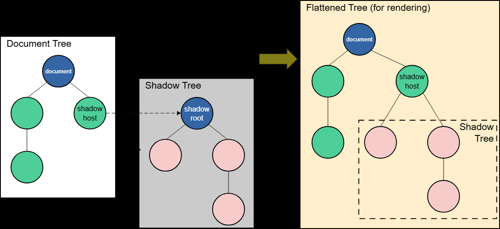

### Shadow DOM - «DOM dentro de DOM»

DOM es una interfaz de programación (API) para el código de la página que representa la página como una estructura de árbol de objetos.

Cada elemento HTML (por ejemplo, `<p>`, `<div>`, ``), cada atributo y cada fragmento de texto es un «nodo» separado
(node) en este árbol. Con JavaScript, podemos acceder a estos nodos para cambiar dinámicamente la página: cambiar texto, añadir estilos, crear nuevos elementos o eliminar los existentes. En esencia, DOM es un modelo «vivo» del documento con el que interactúa el código.

Pero esta apertura tiene un inconveniente. Cuando creamos un componente complejo y reutilizable (por ejemplo, un reproductor de video personalizado o un widget de calendario), su estructura interna y sus estilos se vuelven vulnerables. Los estilos CSS de la página principal pueden «filtrarse» accidentalmente dentro del componente y romper su apariencia. De manera similar, el código JavaScript de la página puede modificar involuntariamente los elementos internos del componente, interrumpiendo su lógica.

Para resolver este problema, existe **Shadow DOM (DOM en la sombra)**.

En esencia, Shadow DOM es **«DOM dentro de DOM»**. Es un árbol oculto de elementos que se adjunta a un elemento normal en la página (llamado «host»), pero que está aislado del DOM principal. Permite al desarrollador crear un límite hermético alrededor de la estructura interna de un componente, protegiéndolo del mundo exterior.

Shadow DOM permite adjuntar árboles DOM ocultos a elementos en el árbol DOM normal. Este árbol en la sombra comienza con una **raíz en la sombra** (shadow root), debajo de la cual se pueden adjuntar cualquier elemento de la misma manera que en el DOM normal.

Hay varios términos relacionados con Shadow DOM que debes conocer:

*   **Host en la sombra (Shadow host):** Un nodo DOM normal al que se adjunta el DOM en la sombra.
*   **Árbol en la sombra (Shadow tree):** El árbol DOM dentro del DOM en la sombra.
*   **Límite en la sombra (Shadow boundary):** El lugar donde termina el DOM en la sombra y comienza el DOM normal.
*   **Raíz en la sombra (Shadow root):** El nodo raíz del árbol en la sombra.

Puedes afectar los nodos en el DOM en la sombra exactamente igual que los nodos normales. La diferencia es que ningún código dentro del DOM en la sombra puede afectar nada fuera de él, lo que proporciona una encapsulación fiable.

Antes de que Shadow DOM estuviera disponible para los desarrolladores web, los navegadores ya lo usaban para encapsular la estructura interna de los elementos estándar. Por ejemplo, el elemento `<video>` con controles. Todo lo que ves en el DOM es la etiqueta `<video>`, pero contiene una serie de botones y otros controles dentro de su DOM en la sombra.

#### Creación de un Shadow DOM

Puedes crear un DOM en la sombra de dos maneras: imperativamente con JavaScript o declarativamente directamente en HTML.

##### Imperativamente con JavaScript

Este método es ideal para aplicaciones que se renderizan en el lado del cliente. Seleccionamos un elemento host y llamamos a su método `attachShadow()`.

```html
<!-- Marcado HTML -->
<div id="host"></div>
<span>No estoy en el DOM en la sombra</span>
```

```javascript
// Encontramos el host y le adjuntamos el DOM en la sombra
const host = document.querySelector("#host");
const shadow = host.attachShadow({ mode: "open" });

// Creamos y añadimos elementos al árbol en la sombra
const span = document.createElement("span");
span.textContent = "Estoy en el DOM en la sombra";
shadow.appendChild(span);
```

El resultado en la página se verá así:
> Estoy en el DOM en la sombra
> No estoy en el DOM en la sombra

##### Declarativamente con HTML

Para aplicaciones donde el renderizado del lado del servidor es importante, puedes definir el DOM en la sombra de forma declarativa, usando el elemento `<template>` con el atributo `shadowrootmode`.


```html
<div id="host">
  <template shadowrootmode="open">
    <p>Este párrafo está dentro del DOM en la sombra.</p>
    <style>
      p { color: red; } /* Estos estilos estarán aislados */
    </style>
  </template>
</div>
```

Cuando el navegador procese este código, creará automáticamente una raíz en la sombra para el `<div>` y colocará el contenido de la etiqueta `<template>` dentro de ella. La etiqueta `<template>` en sí desaparecerá del árbol DOM principal.

#### Encapsulación: protección contra JavaScript y CSS

La principal ventaja de Shadow DOM es el aislamiento. Veamos cómo funciona.

##### Encapsulación de JavaScript

Agreguemos un botón que intentará cambiar todos los elementos `<span>` de la página.

```javascript
// ... código de creación del DOM en la sombra ...

const upper = document.querySelector("#upper-button");
upper.addEventListener("click", () => {
  // Este selector busca en todo el documento
  const spans = document.querySelectorAll("span");
  for (const span of spans) {
    span.textContent = span.textContent.toUpperCase();
  }
});
```

Al hacer clic en el botón, el texto solo cambiará en el `<span>` que se encuentra en el documento principal. El elemento dentro del DOM en la sombra permanecerá intacto, porque `document.querySelectorAll()` no puede «mirar» más allá del límite en la sombra.

##### Acceso al DOM en la sombra: propiedad `shadowRoot` y trabajo con anidamiento

Cuando llamamos a `host.attachShadow({ mode: "open" })`, creamos un DOM en la sombra en modo "abierto". Esto significa que podemos acceder a su contenido desde el exterior a través de la propiedad `host.shadowRoot`.

```javascript
// Encontrar spans solo dentro del árbol en la sombra de un host específico
const spansInShadow = host.shadowRoot.querySelectorAll("span");
```

Si se especifica `mode: "closed"`, la propiedad `host.shadowRoot` devolverá `null`, y el acceso al árbol en la sombra desde el exterior estará cerrado. Este no es un mecanismo de seguridad estricto, sino más bien un acuerdo para los desarrolladores de que las partes internas del componente no deben tocarse.

**Trabajar con árboles en la sombra anidados**

En arquitecturas de componentes complejas, un elemento de usuario puede contener otros elementos de usuario, cada uno con su propio Shadow DOM. Para acceder a un elemento en un árbol en la sombra profundamente anidado, tendrás que «pasar» secuencialmente por cada `shadowRoot`.

Consideremos la siguiente estructura:
*   Componente `<nmbrs-form>` (formulario principal).
*   Dentro de él hay un `<div>`, y dentro de este, un componente `<nmbrs-button>` (botón personalizado).
*   Dentro de `<nmbrs-button>` hay un botón HTML real `<button>`.

Para acceder a este botón desde el contexto global, la ruta se verá así:

```javascript
// 1. Encontrar el componente raíz en el documento principal
const formComponent = document.querySelector('nmbrs-form');

// 2. «Entrar» en su árbol en la sombra
const shadowRoot1 = formComponent.shadowRoot;

// 3. Encontrar el componente de botón anidado
const buttonComponent = shadowRoot1.querySelector('div div.btn-container nmbrs-button');

// 4. «Entrar» en el árbol en la sombra de este componente
const shadowRoot2 = buttonComponent.shadowRoot;

// 5. Y solo ahora encontrar el elemento final
const finalButton = shadowRoot2.querySelector('button#button');
```

En una sola cadena de llamadas, se ve así:

```javascript
const button = document.querySelector('nmbrs-form').shadowRoot
                      .querySelector('div div.btn-container nmbrs-button').shadowRoot
                      .querySelector('button#button');
```

Una cadena tan larga demuestra claramente el poder de la encapsulación: para llegar a los detalles internos, es necesario pasar explícitamente por cada «límite». Esto hace que el código sea más predecible y protege los componentes de cambios accidentales.

##### Encapsulación de CSS

Los estilos definidos en la página principal no afectan a los elementos dentro del DOM en la sombra.

```css
/* Este estilo solo se aplicará a los spans en el documento principal */
span {
  color: blue;
  border: 1px solid black;
}
```

El elemento `<span>` dentro del árbol en la sombra no recibirá estos estilos. Esto resuelve el enorme problema de las superposiciones accidentales y los conflictos de CSS.

#### Aplicación de estilos dentro del DOM en la sombra

Los estilos definidos dentro del árbol en la sombra, a su vez, no afectan a la página principal. Hay dos formas principales de añadirlos.

##### 1. Hojas de estilo construibles (Constructable Stylesheets)

Este método permite crear un objeto `CSSStyleSheet` en JavaScript y aplicarlo a uno o varios árboles en la sombra. Esto es eficiente si tienes estilos comunes para varios componentes.

```javascript
const sheet = new CSSStyleSheet();
sheet.replaceSync("span { color: red; border: 2px dotted black; }");

const shadow = host.attachShadow({ mode: "open" });
// Aplicamos la hoja de estilo a la raíz en la sombra
shadow.adoptedStyleSheets = [sheet];
```

##### 2. Añadir un elemento `<style>`

Una forma sencilla y declarativa es colocar la etiqueta `<style>` directamente dentro del árbol en la sombra (a menudo dentro de `<template>`).

```html
<template id="my-element">
  <style>
    span {
      color: red;
      border: 2px dotted black;
    }
  </style>
  <span>Estoy en el DOM en la sombra</span>
</template>
```

#### Shadow DOM y elementos personalizados: una combinación perfecta

Todo el poder del DOM en la sombra se revela al crear **elementos personalizados (Custom Elements)**. Sin encapsulación, serían increíblemente frágiles.

Un elemento personalizado es una clase que hereda de `HTMLElement`. Por lo general, el propio elemento actúa como host en la sombra, y toda su estructura interna se crea dentro del árbol en la sombra.

Aquí tienes un ejemplo de un componente simple `<filled-circle>`:

```javascript
class FilledCircle extends HTMLElement {
  connectedCallback() {
    const shadow = this.attachShadow({ mode: "open" });

    // Crear la implementación interna (por ejemplo, un círculo SVG)
    const svg = document.createElementNS("http://www.w3.org/2000/svg", "svg");
    const circle = document.createElementNS("http://www.w3.org/2000/svg", "circle");
    circle.setAttribute("r", "50");
    circle.setAttribute("cx", "50");
    circle.setAttribute("cy", "50");
    // El color se toma del atributo del host
    circle.setAttribute("fill", this.getAttribute("color"));
    
    svg.appendChild(circle);
    shadow.appendChild(svg);
  }
}
customElements.define("filled-circle", FilledCircle);
```

Ahora podemos usarlo en HTML como una etiqueta normal, sin preocuparnos por su estructura interna:

```html
<filled-circle color="blue"></filled-circle>
<filled-circle color="green"></filled-circle>
```

Cada uno de estos componentes estará completamente encapsulado y protegido de la influencia de la página externa.
