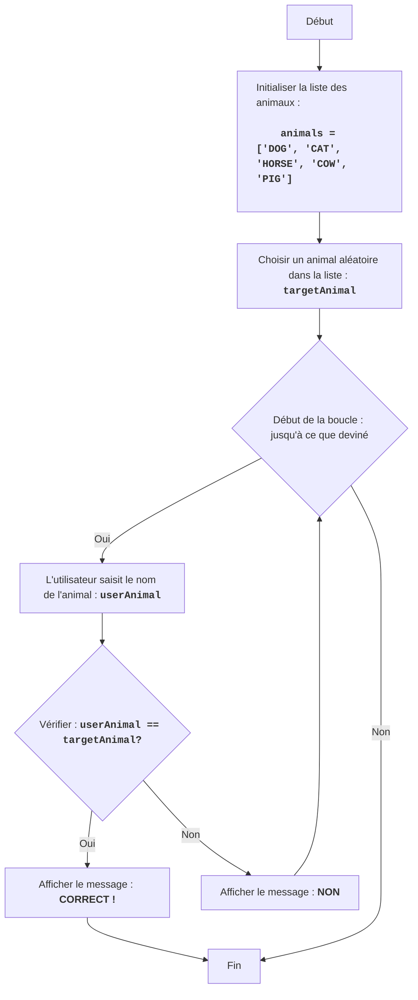

ANIMAL :
=================
Difficulté : 4
-----------------
Le jeu "ANIMAL" est un jeu de devinettes d'animaux dans lequel l'ordinateur sélectionne un animal aléatoire dans une liste, et le joueur essaie de le deviner en saisissant ses suppositions. Le jeu continue jusqu'à ce que le joueur devine l'animal.

Règles du jeu :
1.  L'ordinateur sélectionne un animal aléatoire dans une liste prédéfinie.
2.  Le joueur saisit ses suppositions concernant l'animal caché.
3.  Après chaque tentative, l'ordinateur indique si le joueur a deviné l'animal ou non.
4.  Le jeu continue jusqu'à ce que le joueur devine l'animal caché.
-----------------
Algorithme :
1.  Définir une liste d'animaux.
2.  Sélectionner un animal aléatoire dans la liste.
3.  Démarrer une boucle "tant que l'animal n'est pas deviné" :
    3.1 Demander au joueur de saisir le nom de l'animal.
    3.2 Si le nom saisi correspond à l'animal caché, passer à l'étape 4.
    3.3 Sinon, afficher le message "NON".
4. Afficher le message "CORRECT ! ".
5. Fin du jeu.
-----------------
Organigramme :

Légende :
    Start - Début du programme.
    InitializeAnimals - Initialisation de la liste des animaux.
    ChooseRandomAnimal - Sélection d'un animal aléatoire dans la liste et enregistrement dans la variable targetAnimal.
    LoopStart - Début de la boucle, qui continue jusqu'à ce que l'animal soit deviné.
    InputAnimal - Demande à l'utilisateur de saisir le nom de l'animal et enregistrement dans la variable userAnimal.
    CheckAnimal - Vérification si le nom d'animal saisi userAnimal correspond à l'animal caché targetAnimal.
    OutputWin - Affichage d'un message de victoire si les noms d'animaux correspondent.
    End - Fin du programme.
    OutputWrong - Affichage du message "NON" si le nom d'animal saisi ne correspond pas à l'animal caché.

import random

# Liste des animaux pour le jeu
animals = ['DOG', 'CAT', 'HORSE', 'COW', 'PIG']

# Choisir un animal aléatoire dans la liste
targetAnimal = random.choice(animals)

# Démarrer la boucle jusqu'à ce que l'animal soit deviné
while True:
    # Demander à l'utilisateur de saisir le nom de l'animal
    userAnimal = input("Devinez l'animal (DOG, CAT, HORSE, COW, PIG) : ").upper()

    # Vérifier si l'utilisateur a deviné l'animal
    if userAnimal == targetAnimal:
        print("CORRECT !") # Afficher le message correct
        break # Terminer la boucle si l'animal est deviné
    else:
        print("NON") # Afficher le message incorrect

Explication du code :

1.  **Importation du module `random`** :
    -   `import random` : Importe le module `random`, qui est utilisé pour sélectionner un animal au hasard.

2.  **Liste des animaux** :
    -   `animals = ['DOG', 'CAT', 'HORSE', 'COW', 'PIG']` : Crée une liste de chaînes de caractères avec les noms d'animaux.

3.  **Sélection aléatoire d'un animal** :
    -   `targetAnimal = random.choice(animals)` : Sélectionne un animal aléatoire dans la liste `animals` et l'enregistre dans la variable `targetAnimal`.

4.  **Boucle de jeu principale `while True:`** :
    -   Une boucle infinie qui continue jusqu'à ce que le joueur devine l'animal.
    -   **Saisie des données** :
        -   `userAnimal = input("Devinez l'animal (DOG, CAT, HORSE, COW, PIG) : ").upper()` : Demande à l'utilisateur de saisir le nom de l'animal et le convertit en majuscules pour une comparaison insensible à la casse.
    -   **Condition de victoire** :
        -   `if userAnimal == targetAnimal:` : Vérifie si le nom d'animal saisi par l'utilisateur correspond à celui qui est caché.
        -   `print("CORRECT !")` : Affiche un message de victoire si l'animal est deviné.
        -   `break` : Termine la boucle (et le jeu) si l'animal est deviné.
    -   **Message d'erreur** :
        -   `else:` : S'exécute si le nom d'animal saisi ne correspond pas à celui qui est caché.
        -   `print("NON")` : Affiche le message "NON" si la réponse est incorrecte.