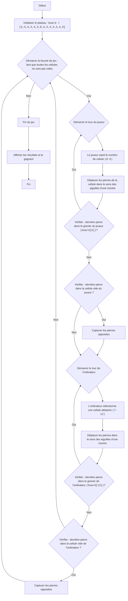

AWARI :
=================
Difficulté : 6
-----------------
Le jeu "Awari" est un jeu de plateau simulant le jeu traditionnel Mancala, où deux joueurs déplacent à tour de rôle des "pierres" (dans ce cas, des nombres) des cellules du plateau, en essayant de capturer le plus de pierres possible dans leurs "greniers". Il s'agit d'une version simplifiée du jeu où le joueur joue contre l'ordinateur.

Règles du jeu :
1. Le plateau de jeu se compose de 14 cellules, numérotées de 0 à 13. Les cellules 6 et 13 sont les "greniers" des joueurs.
2. Au début du jeu, chacune des 12 cellules (0-5 et 7-12) contient 4 pierres.
3. Le joueur (humain) commence la partie.
4. Sélectionne une cellule avec ses pierres (0-5).
5. Toutes les pierres de la cellule sélectionnée sont déplacées une par une dans chaque cellule suivante dans le sens des aiguilles d'une montre, y compris son propre "grenier".
6. Si la dernière pierre atterrit dans le grenier du joueur, le joueur a le droit de faire un autre coup.
7. Si la dernière pierre atterrit dans une cellule vide du côté du joueur, et qu'il y a des pierres en face de cette cellule, le joueur prend les pierres de cette cellule et de la cellule opposée dans son grenier.
8. L'ordinateur joue de la même manière.
9. Le jeu se termine lorsque toutes les cellules avec des pierres deviennent vides.
10. Le joueur qui a le plus de pierres dans son grenier gagne.
-----------------
Algorithme :
1. Initialiser le plateau (tableau) de 14 cellules avec 4 pierres dans chacune, sauf les cellules 6 et 13, qui sont à 0.
2. Démarrer une boucle "tant que le jeu n'est pas terminé"
3. Tour du joueur :
    3.1 Demander la saisie du numéro de cellule au joueur (0 à 5).
    3.2 Déplacer les pierres de la cellule sélectionnée dans le sens des aiguilles d'une montre.
    3.3 Vérifier si la dernière pierre a atterri dans le grenier du joueur (cellule 6). Si oui, donner un autre tour au joueur.
    3.4 Vérifier si la dernière pierre a atterri dans une cellule vide du côté du joueur. Si oui, capturer les pierres de cette cellule et de la cellule opposée.
4. Tour de l'ordinateur (similaire au tour du joueur, mais la sélection de la cellule est aléatoire de 7 à 12).
5. Si toutes les cellules avec des pierres sont vides, terminer le jeu.
6. Afficher le résultat (nombre de pierres dans les greniers du joueur et de l'ordinateur).
7. Déterminer le gagnant (qui a le plus de pierres dans son grenier).
-----------------
Organigramme :

Légende :
   Start - Début du programme.
    InitializeBoard - Initialiser le plateau de jeu avec 14 cellules. Les 6 premières (0-5) et les 6 dernières (7-12) représentent les cellules avec des pierres, 6 et 13 sont les greniers des joueurs.
    GameLoopStart - Début de la boucle de jeu, qui continue jusqu'à ce que le jeu soit terminé.
    PlayerTurnStart - Début du tour du joueur.
    PlayerInputCell - Demander au joueur le numéro de la cellule à partir de laquelle déplacer les pierres.
    PlayerMoveStones - Déplacer les pierres de la cellule sélectionnée dans le sens des aiguilles d'une montre.
    PlayerCheckExtraTurn - Vérifier si la dernière pierre a atterri dans le grenier du joueur. Si oui, le joueur obtient un tour supplémentaire.
    PlayerCheckCapture - Vérifier si la dernière pierre a atterri dans une cellule vide du côté du joueur.
    PlayerCaptureStones - Capturer les pierres de la cellule opposée si la dernière pierre a atterri dans une cellule vide du côté du joueur.
    ComputerTurnStart - Début du tour de l'ordinateur.
    ComputerSelectCell - L'ordinateur sélectionne une cellule aléatoire pour son coup.
    ComputerMoveStones - L'ordinateur déplace les pierres dans le sens des aiguilles d'une montre.
    ComputerCheckExtraTurn - Vérifier si la dernière pierre a atterri dans le grenier de l'ordinateur. Si oui, l'ordinateur obtient un tour supplémentaire.
    ComputerCheckCapture - Vérifier si la dernière pierre a atterri dans une cellule vide du côté de l'ordinateur. Si oui, l'ordinateur capture les pierres de la cellule opposée.
    ComputerCaptureStones - Capturer les pierres de la cellule opposée si la dernière pierre a atterri dans une cellule vide du côté de l'ordinateur.
    EndGame - Fin du jeu.
    OutputResult - Afficher les résultats et déterminer le gagnant.
    End - Fin du programme.

import random

# Initialiser le plateau.
# Cellules 0-5 - cellules du joueur, 6 - grenier du joueur
# Cellules 7-12 - cellules de l'ordinateur, 13 - grenier de l'ordinateur
board = [4, 4, 4, 4, 4, 4, 0, 4, 4, 4, 4, 4, 4, 0]

def display_board():
    """Affiche l'état actuel du plateau de jeu."""
    print("----------------------------------------------------")
    print(f"  {board[12]:2}  {board[11]:2}  {board[10]:2}  {board[9]:2}  {board[8]:2}  {board[7]:2}   ")
    print("----------------------------------------------------")
    print(f"{board[13]:2}                                 {board[6]:2}")
    print("----------------------------------------------------")
    print(f"  {board[0]:2}  {board[1]:2}  {board[2]:2}  {board[3]:2}  {board[4]:2}  {board[5]:2}  ")
    print("----------------------------------------------------")

def player_turn():
    """Gère le tour du joueur."""
    while True:
        try:
            cell = int(input("Sélectionnez une cellule (0-5) : "))
            if 0 <= cell <= 5 and board[cell] > 0:
                break
            else:
                print("Choix invalide. Sélectionnez une cellule avec des pierres de 0 à 5.")
        except ValueError:
            print("Saisie invalide. Veuillez entrer un nombre.")
    
    stones = board[cell]
    board[cell] = 0
    current_cell = cell
    
    while stones > 0:
        current_cell = (current_cell + 1) % 14
        board[current_cell] += 1
        stones -= 1

    # Vérifier le tour supplémentaire si la dernière pierre a atterri dans le grenier du joueur
    if current_cell == 6:
        print("Le joueur obtient un tour supplémentaire.")
        display_board()
        player_turn()
        return
        
    # Capturer les pierres
    if 0 <= current_cell <= 5 and board[current_cell] == 1:
        opposite_cell = 12 - current_cell
        if board[opposite_cell] > 0:
             board[6] += board[opposite_cell] + 1
             board[opposite_cell]=0
             board[current_cell] = 0
             print(f"Le joueur capture les pierres des cellules {current_cell} et {opposite_cell}")
         
        
def computer_turn():
    """Gère le tour de l'ordinateur."""
    possible_moves = [i for i in range(7, 13) if board[i] > 0]
    if not possible_moves:
        return  # S'il n'y a pas de coups disponibles pour l'ordinateur, sortir
    
    cell = random.choice(possible_moves)
    print(f"L'ordinateur sélectionne la cellule {cell}")
    stones = board[cell]
    board[cell] = 0
    current_cell = cell

    while stones > 0:
         current_cell = (current_cell + 1) % 14
         board[current_cell] += 1
         stones -= 1

    # Vérifier le tour supplémentaire si la dernière pierre a atterri dans le grenier de l'ordinateur
    if current_cell == 13:
        print("L'ordinateur obtient un tour supplémentaire.")
        display_board()
        computer_turn()
        return

    # Capturer les pierres
    if 7 <= current_cell <= 12 and board[current_cell] == 1:
          opposite_cell = 12 - current_cell
          if board[opposite_cell] > 0:
             board[13] += board[opposite_cell] + 1
             board[opposite_cell]=0
             board[current_cell] = 0
             print(f"L'ordinateur capture les pierres des cellules {current_cell} et {opposite_cell}")

def is_game_over():
    """Vérifie si le jeu est terminé."""
    player_side_empty = all(board[i] == 0 for i in range(0, 6))
    computer_side_empty = all(board[i] == 0 for i in range(7, 13))
    return player_side_empty or computer_side_empty

def calculate_winner():
    """Détermine le gagnant et affiche les résultats."""
    player_score = board[6]
    computer_score = board[13]

    print(f"Joueur : {player_score} points")
    print(f"Ordinateur : {computer_score} points")

    if player_score > computer_score:
        print("Vous gagnez !")
    elif computer_score > player_score:
        print("L'ordinateur gagne !")
    else:
        print("C'est une égalité !")

# Boucle de jeu principale
while True:
    display_board()
    player_turn()
    if is_game_over():
        break
    display_board()
    computer_turn()
    if is_game_over():
       break
    

# Après la fin du jeu
display_board()
calculate_winner()

Explication du code :
1. **Initialisation du plateau (`board`)** :
   - `board = [4, 4, 4, 4, 4, 4, 0, 4, 4, 4, 4, 4, 4, 0]` : Une liste représentant le plateau de jeu est créée.
     Les 6 premiers éléments (0-5) sont les cellules du joueur, 7-12 sont les cellules de l'ordinateur, 6 est le grenier du joueur, 13 est le grenier de l'ordinateur.
     Au début du jeu, chaque cellule contient 4 pierres, et les greniers en contiennent 0.

2. **Fonction `display_board()`** :
   - Affiche l'état actuel du plateau de jeu à l'écran.

3. **Fonction `player_turn()`** :
   - Gère le tour du joueur :
     - Demande la saisie du numéro de cellule (0-5).
     - Vérifie la validité de la saisie (nombre de 0 à 5 et cellule non vide).
     - Prend les pierres de la cellule sélectionnée.
     - Distribue les pierres une par une dans chaque cellule suivante dans le sens des aiguilles d'une montre.
     - Vérifie si la dernière pierre a atterri dans le grenier du joueur (cellule 6). Si oui, le joueur obtient un tour supplémentaire.
     - Vérifie si la dernière pierre a atterri dans une cellule vide du côté du joueur, si oui, capture les pierres opposées.
4. **Fonction `computer_turn()`** :
   - Gère le tour de l'ordinateur :
     - Sélectionne une cellule aléatoire non vide (7-12).
     - Distribue les pierres une par une dans chaque cellule suivante dans le sens des aiguilles d'une montre.
     - Vérifie si la dernière pierre a atterri dans le grenier de l'ordinateur (cellule 13). Si oui, l'ordinateur obtient un tour supplémentaire.
     - Vérifie si la dernière pierre a atterri dans une cellule vide du côté de l'ordinateur, si oui, capture les pierres opposées.

5.  **Fonction `is_game_over()`** :
    - Vérifie si le jeu est terminé. Le jeu se termine lorsque toutes les cellules du côté du joueur ou de l'ordinateur sont vides.
6.  **Fonction `calculate_winner()`** :
    - Affiche le score de chaque joueur.
    - Détermine le gagnant.

7.  **Boucle de jeu principale (`while True`)** :
    - Affiche le plateau.
    - Donne un tour au joueur.
    - Vérifie si le jeu est terminé. Si oui, quitte la boucle.
    - Donne un tour à l'ordinateur.
    - Vérifie si le jeu est terminé. Si oui, quitte la boucle.

8.  **Affichage des résultats** :
    - Après la fin du jeu, affiche le plateau et les résultats.
