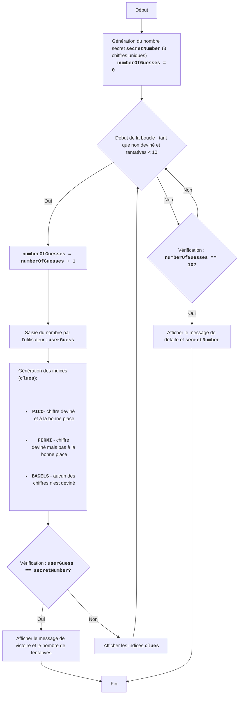

BAGLES :
=================
Difficulté : 6
-----------------
Le jeu "Bagels" est un jeu de logique et de puzzle dans lequel le joueur essaie de deviner un nombre à trois chiffres composé de chiffres uniques. Après chaque tentative, le joueur reçoit des indices : "PICO" signifie qu'un des chiffres est deviné et se trouve à la bonne position, "FERMI" signifie qu'un des chiffres est deviné mais pas à la bonne position, "BAGELS" signifie qu'aucun des chiffres n'est deviné.

Règles du jeu :
1. L'ordinateur génère un nombre aléatoire à trois chiffres composé de chiffres uniques.
2. Le joueur saisit ses suppositions sous forme de nombre à trois chiffres.
3. L'ordinateur fournit des indices :
    - "PICO" - un chiffre est deviné et se trouve à la bonne position.
    - "FERMI" - un chiffre est deviné mais pas à la bonne position.
    - "BAGELS" - aucun des chiffres n'est deviné.
4. Les indices sont donnés dans l'ordre des chiffres du nombre caché, par exemple si le nombre caché est `123` et que le joueur a entré `142`, les indices seront `PICO FERMI`.
5. Le jeu continue jusqu'à ce que le joueur devine le nombre.
6. Si après 10 tentatives le joueur ne devine pas le nombre, le jeu se termine et le nombre caché est affiché.
-----------------
Algorithme :
1. Générer un nombre aléatoire à trois chiffres composé de chiffres uniques (par exemple, 123).
2. Définir le nombre de tentatives à 0.
3. Boucle "tant que le nombre n'est pas deviné ou que le nombre de tentatives est inférieur à 10" :
    3.1. Augmenter le nombre de tentatives de 1.
    3.2. Demander au joueur un nombre à trois chiffres.
    3.3. Comparer le nombre saisi avec le nombre caché et générer les indices "PICO", "FERMI" et "BAGELS".
    3.4. Si le nombre est deviné, afficher un message de victoire et le nombre de tentatives.
    3.5. Si le nombre n'est pas deviné, afficher les indices générés.
4. Si après 10 tentatives le nombre n'est pas deviné, afficher le nombre caché et un message de défaite.
5. Fin du jeu.
-----------------
Organigramme :

Légende :
    Start - Début du jeu.
    GenerateSecretNumber - Génération du nombre secret secretNumber à partir de 3 chiffres uniques et initialisation du nombre de tentatives numberOfGuesses = 0.
    LoopStart - Début de la boucle, qui continue tant que le nombre n'est pas deviné et que le nombre de tentatives est inférieur à 10.
    IncreaseGuesses - Augmentation du compteur de tentatives de 1.
    InputGuess - Demande à l'utilisateur de saisir un nombre et enregistrement dans la variable userGuess.
    GenerateClues - Génération des indices basée sur la comparaison de userGuess et secretNumber.
    CheckWin - Vérification si le nombre saisi userGuess est égal au nombre secret secretNumber.
    OutputWin - Affichage du message de victoire et du nombre de tentatives.
    End - Fin du jeu.
    OutputClues - Affichage des indices générés.
    CheckLose - Vérification si le nombre de tentatives a atteint 10.
    OutputLose - Affichage du message de défaite et du nombre secret secretNumber.
