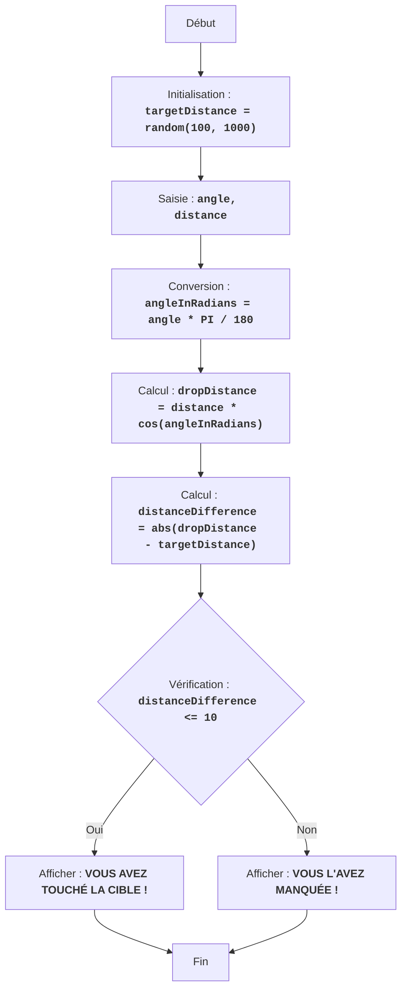

BOMBER :
=================
Difficulté : 5
-----------------
Le jeu "Bomber" est un jeu de puzzle dans lequel le joueur essaie de larguer une bombe sur une cible située à une distance générée aléatoirement. Le joueur saisit l'angle de largage et la distance, et l'ordinateur calcule la trajectoire de la bombe. Le but du jeu est de toucher la cible le plus précisément possible.

Règles du jeu :
1. L'ordinateur génère une distance cible aléatoire dans la plage de 100 à 1000.
2. Le joueur saisit l'angle de largage de la bombe et la distance de largage.
3. L'ordinateur calcule la distance de chute de la bombe.
4. Si la distance de chute de la bombe est à moins de 10 unités de la distance cible, le joueur gagne.
5. Si la distance de chute de la bombe n'est pas dans la plage, le joueur perd.
-----------------
Algorithme :
1. Générer une distance cible aléatoire dans la plage de 100 à 1000 et l'affecter à la variable `targetDistance`.
2. Demander au joueur l'angle de largage de la bombe en degrés (angle) et la distance de largage (distance).
3. Convertir l'angle des degrés en radians `angleInRadians = angle * 3.14159 / 180`.
4. Calculer la distance de chute de la bombe à l'aide de la formule : `dropDistance = distance * cos(angleInRadians)`.
5. Calculer la différence entre la distance de chute de la bombe et la distance cible : `distanceDifference = abs(dropDistance - targetDistance)`.
6. Si la différence de distance est inférieure ou égale à 10, afficher un message de victoire.
7. Sinon, afficher un message de défaite.
8. Fin du jeu.
-----------------
Organigramme :

Légende :
   Start - Début du programme.
    InitializeTargetDistance - Initialisation : une distance cible aléatoire (targetDistance) de 100 à 1000 est générée.
    InputAngleDistance - Demander à l'utilisateur l'angle de largage (angle) et la distance de largage (distance).
    ConvertAngle - Convertir l'angle des degrés en radians (angleInRadians).
    CalculateDropDistance - Calculer la distance de chute de la bombe (dropDistance) en fonction des données saisies.
    CalculateDistanceDifference - Calculer la différence absolue entre la distance de chute de la bombe (dropDistance) et la distance cible (targetDistance).
    CheckDistanceDifference - Vérifier si la différence de distance est inférieure ou égale à 10 unités (distanceDifference <= 10).
    OutputWin - Afficher un message de victoire si la différence est inférieure ou égale à 10 unités.
    End - Fin du programme.
    OutputLose - Afficher un message de défaite si la différence est supérieure à 10 unités.