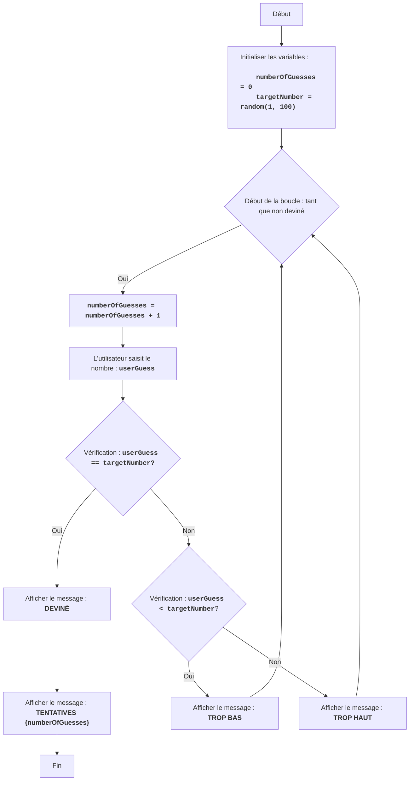

BUZZWD :
=================
Difficulté : 4
-----------------
Le jeu "BUZZWD" est un jeu de nombres simple où l'ordinateur génère un nombre aléatoire, et le joueur doit le deviner en saisissant des nombres à tour de rôle. Après chaque saisie, le programme indique si le nombre saisi est "trop élevé", "trop bas" ou s'il a été deviné. Le jeu se termine lorsque le joueur devine correctement le nombre.

Règles du jeu :
1. L'ordinateur sélectionne un nombre entier aléatoire de 1 à 100.
2. Le joueur saisit ses suppositions pour le nombre caché.
3. Après chaque tentative, l'ordinateur indique si le nombre saisi était trop bas, trop élevé ou deviné.
4. Le jeu continue jusqu'à ce que le joueur devine le nombre caché.
-----------------
Algorithme :
1.  Définir le compteur de tentatives à 0.
2.  Générer un nombre aléatoire dans la plage de 1 à 100.
3.  Démarrer une boucle "tant que le nombre n'est pas deviné" :
    3.1 Augmenter le compteur de tentatives de 1.
    3.2 Demander au joueur de saisir un nombre.
    3.3 Si le nombre saisi est égal au nombre caché, afficher "DEVINÉ" et passer à l'étape 4.
    3.4 Si le nombre saisi est inférieur au nombre caché, afficher "TROP BAS".
    3.5 Si le nombre saisi est supérieur au nombre caché, afficher "TROP HAUT".
4. Afficher "TENTATIVES {compteur de tentatives}"
5. Fin du jeu.
-----------------
Organigramme :

Légende :
    Start - Début du programme.
    InitializeVariables - Initialisation des variables : numberOfGuesses (nombre de tentatives) est défini à 0, et targetNumber (nombre caché) est généré aléatoirement de 1 à 100.
    LoopStart - Début de la boucle, qui continue tant que le nombre n'est pas deviné.
    IncreaseGuesses - Augmentation du compteur de tentatives de 1.
    InputGuess - Demande à l'utilisateur de saisir un nombre et l'enregistre dans la variable userGuess.
    CheckGuess - Vérifie si le nombre saisi userGuess est égal au nombre caché targetNumber.
    OutputWin - Affiche le message "DEVINÉ" si les nombres sont égaux.
    OutputAttempts - Affiche le message "TENTATIVES {numberOfGuesses}", indiquant le nombre de tentatives.
    End - Fin du programme.
    CheckLow - Vérifie si le nombre saisi userGuess est inférieur au nombre caché targetNumber.
    OutputLow - Affiche le message "TROP BAS" si le nombre saisi est inférieur au nombre caché.
    OutputHigh - Affiche le message "TROP HAUT" si le nombre saisi est supérieur au nombre caché.