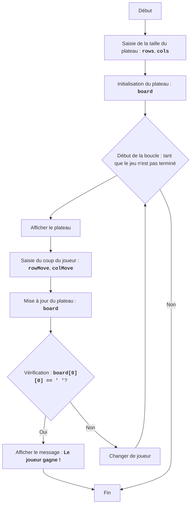

CHOMP :
=================
Difficulté : 5
-----------------
Le jeu "CHOMP" est un jeu à deux joueurs qui se joue sur un plateau rectangulaire, représentant une tablette de chocolat.
Un des coins (généralement en bas à gauche) représente un "carré" empoisonné. Les joueurs cassent tour à tour des morceaux de la tablette, en effectuant des coups. Le but du jeu est de forcer l'adversaire à manger le carré empoisonné.
Le joueur qui est forcé de manger le carré empoisonné perd.
 Règles du jeu :
1. Le plateau de jeu est une tablette de chocolat rectangulaire.
2. Un des coins (en bas à gauche) est considéré comme empoisonné.
3. Les joueurs mordent tour à tour un morceau de la tablette de chocolat.
4. Le joueur choisit une ligne et une colonne (mord un morceau de chocolat).
5. Toutes les cellules à droite et au-dessus de la position sélectionnée sont supprimées.
6. Le but est de forcer l'adversaire à manger le carré empoisonné.
7. Le joueur qui mange le carré empoisonné perd.
-----------------
Algorithme :
1.  Début du jeu.
2.  Demander à l'utilisateur la taille de la tablette de chocolat (nombre de lignes et de colonnes).
3.  Initialiser le plateau de jeu, représentant la tablette de chocolat.
4.  Démarrer la boucle de jeu, tant que le jeu n'est pas terminé :
    4.1.  Afficher l'état actuel du plateau à l'écran.
    4.2.  Demander au joueur actuel les coordonnées du morceau de chocolat à mordre.
    4.3.  Mettre à jour l'état du plateau après avoir mordu le morceau sélectionné.
    4.4.  Vérifier si le joueur actuel a mangé le carré empoisonné.
    4.5.  Si oui, déclarer la victoire de l'adversaire et terminer le jeu.
    4.6.  Passer le tour au joueur suivant.
5. Fin du jeu.
-----------------
Organigramme :

Légende :
    Start - Début du jeu.
    InputBoardSize - Demande de la taille du plateau (nombre de lignes et de colonnes).
    InitializeBoard - Initialisation du plateau de jeu.
    LoopStart - Début de la boucle de jeu, qui continue tant que le jeu n'est pas terminé.
    DisplayBoard - Affichage de l'état actuel du plateau à l'écran.
    InputMove - Demande au joueur actuel les coordonnées du morceau de chocolat à mordre.
    UpdateBoard - Mise à jour de l'état du plateau après le coup du joueur.
    CheckWin - Vérifie si le joueur actuel a mangé le carré empoisonné.
    OutputWinner - Affichage du message de victoire de l'autre joueur.
    End - Fin du jeu.
    SwitchPlayer - Passage du tour au joueur suivant.