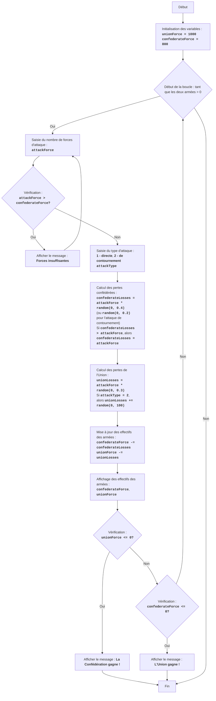

CIVILW :
=================
Difficulté : 7
-----------------
Le jeu "Guerre Civile" est une simulation de bataille entre deux armées : la Confédération et l'Union. Le joueur contrôle la Confédération et prend des décisions concernant la taille de ses troupes et le type d'attaques (attaque directe ou manœuvre de contournement). Le but du jeu est de vaincre l'armée de l'Union, tout en minimisant ses propres pertes. Le jeu prend en compte des facteurs aléatoires qui influencent l'issue de la bataille, rendant chaque bataille unique.

Règles du jeu :
1.  Le joueur contrôle l'armée de la Confédération et doit vaincre l'armée de l'Union.
2.  Le joueur saisit le nombre de soldats qu'il souhaite envoyer à l'attaque.
3.  Le joueur choisit le type d'attaque : directe (1) ou de contournement (2).
4.  En fonction du choix du joueur et des facteurs aléatoires, les pertes sont calculées pour les deux camps.
5.  Après chaque bataille, le jeu affiche les effectifs actuels des deux armées.
6.  Le jeu se termine par la victoire d'un des camps lorsque les effectifs de l'armée adverse deviennent égaux ou inférieurs à 0.
-----------------
Algorithme :
1. Définir les effectifs initiaux de l'armée de l'Union (UnionForce) à 1000 et de l'armée de la Confédération (ConfederateForce) à 800.
2. Démarrer une boucle "tant que les deux armées ont des effectifs supérieurs à 0" :
    2.1. Demander au joueur le nombre de soldats qu'il souhaite envoyer à l'attaque (AttackForce).
        2.1.1. Si AttackForce est supérieur aux forces confédérées disponibles (ConfederateForce), afficher le message "Forces insuffisantes" et revenir au début de l'étape 2.1.
    2.2. Demander au joueur le type d'attaque : directe (1) ou de contournement (2) (AttackType).
    2.3. Calculer les pertes confédérées (ConfederateLosses) de manière aléatoire, en multipliant AttackForce par un nombre aléatoire de 0 à 0.4 (pour une attaque directe) ou par un nombre aléatoire de 0 à 0.2 (pour une manœuvre de contournement).
        2.3.1. Si ConfederateLosses est supérieur à AttackForce, définir ConfederateLosses égal à AttackForce.
    2.4. Calculer les pertes de l'Union (UnionLosses) de manière aléatoire, en multipliant AttackForce par un nombre aléatoire de 0 à 0.3.
        2.4.1. Si AttackType est égal à 2, augmenter UnionLosses d'un nombre aléatoire de 0 à 100.
    2.5. Mettre à jour les effectifs des armées :
        ConfederateForce = ConfederateForce - ConfederateLosses
        UnionForce = UnionForce - UnionLosses
    2.6. Afficher les effectifs actuels des deux armées.
    2.7. Vérifier la condition de victoire :
        2.7.1. Si UnionForce est inférieur ou égal à 0, afficher le message "La Confédération gagne !" et terminer le jeu.
        2.7.2. Si ConfederateForce est inférieur ou égal à 0, afficher le message "L'Union gagne !" et terminer le jeu.
3. Fin du jeu.
-----------------
Organigramme :

    
Légende :
    Start - Début du programme.
    InitializeForces - Initialisation des effectifs initiaux des troupes de l'Union (unionForce = 1000) et de la Confédération (confederateForce = 800).
    LoopStart - Début de la boucle, qui continue tant que les deux armées ont des effectifs supérieurs à 0.
    InputAttackForce - Demande au joueur le nombre de soldats pour l'attaque (attackForce).
    CheckForce - Vérifie si la Confédération a suffisamment de forces pour l'attaque (attackForce > confederateForce).
    OutputInsufficient - Affiche le message "Forces insuffisantes", si les forces d'attaque sont supérieures aux forces disponibles.
    InputAttackType - Demande au joueur de choisir le type d'attaque : directe (1) ou de contournement (2).
    CalculateConfederateLosses - Calcul des pertes confédérées (confederateLosses) basé sur attackForce et le type d'attaque, en tenant compte d'un facteur aléatoire. Si les pertes dépassent attackForce, les pertes sont définies comme égales à attackForce.
    CalculateUnionLosses - Calcul des pertes de l'Union (unionLosses) basé sur attackForce et le type d'attaque, en tenant compte d'un facteur aléatoire. Pour une attaque de contournement, les pertes de l'Union sont augmentées d'un nombre aléatoire.
    UpdateForces - Mise à jour des effectifs des deux armées après la bataille.
    OutputForces - Affichage des effectifs actuels des armées confédérées et de l'Union.
    CheckUnionWin - Vérifie si la Confédération a gagné (effectifs de l'armée de l'Union <= 0).
    OutputConfederateWin - Affiche le message de victoire de la Confédération.
    CheckConfederateWin - Vérifie si l'Union a gagné (effectifs de l'armée de la Confédération <= 0).
    OutputUnionWin - Affiche le message de victoire de l'Union.
    End - Fin du programme.