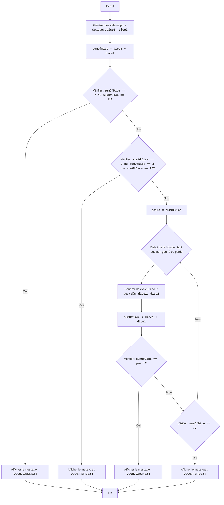

CRAPS :
=================
Difficulté : 7
-----------------
Le jeu "Craps" est un jeu de dés de hasard dans lequel le joueur parie sur le résultat du lancer de deux dés. Au premier tour, le joueur gagne si la somme des dés est 7 ou 11, et perd si la somme est 2, 3 ou 12. Si la somme des dés est 4, 5, 6, 8, 9 ou 10, cela devient le "point" du joueur, et il continue à lancer les dés jusqu'à ce que ce nombre soit relancé (auquel cas le joueur gagne) ou qu'un 7 soit lancé (auquel cas le joueur perd).

Règles du jeu :
1. Au début du jeu, le joueur lance deux dés.
2. Si la somme des dés est 7 ou 11, le joueur gagne.
3. Si la somme des dés est 2, 3 ou 12, le joueur perd.
4. Si la somme des dés est 4, 5, 6, 8, 9 ou 10, ce nombre devient le "point".
5. Après avoir établi le "point", le joueur continue à lancer les dés jusqu'à ce que :
   - le "point" soit relancé, alors le joueur gagne.
   - un 7 soit lancé, alors le joueur perd.
-----------------
Algorithme :
1. Générer des valeurs aléatoires pour deux dés (de 1 à 6).
2. Calculer la somme des valeurs obtenues.
3. Si la somme est 7 ou 11, afficher un message de victoire et passer à l'étape 7.
4. Si la somme est 2, 3 ou 12, afficher un message de défaite et passer à l'étape 7.
5. Enregistrer la somme comme "point".
6. Démarrer une boucle :
    6.1 Générer des valeurs aléatoires pour deux dés.
    6.2 Calculer la somme des valeurs obtenues.
    6.3 Si la somme est égale au "point", afficher un message de victoire et passer à l'étape 7.
    6.4 Si la somme est 7, afficher un message de défaite et passer à l'étape 7.
    6.5 Sinon, répéter la boucle à partir de l'étape 6.
7. Fin du jeu.
-----------------
Organigramme :

Légende :
   Start - Début du programme.
    RollDice1 - Génération de valeurs aléatoires pour deux dés (dice1, dice2) au premier lancer.
    CalculateSum1 - Calcul de la somme des valeurs de dice1 et dice2 et enregistrement du résultat dans la variable sumOfDice.
    CheckWin1 - Vérifie si sumOfDice est 7 ou 11. Si oui, le joueur gagne.
    OutputWin1 - Affiche le message "VOUS GAGNEZ !" et termine le jeu.
    CheckLose1 - Vérifie si sumOfDice est 2, 3 ou 12. Si oui, le joueur perd.
    OutputLose1 - Affiche le message "VOUS PERDEZ !" et termine le jeu.
    SetPoint - Si ni gagné ni perdu au premier lancer, sumOfDice est enregistré dans la variable point, qui devient le "point".
    LoopStart - Début de la boucle qui continue jusqu'à ce que le joueur gagne ou perde.
    RollDice2 - Génération de valeurs aléatoires pour deux dés (dice1, dice2) lors des lancers suivants.
    CalculateSum2 - Calcul de la somme des valeurs de dice1 et dice2 et enregistrement du résultat dans la variable sumOfDice.
    CheckWin2 - Vérifie si sumOfDice est égal au "point". Si oui, le joueur gagne.
    OutputWin2 - Affiche le message "VOUS GAGNEZ !" et termine le jeu.
    CheckLose2 - Vérifie si sumOfDice est 7. Si oui, le joueur perd.
    OutputLose2 - Affiche le message "VOUS PERDEZ !" et termine le jeu.
    End - Fin du programme.