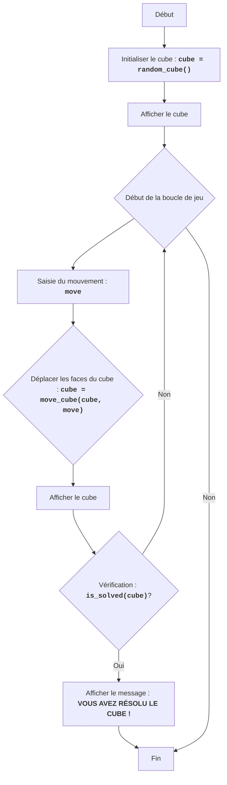

CUBE
=================

Difficulté : 5
-----------------
Le jeu "Cube" est un jeu de puzzle où le joueur doit assembler un cube en déplaçant ses faces. Le cube est représenté sous forme de matrice 3x3, où chaque cellule représente une face du cube. Le joueur peut déplacer les faces du cube vers le haut, le bas, la gauche et la droite. Le but du jeu est d'assembler le cube en arrangeant les faces dans le bon ordre.
Règles du jeu :
1. Le cube est représenté sous forme de matrice 3x3.
2. Le joueur peut déplacer les faces du cube en saisissant des commandes : U (haut), D (bas), L (gauche), R (droite).
3. Le but du jeu est d'assembler le cube en arrangeant les faces dans le bon ordre.
4. La position initiale du cube est générée aléatoirement.
5. Le jeu se termine lorsque le cube est assemblé, c'est-à-dire lorsque toutes les faces sont dans le bon ordre.
-----------------
Algorithme :
1. Initialiser le cube avec des valeurs aléatoires de 1 à 9 sous forme de matrice 3x3.
2. Afficher le cube à l'écran.
3. Démarrer la boucle de jeu :
    3.1. Demander au joueur une commande pour déplacer une face du cube (U, D, L, R).
    3.2. Effectuer le déplacement de la face selon la commande :
       - Si la commande est "U", décaler toutes les lignes vers le haut.
       - Si la commande est "D", décaler toutes les lignes vers le bas.
       - Si la commande est "L", décaler toutes les colonnes vers la gauche.
       - Si la commande est "R", décaler toutes les colonnes vers la droite.
    3.3. Afficher le cube à l'écran.
    3.4. Vérifier si le cube est assemblé.
    3.5. Si le cube est assemblé, afficher un message de victoire et terminer le jeu.
    3.6. Si le cube n'est pas assemblé, revenir à l'étape 3.1.
-----------------
Organigramme :

Légende :
    Start - Début du programme.
    InitializeCube - Initialisation du cube, création d'une matrice 3x3 avec des valeurs aléatoires de 1 à 9.
    DisplayCube - Affichage de l'état actuel du cube à l'écran.
    GameLoopStart - Début de la boucle de jeu, qui continue jusqu'à ce que le cube soit assemblé.
    InputMove - Demande à l'utilisateur une commande pour déplacer les faces du cube (U, D, L, R).
    MoveCube - Déplacement des faces du cube selon la commande saisie.
    DisplayCubeAgain - Affichage du cube après le déplacement effectué.
    CheckSolved - Vérification si le cube est assemblé.
    OutputWin - Affichage d'un message de victoire si le cube est assemblé.
    End - Fin du programme.