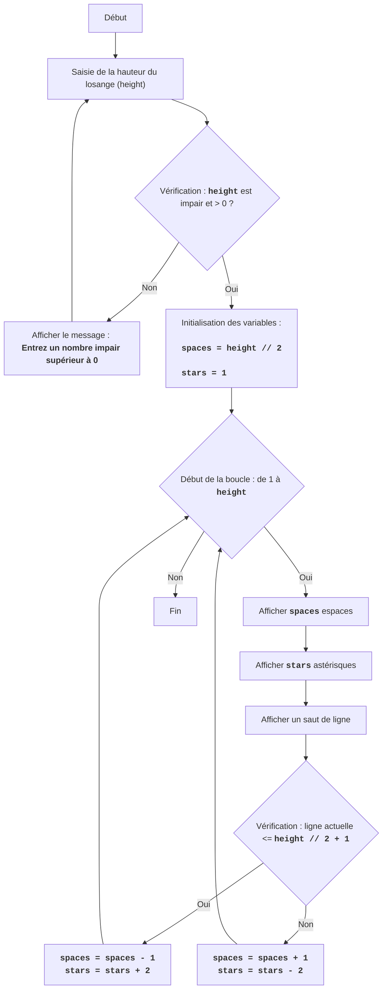

DIAMND :
=================
Difficulté : 7
-----------------
Le jeu DIAMND est un jeu textuel où le joueur tente de dessiner un losange d'étoiles, en spécifiant sa hauteur.
Le jeu demande d'abord à l'utilisateur une hauteur de losange impaire. Ensuite, si le nombre saisi est impair, le jeu construit un losange d'étoiles, en utilisant des espaces pour former la géométrie correcte de la figure. Si le nombre saisi est pair ou inférieur à 1, un message d'erreur est affiché.
Règles du jeu :
1. Le joueur saisit un nombre impair qui détermine la hauteur du losange.
2. Si un nombre pair ou un nombre inférieur à 1 est saisi, le jeu affiche un message d'erreur.
3. Si un nombre correct (impair et supérieur à 0) est saisi, le jeu affiche un losange d'étoiles de la hauteur spécifiée.
-----------------
Algorithme :
1. Demander à l'utilisateur la hauteur du losange (H).
2. Vérifier si H est pair ou inférieur à 1. Si oui, afficher un message d'erreur et passer à l'étape 1.
3. Si H est impair et supérieur à 0, alors :
   3.1. Définir la variable `space` à H // 2 (division entière).
   3.2. Définir la variable `stars` à 1.
   3.3. Démarrer une boucle de 1 à H inclus :
      3.3.1. Afficher `space` espaces.
      3.3.2. Afficher `stars` astérisques.
      3.3.3. Afficher un saut de ligne.
      3.3.4. Si le numéro de ligne actuel est inférieur à H // 2 + 1 :
          3.3.4.1. Diminuer `space` de 1.
          3.3.4.2. Augmenter `stars` de 2.
       3.3.5. Sinon :
          3.3.5.1. Augmenter `space` de 1.
          3.3.5.2. Diminuer `stars` de 2.
4. Fin du jeu.
-----------------
Organigramme :

Légende :
    Start - Début du programme.
    InputHeight - Demande à l'utilisateur de saisir la hauteur du losange et enregistrement de la valeur dans la variable `height`.
    CheckHeight - Vérification si la hauteur saisie est un nombre impair supérieur à 0.
    OutputError - Affichage d'un message d'erreur si la hauteur ne correspond pas à la condition.
    InitializeVars - Initialisation des variables : `spaces` (nombre d'espaces) est défini à `height // 2`, et `stars` (nombre d'astérisques) est défini à 1.
    LoopStart - Début de la boucle, qui se répète `height` fois.
    OutputSpaces - Affichage de `spaces` espaces.
    OutputStars - Affichage de `stars` astérisques.
    OutputNewline - Affichage d'un caractère de nouvelle ligne.
    CheckRow - Vérification si la ligne actuelle est inférieure ou égale au milieu du losange (`height // 2 + 1`).
    DecreaseSpaceIncreaseStars - Diminution du nombre d'espaces `spaces` de 1 et augmentation du nombre d'astérisques `stars` de 2.
    IncreaseSpaceDecreaseStars - Augmentation du nombre d'espaces `spaces` de 1 et diminution du nombre d'astérisques `stars` de 2.
    End - Fin du programme.