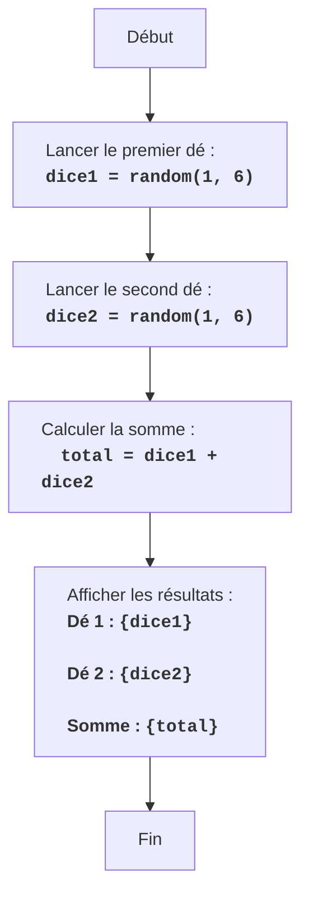

DICE :
=================
Difficulté : 2
-----------------
Le jeu "Dés" est un jeu simple dans lequel le joueur lance deux dés, et l'ordinateur affiche la somme des valeurs obtenues.

Règles du jeu :
1.  L'ordinateur simule le lancer de deux dés à six faces.
2.  L'ordinateur affiche les valeurs de chaque dé et leur somme.
-----------------
Algorithme :
1.  Générer un nombre aléatoire de 1 à 6 pour le premier dé.
2.  Générer un nombre aléatoire de 1 à 6 pour le second dé.
3.  Calculer la somme des valeurs des deux dés.
4.  Afficher la valeur du premier dé, la valeur du second dé et leur somme.
-----------------
Organigramme :

Légende :
    Start - Début du programme.
    RollDice1 - Un nombre aléatoire de 1 à 6 est généré, représentant le résultat du lancer du premier dé, et enregistré dans la variable dice1.
    RollDice2 - Un nombre aléatoire de 1 à 6 est généré, représentant le résultat du lancer du second dé, et enregistré dans la variable dice2.
    CalculateSum - La somme des valeurs de dice1 et dice2 est calculée, le résultat est enregistré dans la variable total.
    OutputResults - Les valeurs de dice1, dice2 et leur somme total sont affichées à l'écran.
    End - Fin du programme.