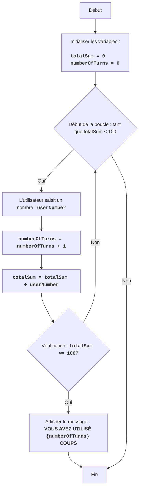

FIPFOP :
=================
Difficulté : 5
-----------------
Le jeu FIPFOP est un jeu de puzzle où le joueur doit, tour à tour, saisir des nombres.
Le but du jeu est de faire en sorte que tous les nombres saisis par l'utilisateur, additionnés, donnent le nombre 100.
Le jeu se termine lorsque la somme de tous les nombres saisis atteint 100.

Règles du jeu :
1. Le joueur saisit des nombres entiers, un à la fois.
2. Chaque nombre saisi est ajouté à la somme totale.
3. Le jeu se termine lorsque la somme totale atteint 100.
4. Une fois le jeu terminé, le nombre total de nombres saisis (coups) est affiché.
-----------------
Algorithme :
1. Définir la somme à 0.
2. Définir le compteur de coups à 0.
3. Démarrer la boucle "tant que la somme est inférieure à 100" :
    3.1 Demander au joueur de saisir un nombre.
    3.2 Augmenter le compteur de coups de 1.
    3.3 Ajouter le nombre saisi à la somme totale.
4. Afficher le message "VOUS AVEZ UTILISÉ {nombre de coups} COUPS"
5. Fin du jeu.
-----------------
Organigramme :

Légende :
    Start - Début du programme.
    InitializeVariables - Initialisation des variables : totalSum (somme des nombres saisis) est défini à 0, et numberOfTurns (nombre de coups) est défini à 0.
    LoopStart - Début de la boucle, qui continue tant que totalSum est inférieur à 100.
    InputNumber - Demande à l'utilisateur de saisir un nombre et l'enregistre dans la variable userNumber.
    IncreaseTurns - Augmentation du compteur de coups de 1.
    AddNumber - Ajout du nombre saisi userNumber à la somme totale totalSum.
    CheckSum - Vérifie si la somme totale totalSum est supérieure ou égale à 100.
    OutputTurns - Affiche un message sur le nombre de coups utilisés par l'utilisateur.
    End - Fin du programme.

# Initialisation de la somme et du compteur de coups
totalSum = 0 # Somme des nombres saisis
numberOfTurns = 0 # Nombre de coups

# Boucle de jeu principale
while totalSum < 100:
    # Demander la saisie d'un nombre à l'utilisateur
    try:
        userNumber = int(input("Entrez un nombre : "))
    except ValueError:
         print("Veuillez entrer un nombre entier.")
         continue
    
    # Incrémenter le compteur de coups
    numberOfTurns += 1
    # Ajouter le nombre saisi à la somme totale
    totalSum += userNumber

# Afficher le message sur le nombre de coups
print(f"VOUS AVEZ UTILISÉ {numberOfTurns} COUPS")

Explication du code :
1. **Initialisation des variables :**
   - `totalSum = 0` : Initialise la variable `totalSum` pour stocker la somme des nombres saisis, en commençant par 0.
   - `numberOfTurns = 0` : Initialise la variable `numberOfTurns` pour compter le nombre de coups, en commençant également par 0.
2. **Boucle principale `while totalSum < 100` :**
   -  La boucle continue tant que la somme des nombres saisis (`totalSum`) est inférieure à 100.
3. **Saisie des données par l'utilisateur :**
    - `try...except ValueError` : Le bloc try-except gère les erreurs de saisie possibles. Si l'utilisateur saisit une valeur non entière, un message d'erreur s'affiche.
   - `userNumber = int(input("Entrez un nombre : "))` : Demande à l'utilisateur de saisir un nombre et le convertit en entier, en enregistrant le résultat dans la variable `userNumber`.
4. **Incrémentation du compteur de coups :**
   - `numberOfTurns += 1` : Incrémente le compteur de coups de 1 à chaque itération de la boucle.
5.  **Ajout du nombre à la somme :**
   -  `totalSum += userNumber` : Ajoute le nombre saisi (`userNumber`) à la somme totale (`totalSum`).
6.  **Affichage du résultat :**
    - `print(f"VOUS AVEZ UTILISÉ {numberOfTurns} COUPS")` : Affiche un message à l'écran indiquant le nombre de coups effectués lorsque la somme des nombres a atteint 100 ou plus.
