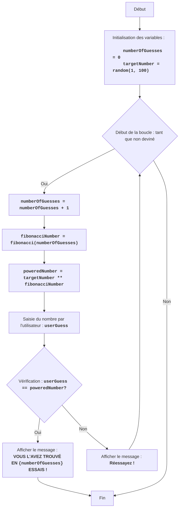

FIPOWR :
=================
Difficulté : 6
-----------------
Le jeu "Puissance de Fibonacci" est un jeu mathématique où l'ordinateur choisit un nombre aléatoire dans la plage de 1 à 100, et le joueur saisit un nombre.
L'ordinateur élève le nombre choisi aléatoirement à la puissance du nombre de Fibonacci correspondant au numéro de tentative, et le compare au nombre de l'utilisateur.
Le jeu continue jusqu'à ce que les nombres soient égaux.
Règles du jeu :
1. L'ordinateur choisit un nombre entier aléatoire de 1 à 100.
2. Le joueur saisit son nombre.
3. L'ordinateur calcule le nombre de Fibonacci correspondant au numéro de tentative, et élève le nombre aléatoire à cette puissance.
4. Compare le résultat obtenu avec le nombre du joueur.
5. Le jeu continue jusqu'à ce que les nombres soient égaux.
-----------------
Algorithme :
1. Définir le compteur de tentatives à 0.
2. Générer un nombre aléatoire dans la plage de 1 à 100.
3. Démarrer une boucle "tant que le nombre du joueur n'est pas égal au nombre élevé à la puissance de Fibonacci" :
    3.1. Incrémenter le compteur de tentatives de 1.
    3.2. Calculer le nombre de Fibonacci correspondant au numéro de tentative.
    3.3. Élever le nombre aléatoire à la puissance du nombre de Fibonacci.
    3.4. Demander au joueur un nombre.
    3.5. Si le nombre du joueur est égal au nombre calculé, passer à l'étape 4.
    3.6. Si le nombre du joueur n'est pas égal au nombre calculé, afficher un message sur l'état actuel.
4. Afficher le message "VOUS L'AVEZ TROUVÉ EN {nombre de tentatives} ESSAIS !"
5. Fin du jeu.
-----------------
Organigramme :

Légende :
    Start - Début du programme.
    InitializeVariables - Initialisation des variables : numberOfGuesses (nombre de tentatives) est défini à 0, et targetNumber (nombre caché) est généré aléatoirement de 1 à 100.
    LoopStart - Début de la boucle, qui continue tant que le nombre n'est pas deviné.
    IncreaseGuesses - Augmentation du compteur de tentatives de 1.
    CalculateFibonacci - Calcul du nombre de Fibonacci correspondant à la tentative actuelle.
    CalculatePower - Élévation du nombre caché à la puissance du nombre de Fibonacci.
    InputGuess - Demande à l'utilisateur de saisir un nombre et l'enregistre dans la variable userGuess.
    CheckGuess - Vérifie si le nombre saisi userGuess est égal au nombre calculé poweredNumber.
    OutputWin - Affiche un message de victoire si les nombres sont égaux, indiquant le nombre de tentatives.
    End - Fin du programme.
    OutputTryAgain - Affiche le message "Réessayez !" si le nombre saisi n'est pas égal au nombre calculé.

import random

# Fonction pour calculer le nombre de Fibonacci
def fibonacci(n):
    if n <= 0:
        return 0
    elif n == 1:
        return 1
    else:
        a, b = 0, 1
        for _ in range(2, n + 1):
            a, b = b, a + b
        return b

# Initialisation du compteur de tentatives
numberOfGuesses = 0
# Générer un nombre aléatoire de 1 à 100
targetNumber = random.randint(1, 100)

# Boucle de jeu principale
while True:
    # Incrémenter le compteur de tentatives
    numberOfGuesses += 1
    # Calculer le nombre de Fibonacci pour la tentative actuelle
    fibonacciNumber = fibonacci(numberOfGuesses)
    # Élever le nombre caché à la puissance du nombre de Fibonacci
    poweredNumber = targetNumber ** fibonacciNumber

    # Demander la saisie d'un nombre à l'utilisateur
    try:
        userGuess = int(input(f"Tentative {numberOfGuesses} : Entrez un nombre : "))
    except ValueError:
         print("Veuillez entrer un nombre entier.")
         continue

    # Vérifier si le nombre est deviné
    if userGuess == poweredNumber:
        print(f"FÉLICITATIONS ! Vous avez deviné le nombre en {numberOfGuesses} tentatives !")
        break  # Terminer la boucle si le nombre est deviné
    else:
         print("Réessayez !") # Afficher un message pour réessayer

Explication du code :
1.  **Importation du module `random`** :
   -  `import random` : Importe le module `random`, qui est utilisé pour générer un nombre aléatoire.
2.  **Fonction `fibonacci(n)`** :
    -   Définit la fonction `fibonacci(n)`, qui calcule le n-ième nombre de Fibonacci.
    -   Utilise une approche itérative pour calculer les nombres de Fibonacci.
3.  **Initialisation des variables** :
    -   `numberOfGuesses = 0` : Initialise la variable `numberOfGuesses` pour compter les tentatives du joueur.
    -   `targetNumber = random.randint(1, 100)` : Génère un nombre entier aléatoire dans la plage de 1 à 100 et l'enregistre dans `targetNumber`.
4. **Boucle principale `while True:`** :
    - Une boucle infinie qui continue jusqu'à ce que le joueur devine le nombre (la commande `break` sera exécutée).
    - `numberOfGuesses += 1` : Incrémente le compteur de tentatives de 1 à chaque nouvelle itération de la boucle.
    - `fibonacciNumber = fibonacci(numberOfGuesses)` : Appelle la fonction `fibonacci` pour obtenir le nombre de Fibonacci correspondant à la tentative actuelle.
    - `poweredNumber = targetNumber ** fibonacciNumber` : Calcule le nombre caché élevé à la puissance du nombre de Fibonacci.
    - **Saisie des données** :
       - `try...except ValueError` : Le bloc try-except gère les erreurs de saisie possibles. Si l'utilisateur saisit une valeur non entière, un message d'erreur s'affiche.
       - `userGuess = int(input(f"Tentative {numberOfGuesses} : Entrez un nombre : "))` : Demande à l'utilisateur un nombre et le convertit en entier, en enregistrant le résultat dans `userGuess`.
    - **Condition de victoire** :
      -  `if userGuess == poweredNumber:` : Vérifie si le nombre saisi est égal à la valeur calculée.
      -  `print(f"FÉLICITATIONS ! Vous avez deviné le nombre en {numberOfGuesses} tentatives !")` : Affiche un message de victoire et le nombre de tentatives.
      - `break` : Termine la boucle (et le jeu) si le nombre est deviné.
    -  **Indice** :
       - `else:` : Si le nombre n'est pas deviné, le message "Réessayez !" est affiché.
