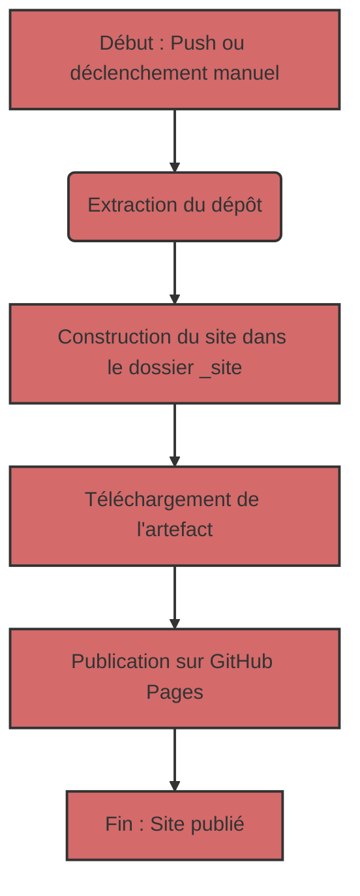

## Déploiement automatisé de Jekyll sur GitHub Pages

Pour automatiser le processus de déploiement, nous utiliserons GitHub Actions, qui vous permettent d'effectuer diverses tâches, y compris la création et la publication de sites web, directement dans votre dépôt.

### 1 : Aperçu du fichier de workflow
Tout d'abord, examinons le fichier de workflow principal qui contrôle le processus de création et de déploiement. Ce fichier est écrit en YAML et se trouve généralement dans le répertoire `.github/workflows`. Voici son contenu :

```yaml
# Sample workflow for building and deploying a Jekyll site to GitHub Pages
name: Deploy Jekyll with GitHub Pages dependencies preinstalled

on:
  # Runs on pushes targeting the default branch
  push:
    branches: ["master"]

  # Allows you to run this workflow manually from the Actions tab
  workflow_dispatch:

# Sets permissions of the GITHUB_TOKEN to allow deployment to GitHub Pages
permissions:
  contents: read
  pages: write
  id-token: write

# Allow only one concurrent deployment, skipping runs queued between the run in-progress and latest queued.
# However, do NOT cancel in-progress runs as we want to allow these production deployments to complete.
concurrency:
  group: "pages"
  cancel-in-progress: false

jobs:
  # Build job
  build:
    runs-on: ubuntu-latest
    steps:
      - name: Checkout
        uses: actions/checkout@v4
      - name: Setup Pages
        uses: actions/configure-pages@v5
      - name: Build with Jekyll
        uses: actions/jekyll-build-pages@v1
        with:
          source: ./docs/gemini/consultant/ru/src
          destination: ./_site
      - name: Upload artifact
        uses: actions/upload-pages-artifact@v3

  # Deployment job
  deploy:
    environment:
      name: github-pages
      url: ${{ steps.deployment.outputs.page_url }}
    runs-on: ubuntu-latest
    needs: build
    steps:
      - name: Deploy to GitHub Pages
        id: deployment
        uses: actions/deploy-pages@v4
```

### 2 : Analyse de la structure du workflow
Maintenant, décomposons chaque section de ce fichier :

#### 2.1. Informations générales

-   `name: Deploy Jekyll with GitHub Pages dependencies preinstalled` : Le nom du workflow que vous verrez dans la liste des Actions du dépôt.
-   `on` : Décrit quand le workflow doit s'exécuter :
    -   `push` : Le workflow s'exécute à chaque push vers la branche `master`.
    -   `workflow_dispatch` : Vous permet d'exécuter manuellement le workflow via l'interface GitHub.
-   `permissions` : Configure les autorisations pour l'exécution du workflow :
    -   `contents: read` : Autorisation de lire le code du dépôt.
    -   `pages: write` : Autorisation de publier sur GitHub Pages.
    -   `id-token: write` : Autorisation d'obtenir un jeton d'authentification (requis pour GitHub Actions).
-   `concurrency` : Configure l'exécution concurrente du workflow :
    -   `group: "pages"` : Garantit qu'un seul workflow pour GitHub Pages s'exécute à la fois.
    -   `cancel-in-progress: false` : Empêche l'annulation de l'exécution actuelle du workflow lorsqu'une nouvelle est lancée.

#### 2.2. Section `jobs`
Cette section décrit les tâches à effectuer. Nous avons deux tâches : `build` et `deploy`.

##### 2.2.1. `build` : Construction du site
    -   `runs-on: ubuntu-latest` : Indique que la tâche s'exécute sur un serveur Ubuntu.
    -   `steps` : Liste les étapes qui sont effectuées pendant la construction :
        -   `name: Checkout` : Extrait le code source du dépôt.
        -   `uses: actions/checkout@v4` : Utilise une action prédéfinie pour extraire le code.
        -   `name: Setup Pages` : Configure l'environnement pour travailler avec GitHub Pages.
        -    `uses: actions/configure-pages@v5` : Utilise une action prédéfinie pour la configuration.
        -   `name: Build with Jekyll` : Lance la construction du site Jekyll.
        -   `uses: actions/jekyll-build-pages@v1` : Utilise une action prédéfinie pour la construction.
        -   `with:` : Configure les paramètres de l'action :
            -   `source: ./docs/gemini/consultant/ru/src` : Spécifie l'emplacement des fichiers source de votre site. **Remarque** : le chemin vers vos fichiers `docs/gemini/consultant/ru/src`.
            -    `destination: ./_site` : Spécifie où placer les fichiers construits.
        -   `name: Upload artifact` : Télécharge les fichiers construits pour les transmettre à la tâche suivante.
        -   `uses: actions/upload-pages-artifact@v3` : Utilise une action prédéfinie pour télécharger les artefacts.
    
##### 2.2.2. `deploy` : Publication du site
    -   `environment` : Configure l'environnement de publication.
        -  `name: github-pages` : Nom de l'environnement.
        -   `url: ${{ steps.deployment.outputs.page_url }}` : Obtient l'URL du site publié.
    -   `runs-on: ubuntu-latest` : Indique que la tâche s'exécute sur un serveur Ubuntu.
    -   `needs: build` : Indique que la tâche `deploy` doit s'exécuter après l'exécution réussie de la tâche `build`.
    -   `steps` : Liste les étapes qui sont effectuées pendant la publication :
        -   `name: Deploy to GitHub Pages` : Publie le site sur GitHub Pages.
        -   `id: deployment` : Définit l'identifiant pour l'action.
        -    `uses: actions/deploy-pages@v4` : Utilise une action prédéfinie pour le déploiement.

### 3 : Que font les fichiers Markdown ?

Les fichiers `.md` (Markdown) sont la base d'un site Jekyll. Markdown est un langage de balisage simple qui vous permet de formater du texte.
Jekyll traite automatiquement les fichiers `.md`, les convertissant en pages HTML. Vos fichiers doivent être situés dans le dossier `docs/gemini/consultant/ru/src` spécifié dans le workflow.

### 4 : Organigramme




### 5 : Comment ça marche
1.  **Modification du code :** Vous apportez des modifications à vos fichiers `.md` ou `.html` situés dans le dossier `docs/gemini/consultant/ru/src`.
2.  **Push :** Vous poussez (push) vos modifications vers la branche `master` de votre dépôt GitHub.
3.  **Déclenchement du workflow :** GitHub Actions déclenche automatiquement le workflow décrit dans le fichier YAML.
4.  **Construction :** Le workflow télécharge d'abord le code du dépôt, puis construit le site Jekyll à partir de vos fichiers source dans le dossier `_site`.
5.  **Publication :** Le site construit est publié sur GitHub Pages.
6.  **Site prêt :** Votre site est alors disponible à l'URL spécifiée dans les paramètres de vos GitHub Pages.
