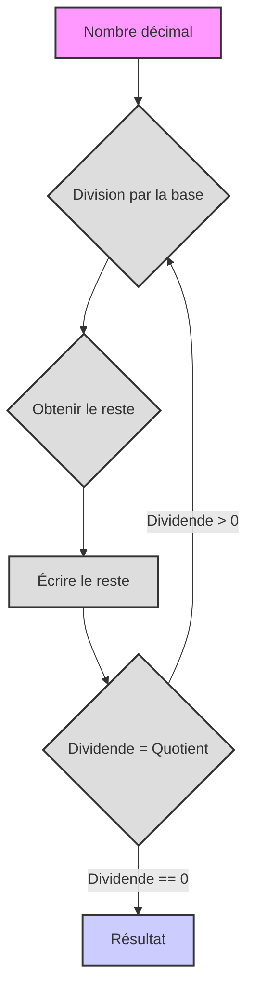

# Systèmes de numération

Bonjour ! Plongeons dans le monde fascinant des systèmes de numération. Préparez-vous, aujourd'hui vous allez apprendre beaucoup de choses nouvelles et intéressantes !

# Systèmes de numération

**1. Système de numération abstrait**

Imaginez que les nombres sont comme des mots que l'on peut écrire avec différentes "lettres". Peu importe la manière exacte dont nous désignons les nombres, l'essentiel est que certaines règles soient respectées :

*   **Base :** C'est le nombre de symboles (chiffres) uniques que nous utilisons. Désignons la base par `b`. Par exemple, dans le système décimal, la base est 10.
*   **Chiffres :** Ce sont les symboles que nous utilisons pour écrire les nombres. Habituellement, ce sont des chiffres arabes (0, 1, 2, 3, ...), mais il peut aussi s'agir d'autres symboles, tels que des lettres latines (I, V, X) ou même des fruits (🍎, 🍐, 🍉).
*   **Position :** Chaque chiffre dans la représentation d'un nombre a sa propre position, ce qui affecte sa valeur. Cela signifie que le même chiffre peut avoir une valeur différente selon l'endroit où il se trouve dans le nombre.
*   **Poids :** Chaque position est appelée un poids (par exemple, unités, dizaines, centaines, etc.). Dans chaque position, la valeur du chiffre est multipliée par la base élevée à la puissance correspondant au numéro du poids.

**Comment est construit un système de numération ?**

1.  **Choix de la base :** Nous choisissons un entier `b` qui sera la base de notre système.
2.  **Choix des chiffres :** Nous avons besoin de `b` chiffres uniques. Habituellement, ce sont 0, 1, 2, ..., `b-1`. Par exemple, pour le système binaire (base 2), nous avons les chiffres 0 et 1.
3.  **Écriture d'un nombre :** Un nombre est écrit comme une séquence de chiffres. La valeur de chaque chiffre est multipliée par la base élevée à la puissance égale à sa position (en commençant par 0 à droite).

**Formule de calcul de la valeur d'un nombre :**

Si nous avons un nombre écrit sous forme de séquence de chiffres `dₙ dₙ₋₁ ... d₁ d₀`, sa valeur dans le système décimal peut être calculée à l'aide de la formule :

`valeur = dₙ * bⁿ + dₙ₋₁ * bⁿ⁻¹ + ... + d₁ * b¹ + d₀ * b⁰`

Où :

*   `dᵢ` - chiffre à la i-ème position
*   `b` - base du système de numération
*   `i` - numéro de position (de droite à gauche, en commençant par 0)

**Exemple :**

Supposons que nous ayons le nombre 123 dans le système décimal (base 10). Selon la formule :

`1 * 10² + 2 * 10¹ + 3 * 10⁰ = 100 + 20 + 3 = 123₁₀`

**Ordres de grandeur (positions) :**

Les ordres de grandeur, comme nous l'avons déjà dit, sont les positions des chiffres dans un nombre, chaque position ayant son propre poids, qui est déterminé par la base élevée à la puissance de son numéro ordinal.
*   `d₀` : unités (`b⁰`)
*   `d₁` : `b` (`b¹`)
*   `d₂` : `b²`
*   `d₃` : `b³`
*   et ainsi de suite

**Règles :**

1.  **Plage de chiffres :** Les chiffres de 0 à `b-1` sont utilisés.
2.  **Principe de position :** La valeur d'un chiffre dépend de sa position.
3.  **Transition vers le rang suivant :** Lorsque la valeur `b` est atteinte dans un rang, un report se produit vers le rang suivant (analogue à la façon dont après 9 dans le système décimal, 1 est ajouté au rang suivant et on obtient 10).

## Exemple : Système de numération des fruits

Considérons un exemple de système de numération abstrait avec des fruits :

*   🍎 (pomme)
*   🍐 (poire)
*   🍉 (melon)
*   🧺 (panier)

**Règles :**

1.  3 🍎 = 1 🍐
2.  5 🍐 = 3 🍉
3.  2 🍉 = 1 🧺

**Représentation des nombres :**

Nous représenterons le nombre de fruits sous forme de chaîne de caractères, où chaque caractère Unicode correspond à un fruit. Par exemple, "🍎🍎🍎" représente 3 pommes, et "🍉🍉" représente 2 melons.

**Opérations arithmétiques :**

Nous pouvons effectuer des opérations d'addition et de soustraction. Commençons par l'addition.

**Code Python :**

```python
def normalize_fruits(fruits: str) -> str:
    """
    Normalise une chaîne de fruits, la réduisant à sa représentation minimale,
    en utilisant les règles d'échange de fruits.

    Args:
        fruits: Chaîne de fruits (🍎, 🍐, 🍉, 🧺).

    Returns:
        Chaîne avec le nombre de fruits normalisé.
    """
    apples = fruits.count('🍎')
    pears = fruits.count('🍐')
    melons = fruits.count('🍉')
    baskets = fruits.count('🧺')

    # Conversion des pommes en poires
    pears += apples // 3
    apples %= 3

    # Conversion des poires en melons
    melons += (pears * 3) // 5
    pears %= 5

    # Conversion des melons en paniers
    baskets += melons // 2
    melons %= 2

    # Réassembler la chaîne, paniers d'abord, puis melons, poires, pommes
    return (
        "🧺" * baskets
        + "🍉" * melons
        + "🍐" * pears
        + "🍎" * apples
    )


def add_fruits(fruits1: str, fruits2: str) -> str:
    """
    Ajoute deux chaînes de fruits.

    Args:
        fruits1: Chaîne de fruits.
        fruits2: Chaîne de fruits.

    Returns:
        Chaîne avec la somme des fruits.
    """
    return normalize_fruits(fruits1 + fruits2)


def sub_fruits(fruits1: str, fruits2: str) -> str:
    """
    Soustrait la deuxième chaîne de fruits de la première, si possible.

    Args:
        fruits1: Chaîne de fruits à soustraire.
        fruits2: Chaîne de fruits à soustraire.

    Returns:
        Chaîne avec la différence de fruits ou "Impossible de soustraire" si le résultat est négatif.
    """

    apples1 = fruits1.count('🍎')
    pears1 = fruits1.count('🍐')
    melons1 = fruits1.count('🍉')
    baskets1 = fruits1.count('🧺')

    apples2 = fruits2.count('🍎')
    pears2 = fruits2.count('🍐')
    melons2 = fruits2.count('🍉')
    baskets2 = fruits2.count('🧺')


    # Représentation temporaire en nombre total de pommes
    total_apples1 = apples1 + pears1 * 3 + melons1 * 15 // 3 + baskets1 * 30
    total_apples2 = apples2 + pears2 * 3 + melons2 * 15 // 3 + baskets2 * 30

    if total_apples1 < total_apples2:
        return "Impossible de soustraire"
    else:
        total_apples = total_apples1 - total_apples2

    # Renvoyer la représentation normalisée de la somme des pommes
    result_fruits = ""
    baskets = total_apples // 30
    result_fruits += "🧺" * baskets
    total_apples %= 30
    melons = (total_apples*3) // 15
    result_fruits += "🍉" * melons
    total_apples %= 15
    pears = total_apples // 3
    result_fruits += "🍐" * pears
    total_apples %= 3
    result_fruits += "🍎" * total_apples

    return normalize_fruits(result_fruits)


# Exemples :
fruits1 = "🍎🍎🍎🍎🍎" # 5 pommes
fruits2 = "🍎🍎🍎" # 3 pommes
print(f"{fruits1} + {fruits2} = {add_fruits(fruits1, fruits2)}")

fruits3 = "🍐🍐"  # 2 poires
fruits4 = "🍎🍎🍎🍎" # 4 pommes
print(f"{fruits3} + {fruits4} = {add_fruits(fruits3, fruits4)}")

fruits5 = "🍉🍉" # 2 melons
fruits6 = "🍎🍎🍎🍎🍎🍎🍎🍎🍎🍎🍎🍎🍎🍎🍎" # 15 pommes
print(f"{fruits5} + {fruits6} = {add_fruits(fruits5, fruits6)}")

fruits7 = "🧺🧺" # 2 paniers
fruits8 = "🍉🍉🍉" # 3 melons
print(f"{fruits7} + {fruits8} = {add_fruits(fruits7, fruits8)}")

fruits9 = "🧺🍉🍐🍎" # 1 panier, 1 melon, 1 poire, 1 pomme
fruits10 = "🍉🍐🍎" # 1 melon, 1 poire, 1 pomme
print(f"{fruits9} - {fruits10} = {sub_fruits(fruits9, fruits10)}")

fruits11 = "🧺🍉" # 1 panier, 1 melon
fruits12 = "🧺🍉🍎🍎🍎" # 1 panier, 1 melon, 3 pommes
print(f"{fruits11} - {fruits12} = {sub_fruits(fruits11, fruits12)}")

fruits13 = "🍉🍉🍉" # 3 melons
fruits14 = "🍎🍎🍎🍎" # 4 pommes
print(f"{fruits13} - {fruits14} = {sub_fruits(fruits13, fruits14)}")

fruits15 = "🍐🍐🍐🍐🍐" # 5 poires
fruits16 = "🍉" # 1 melon
print(f"{fruits15} - {fruits16} = {sub_fruits(fruits15, fruits16)}")
```

**Explication du code :**

1.  **`normalize_fruits(fruits)` :** Cette fonction convertit une chaîne de fruits à sa forme minimale. Elle compte d'abord le nombre de chaque fruit, puis, en utilisant les règles d'échange, les convertit en unités plus grandes (pommes en poires, poires en melons, melons en paniers), et après la conversion, les concatène à nouveau en une chaîne avec l'ensemble minimal de fruits.
2.  **`add_fruits(fruits1, fruits2)` :** Cette fonction effectue l'addition de deux chaînes de fruits. Elle concatène simplement les deux chaînes et normalise ensuite le résultat.
3.  **`sub_fruits(fruits1, fruits2)` :** Cette fonction sert à soustraire une chaîne de fruits d'une autre. Elle convertit tout en "nombre de pommes" et effectue ensuite la soustraction, puis reconvertit les pommes en une forme normalisée, tout en vérifiant la possibilité de soustraction.
4.  **Exemples :** À la fin du code, des exemples d'addition et de soustraction avec diverses combinaisons de fruits et l'affichage des résultats sont donnés.

**Tâches :**

1.  Essayez d'ajouter au code une fonction pour multiplier les fruits par un entier (par exemple, `multiply_fruits(fruits, n)`).
2.  Implémentez la fonction `compare_fruits(fruits1, fruits2)`, qui compare deux chaînes de fruits et renvoie "plus grand", "plus petit" ou "égal".
3.  Inventez vos propres règles d'échange de fruits et modifiez le code en conséquence.
4.  Ajoutez une validation des données d'entrée (pour vous assurer que la chaîne ne contient que des caractères Unicode autorisés).
5.  Implémentez une soustraction plus avancée, par exemple, ne pas émettre d'erreur "Impossible de soustraire", mais afficher le résultat avec un signe moins (tâche avancée).

## 2. Systèmes de numération spécifiques

Passons maintenant à des exemples spécifiques de systèmes de numération qui sont souvent utilisés en informatique et dans la vie quotidienne.

### 2.1. Système binaire (base 2)

*   **Chiffres :** 0, 1
*   **Utilisé dans les ordinateurs :** Toutes les données des ordinateurs sont représentées en code binaire (bits).

**Exemple :**

*   Nombre `1011₂` (se lit "un zéro un un en base 2"). Conversion en système décimal :
    `1 * 2³ + 0 * 2² + 1 * 2¹ + 1 * 2⁰ = 8 + 0 + 2 + 1 = 11₁₀`

**Python :**

```python
def bin_to_dec(binary: str) -> int:
    """
    Convertit un nombre binaire (chaîne) en décimal.

    Args:
        binary: Nombre binaire sous forme de chaîne.

    Returns:
        Représentation décimale du nombre (entier).
    """
    decimal = 0  # Initialiser la valeur décimale
    power = 0  # Initialiser la puissance de deux (exposant de la position)
    for digit in reversed(binary):  # Itérer sur les chiffres du nombre binaire en ordre inverse
        if digit == '1':
            decimal += 2 ** power  # Si le chiffre est '1', ajouter 2 à la puissance de la position
        power += 1  # Incrémenter la puissance pour la position suivante
    return decimal  # Renvoyer la valeur décimale


binary_number = "1011"
decimal_number = bin_to_dec(binary_number)
print(f"Binaire {binary_number} = Décimal {decimal_number}")

def dec_to_bin(decimal: int) -> str:
    """
    Convertit un nombre décimal (entier) en représentation binaire (chaîne).

    Args:
        decimal: Nombre décimal.

    Returns:
        Représentation binaire du nombre (chaîne).
    """
    if decimal == 0:  # Si le nombre décimal est 0
        return "0"  # Renvoyer la chaîne "0"
    binary = ""  # Initialiser la chaîne pour le nombre binaire
    while decimal > 0:  # Tant que le nombre décimal est supérieur à 0
        binary = str(decimal % 2) + binary  # Ajouter le reste de la division par 2 au début de la chaîne binaire
        decimal = decimal // 2  # Diviser le nombre décimal par 2 (division entière)
    return binary  # Renvoyer la chaîne binaire


decimal_number = 11
binary_number = dec_to_bin(decimal_number)
print(f"Décimal {decimal_number} = Binaire {binary_number}")
```

### 2.2. Système ternaire (base 3)

*   **Chiffres :** 0, 1, 2
*   **Intéressant théoriquement :** Utilisé dans certains domaines des mathématiques et de l'informatique.

**Exemple :**

*   Nombre `210₃` (se lit "deux un zéro en base 3"). Conversion en système décimal :
    `2 * 3² + 1 * 3¹ + 0 * 3⁰ = 18 + 3 + 0 = 21₁₀`

**Python :**

```python
def ternary_to_dec(ternary: str) -> int:
    """
    Convertit un nombre ternaire (chaîne) en décimal.

    Args:
        ternary: Nombre ternaire sous forme de chaîne.

    Returns:
        Représentation décimale du nombre (entier).
    """
    decimal = 0  # Initialiser la valeur décimale
    power = 0  # Initialiser la puissance de trois (exposant de la position)
    for digit in reversed(ternary):  # Itérer sur les chiffres du nombre ternaire en ordre inverse
        decimal += int(digit) * (3 ** power)  # Ajouter le chiffre * 3 à la puissance de la position
        power += 1  # Incrémenter la puissance pour la position suivante
    return decimal  # Renvoyer la valeur décimale


ternary_number = "210"
decimal_number = ternary_to_dec(ternary_number)
print(f"Ternaire {ternary_number} = Décimal {decimal_number}")

def dec_to_ternary(decimal: int) -> str:
    """
    Convertit un nombre décimal (entier) en représentation ternaire (chaîne).

    Args:
        decimal: Nombre décimal.

    Returns:
        Représentation ternaire du nombre (chaîne).
    """
    if decimal == 0:  # Si le nombre décimal est 0
        return "0"  # Renvoyer la chaîne "0"
    ternary = ""  # Initialiser la chaîne pour le nombre ternaire
    while decimal > 0:  # Tant que le nombre décimal est supérieur à 0
        ternary = str(decimal % 3) + ternary  # Ajouter le reste de la division par 3 au début de la chaîne ternaire
        decimal = decimal // 3  # Diviser le nombre décimal par 3 (division entière)
    return ternary  # Renvoyer la chaîne ternaire


decimal_number = 21
ternary_number = dec_to_ternary(decimal_number)
print(f"Décimal {decimal_number} = Ternaire {ternary_number}")
```

### 2.3. Système septénaire (base 7)

*   **Chiffres :** 0, 1, 2, 3, 4, 5, 6
*   **Moins courant :** Utilisé dans certains domaines restreints, par exemple, dans certains systèmes de codage. A également une application pratique dans les jours de la semaine.

**Exemple :**

*   Nombre `345₇` (se lit "trois quatre cinq en base 7"). Conversion en système décimal :
    `3 * 7² + 4 * 7¹ + 5 * 7⁰ = 147 + 28 + 5 = 180₁₀`

**Python :**

```python
def septenary_to_dec(septenary: str) -> int:
    """
    Convertit un nombre septénaire (chaîne) en décimal.

    Args:
        septenary: Nombre septénaire sous forme de chaîne.

    Returns:
        Représentation décimale du nombre (entier).
    """
    decimal = 0  # Initialiser la valeur décimale
    power = 0  # Initialiser la puissance de sept (exposant de la position)
    for digit in reversed(septenary):  # Itérer sur les chiffres du nombre septénaire en ordre inverse
        decimal += int(digit) * (7 ** power)  # Ajouter le chiffre * 7 à la puissance de la position
        power += 1  # Incrémenter la puissance pour la position suivante
    return decimal  # Renvoyer la valeur décimale


septenary_number = "345"
decimal_number = septenary_to_dec(septenary_number)
print(f"Septénaire {septenary_number} = Décimal {decimal_number}")

def dec_to_septenary(decimal: int) -> str:
    """
    Convertit un nombre décimal (entier) en représentation septénaire (chaîne).

    Args:
        decimal: Nombre décimal.

    Returns:
        Représentation septénaire du nombre (chaîne).
    """
    if decimal == 0: # Si le nombre décimal est 0
        return "0" # Renvoyer la chaîne "0"
    septenary = ""  # Initialiser la chaîne pour le nombre septénaire
    while decimal > 0:  # Tant que le nombre décimal est supérieur à 0
        septenary = str(decimal % 7) + septenary  # Ajouter le reste de la division par 7 au début de la chaîne septénaire
        decimal = decimal // 7  # Diviser le nombre décimal par 7 (division entière)
    return septenary  # Renvoyer la chaîne septénaire


decimal_number = 180
septenary_number = dec_to_septenary(decimal_number)
print(f"Décimal {decimal_number} = Septénaire {septenary_number}")
```

### 2.4. Système décimal (base 10)

*   **Chiffres :** 0, 1, 2, 3, 4, 5, 6, 7, 8, 9
*   **Quotidien :** Le système le plus courant que nous utilisons tous les jours.

**Exemple :**

*   Nombre `789₁₀`. Conversion en système décimal : (pas de sens, c'est déjà décimal)
    `7 * 10² + 8 * 10¹ + 9 * 10⁰ = 700 + 80 + 9 = 789₁₀`

### 2.5. Système hexadécimal (base 16)

*   **Chiffres :** 0, 1, 2, 3, 4, 5, 6, 7, 8, 9, A, B, C, D, E, F
    *   A = 10, B = 11, C = 12, D = 13, E = 14, F = 15
*   **Largement utilisé en programmation :** Pour représenter les couleurs, les adresses mémoire, les codes machine, etc. Souvent utilisé pour raccourcir la représentation des nombres binaires.

**Exemple :**

*   Nombre `2AF₁₆` (se lit "deux a f en base 16"). Conversion en système décimal :
    `2 * 16² + 10 * 16¹ + 15 * 16⁰ = 512 + 160 + 15 = 687₁₀`

**Python :**

```python
def hex_to_dec(hexadecimal: str) -> int:
    """
    Convertit un nombre hexadécimal (chaîne) en décimal.

    Args:
        hexadecimal: Nombre hexadécimal sous forme de chaîne.

    Returns:
        Représentation décimale du nombre (entier).
    """
    decimal = 0  # Initialiser la valeur décimale
    power = 0  # Initialiser la puissance de 16 (exposant de la position)
    for digit in reversed(hexadecimal):  # Itérer sur les chiffres du nombre hexadécimal en ordre inverse
        if digit.isdigit():  # Si le chiffre est un nombre
            decimal += int(digit) * (16 ** power)  # Ajouter le chiffre * 16 à la puissance de la position
        elif digit.upper() == 'A':  # Si le chiffre est 'A'
            decimal += 10 * (16 ** power)  # Ajouter 10 * 16 à la puissance de la position
        elif digit.upper() == 'B':  # Si le chiffre est 'B'
            decimal += 11 * (16 ** power)  # Ajouter 11 * 16 à la puissance de la position
        elif digit.upper() == 'C':  # Si le chiffre est 'C'
            decimal += 12 * (16 ** power)  # Ajouter 12 * 16 à la puissance de la position
        elif digit.upper() == 'D':  # Si le chiffre est 'D'
            decimal += 13 * (16 ** power)  # Ajouter 13 * 16 à la puissance de la position
        elif digit.upper() == 'E':  # Si le chiffre est 'E'
            decimal += 14 * (16 ** power)  # Ajouter 14 * 16 à la puissance de la position
        elif digit.upper() == 'F':  # Si le chiffre est 'F'
            decimal += 15 * (16 ** power)  # Ajouter 15 * 16 à la puissance de la position
        power += 1  # Incrémenter la puissance pour la position suivante
    return decimal  # Renvoyer la valeur décimale


hex_number = "2AF"
decimal_number = hex_to_dec(hex_number)
print(f"Hexadécimal {hex_number} = Décimal {decimal_number}")

def dec_to_hex(decimal: int) -> str:
    """
    Convertit un nombre décimal (entier) en représentation hexadécimale (chaîne).

    Args:
        decimal: Nombre décimal.

    Returns:
        Représentation hexadécimale du nombre (chaîne).
    """
    if decimal == 0:  # Si le nombre décimal est 0
        return "0"  # Renvoyer la chaîne "0"
    hex_digits = "0123456789ABCDEF"  # Chaîne pour la correspondance des restes et des chiffres hexadécimaux
    hexadecimal = ""  # Initialiser la chaîne pour le nombre hexadécimal
    while decimal > 0:  # Tant que le nombre décimal est supérieur à 0
        remainder = decimal % 16  # Obtenir le reste de la division par 16
        hexadecimal = hex_digits[remainder] + hexadecimal  # Ajouter le chiffre correspondant au début de la chaîne hexadécimale
        decimal = decimal // 16  # Diviser le nombre décimal par 16 (division entière)
    return hexadecimal  # Renvoyer la chaîne hexadécimale


decimal_number = 687
hex_number = dec_to_hex(decimal_number)
print(f"Décimal {decimal_number} = Hexadécimal {hex_number}")
```

### 2.6. Système sexagésimal (base 60)

*   **Chiffres :** 0-59 (en application pratique, des combinaisons de symboles sont utilisées)
*   **Historique :** Utilisé dans l'ancienne Babylone, et maintenant pour mesurer le temps (heures, minutes, secondes) et les angles.

**Exemple :**

*   Représentons le nombre `25:30:15₆₀` (25 degrés, 30 minutes, 15 secondes) ou
    `25 * 60² + 30 * 60¹ + 15 * 60⁰ = 25 * 3600 + 30 * 60 + 15 * 1 = 90000 + 1800 + 15 = 91815₁₀` (nombre total de secondes)

## 3. Exemples de systèmes de numération dans la vie quotidienne

Les systèmes de numération ne sont pas seulement des concepts mathématiques abstraits, mais aussi des méthodes réelles de codage de l'information. Voici quelques exemples :

### 3.1. Chiffres romains
Le système de numération romain est un système non positionnel qui utilise des lettres latines pour écrire les nombres. Ce système est toujours utilisé, par exemple, pour numéroter les chapitres des livres ou pour désigner les siècles.

**Code Python :**
```python
import sys

def roman_to_int(roman_str: str) -> int:
    """
    Convertit un nombre romain (chaîne) en décimal.

    Args:
        roman_str: Nombre romain sous forme de chaîne.

    Returns:
        Représentation décimale du nombre (entier).
    """
    roman_dict = {
        'I': 1,
        'V': 5,
        'X': 10,
        'L': 50,
        'C': 100,
        'D': 500,
        'M': 1000
    }

    number = 0
    roman_str = roman_str.replace("IV","IIII")
    roman_str = roman_str.replace("IX","VIIII")
    roman_str = roman_str.replace("XL","XXXX")
    roman_str = roman_str.replace("XC","LXXXX")
    roman_str = roman_str.replace("CD","CCCC")
    roman_str = roman_str.replace("CM","DCCCC")
    for char in roman_str:
        number += roman_dict[char]

    return number

# Exemple d'utilisation
if __name__ == '__main__':
    roman_number = sys.argv[1] # Obtenir le nombre romain à partir des arguments de la ligne de commande
    decimal_number = roman_to_int(roman_number)
    print(f"Romain {roman_number} = Décimal {decimal_number}")
```

### 3.2. Code Morse
Le code Morse est un système de codage de caractères utilisant une combinaison de signaux courts et longs (points et tirets). Il était utilisé pour transmettre des messages par télégraphe.

**Code Python :**

```python
import time
import platform

# Dictionnaire du code Morse avec l'alphabet cyrillique
morse_code_dict = {
    'A': '.-',    'А': '.-',
    'B': '-...',   'Б': '-...',
    'C': '-.-.',   'В': '.--',
    'D': '-..',    'Г': '--.',
    'E': '.',      'Д': '-..',
    'F': '..-.',   'Е': '.',
    'G': '--.',    'Ж': '...-',
    'H': '....',   'З': '--..',
    'I': '..',     'И': '..',
    'J': '.---',   'Й': '.---',
    'K': '-.-',    'К': '-.-',
    'L': '.-..',   'Л': '.-..',
    'M': '--',     'М': '--',
    'N': '-.',     'Н': '-.',
    'O': '---',    'О': '---',
    'P': '.--.',   'П': '.--.',
    'Q': '--.-',   'Р': '.-.',
    'R': '.-.',    'С': '...',
    'S': '...',    'Т': '-',
    'T': '-',      'У': '..-',
    'U': '.-',    'Ф': '..-.',
    'V': '...-',   'Х': '....-',
    'W': '.--',    'Ц': '-.-.',
    'X': '-..-',   'Ч': '---.',
    'Y': '-.--',   'Ш': '----',
    'Z': '--..',   'Щ': '--.-',
    '0': '-----',   'Ъ': '--.--',
    '1': '.----',  'Ы': '-.--',
    '2': '..---',  'Ь': '-..-',
    '3': '...--',  'Э': '..-..',
    '4': '....-',  'Ю': '..--',
    '5': '.....',  'Я': '.-.-',
    '6': '-....',
    '7': '--...',
    '8': '....-',
    '9': '----.',
    '.': '.-.-.-',
    ',': '--..--',
    '?': '..--..',
    "'": '.----.',
    '!': '-.-.--',
    '/': '-..-.',
    '(': '-.--.',
    ')': '-.--.-',
    '&': '.-...',
    ':': '---...',
    ';': '-.-.-.',
    '=': '-...-',
    '+': '.-.-.',
    '-': '-....-',
    '_': '..--.-',
    '"': '.-..-.',
    '$': '...-..-',
    '@': '.--.-.',
    ' ': '/'
}

def play_sound(duration):
    """
    Produit un signal sonore d'une durée donnée.
    """
    # Pour Windows
    if platform.system() == 'Windows':
        import winsound
        winsound.Beep(1000, duration)  # Bip à 1000 Hz pendant 'duration' millisecondes
    # Pour Linux/macOS
    else:
        import os
        os.system('printf "\a"')  # Produit un bip système

def text_to_morse(text):
    """
    Convertit le texte en code Morse.

    Args:
        text: Chaîne de texte.

    Returns:
        Chaîne avec le code Morse.
    """
    morse_code = ''
    for char in text.upper():
        if char in morse_code_dict:
            morse_code += morse_code_dict[char] + ' '
        else:
            morse_code += '/ '  # Si le caractère n'est pas trouvé, le considérer comme un espace
    return morse_code

def morse_to_sound(morse_code):
    """
    Joue le code Morse sous forme de signaux sonores.

    Args:
        morse_code: Chaîne avec le code Morse.
    """
    for symbol in morse_code:
        if symbol == '.':
            play_sound(100)  # Durée du point : 100 millisecondes
        elif symbol == '-':
            play_sound(300)  # Durée du tiret : 300 millisecondes
        elif symbol == ' ':
            time.sleep(0.3)  # Pause entre les caractères : 300 millisecondes
        elif symbol == '/':
            time.sleep(0.7)  # Pause entre les mots : 700 millisecondes

if __name__ == '__main__':
    # Obtenir l'entrée de l'utilisateur
    text = input("Entrez le texte à convertir en code Morse : ")
    
    # Convertir le texte en code Morse
    morse = text_to_morse(text)
    print("Code Morse :", morse)
    
    # Convertir le code Morse en son
    morse_to_sound(morse)
```
## 4. Tâches

**Tâche 1 :**


Convertissez les nombres suivants d'un système à l'autre :

*   `11011₂` en décimal
*   `201₃` en décimal
*   `563₇` en décimal
*   `2AF₁₆` en décimal
*   `45₁₀` en binaire
*   `34₁₀` en ternaire
*   `150₁₀` en septénaire
*   `687₁₀` en hexadécimal

**Tâche 2 :**

Inventez votre propre système de numération avec une base, par exemple, 5 (quinaire). Écrivez quelques nombres dans ce système et convertissez-les en décimal.

**Tâche 3 :**

Implémentez des fonctions pour la conversion du décimal au binaire, ternaire, septénaire, hexadécimal et inversement (comme dans les exemples ci-dessus). Vous pouvez organiser ces fonctions dans une seule classe, par exemple `NumberConverter`.

**Tâche 4 :**

Écrivez une fonction pour additionner deux nombres binaires représentés sous forme de chaînes de caractères. (Avancé).

**Tâche 5 :**

Essayez de convertir un temps en secondes, représenté sous la forme "h:m:s" en système décimal et inversement.

**Tâche 6 :**

Écrivez une fonction qui prendra deux jours de la semaine et une plage de jours (comme dans l'exemple ci-dessus), si la plage est inférieure à une semaine, elle renvoie le nombre de jours entre eux, si elle est supérieure, elle renvoie le nombre de semaines complètes et le reste en jours.

**Tâche 7 :**

Améliorez la fonction `calculate_day_of_week` afin qu'elle gère correctement un nombre négatif de jours écoulés (c'est-à-dire lorsque nous comptons les jours en arrière).

## 5. Matériel supplémentaire : Jours de la semaine et système septénaire

Les jours de la semaine peuvent être considérés comme un exemple d'utilisation du système septénaire, où chaque jour est un chiffre de 0 à 6. Cependant, comme nous ne commençons généralement pas à compter les jours de la semaine à partir de zéro, mais plutôt à partir du lundi, on peut dire qu'il s'agit d'un système septénaire décalé.

**Exemple de code simple pour compter les jours de la semaine :**

```python
def calculate_day_of_week(start_day: int, days_passed: float) -> int:
    """
    Calcule le jour de la semaine après un nombre de jours donné.

    Args:
        start_day: Jour de début de la semaine (0 - lundi, 6 - dimanche).
        days_passed: Nombre de jours passés.

    Returns:
        Jour de la semaine après le nombre de jours donné (0 - lundi, 6 - dimanche).
    """
    if not isinstance(start_day, int) or not (0 <= start_day <= 6):
        raise ValueError("Le jour de début de la semaine doit être un entier de 0 à 6 (lun-dim)")
    if not isinstance(days_passed, (int, float)):
        raise ValueError("Le nombre de jours passés doit être un nombre")
    
    days_passed = int(days_passed)
    new_day = (start_day + days_passed) % 7
    return new_day

def day_number_to_name(day_number: int) -> str:
    """
    Convertit un numéro de jour de la semaine (0-6) en son nom.

    Args:
        day_number: Numéro du jour de la semaine (0 - lundi, 6 - dimanche).

    Returns:
        Nom du jour de la semaine (chaîne).
    """
    days = ["lundi", "mardi", "mercredi", "jeudi", "vendredi", "samedi", "dimanche"]
    return days[day_number]

# Exemples :
start_day = 0  # Lundi
days = 10.5 # Une semaine et demie
new_day = calculate_day_of_week(start_day, days)
print(f"{days} jours après {day_number_to_name(start_day)}: {day_number_to_name(new_day)}")
days = 120 # Quatre mois (environ)
new_day = calculate_day_of_week(start_day, days)
print(f"{days} jours après {day_number_to_name(start_day)}: {day_number_to_name(new_day)}")

# peut commencer à compter à partir d'un autre jour
start_day = 4  # Vendredi
days = 365 # An
new_day = calculate_day_of_week(start_day, days)
print(f"{days} jours après {day_number_to_name(start_day)}: {day_number_to_name(new_day)}")
```

**Explications :**

1.  La fonction `calculate_day_of_week` prend le jour de début de la semaine (0-lundi, 6-dimanche) et le nombre de jours passés (peut être fractionnaire).
2.  `new_day = (start_day + days_passed) % 7` : Additionne les jours et prend le reste de la division par 7, car il y a 7 jours dans une semaine. L'opération `% 7` assure le "bouclage" lorsque les jours dépassent le dimanche.
3.  `day_number_to_name` fonction d'aide pour une meilleure compréhension des résultats.

## 6. Diagramme

Pour une meilleure compréhension du processus de conversion des nombres d'un système de numération à un autre, vous pouvez utiliser un diagramme. Voici un exemple de diagramme décrivant le processus de conversion du système décimal vers tout autre système (y compris binaire, ternaire, septénaire, hexadécimal) :



**Légende :**

1.  **Nombre décimal :** Le nombre original dans le système décimal.
2.  **Division par la base :** Nous divisons le nombre original par la base du système de numération cible (2, 3, 7, 16, etc.).
3.  **Obtenir le reste :** Nous mémorisons le reste de la division, car ce sera l'un des chiffres du nombre du système de numération cible.
4.  **Écrire le reste :** Le reste est ajouté au résultat dans l'ordre inverse, c'est-à-dire de la fin au début.
5.  **Dividende = quotient :** Après cela, nous passons à un nouveau dividende, qui est égal au quotient de la division précédente.
6.  **Vérifier si 0 :** Si notre dividende n'est pas égal à 0, nous répétons la boucle, en commençant par le point 2.
7.  **Résultat :** Lorsque le dividende est 0, nous avons obtenu le résultat - le nombre dans le système de numération cible.

Ce diagramme décrit le principe général de conversion des nombres du système décimal vers tout autre système. Un diagramme similaire peut être construit pour la conversion d'un système de numération arbitraire vers le décimal (somme des produits des chiffres par la base élevée à une puissance).


**Conseils :**

*   Entraînez-vous à convertir les systèmes de numération. Plus vous vous entraînez, mieux vous comprendrez les principes des systèmes de numération.
*   Essayez de créer vos propres systèmes de numération.
*   Utilisez Python pour vérifier vos solutions et automatiser les conversions.
