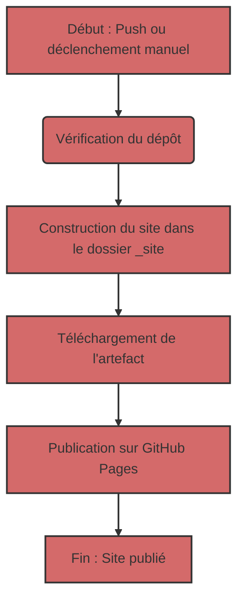

## Déploiement automatique d'un site Jekyll sur GitHub Pages

Pour automatiser le processus de déploiement, nous utiliserons GitHub Actions, qui permettent d'effectuer diverses tâches, y compris la construction et la publication de sites Web, directement dans votre dépôt.

### 1 : Aperçu du fichier de workflow
Tout d'abord, examinons le fichier de workflow principal qui contrôle le processus de construction et de déploiement. Ce fichier est écrit en YAML et se trouve généralement dans le répertoire `.github/workflows`. Voici son contenu :

```yaml
# Exemple de workflow pour la construction et le déploiement d'un site Jekyll sur GitHub Pages
name: Déployer Jekyll avec les dépendances GitHub Pages préinstallées

on:
  # S'exécute lors des pushs ciblant la branche par défaut
  push:
    branches: ["master"]

  # Vous permet d'exécuter ce workflow manuellement depuis l'onglet Actions
  workflow_dispatch:

# Définit les autorisations du GITHUB_TOKEN pour permettre le déploiement sur GitHub Pages
permissions:
  contents: read
  pages: write
  id-token: write

# Autoriser un seul déploiement concurrent, en ignorant les exécutions mises en file d'attente entre l'exécution en cours et la dernière mise en file d'attente.
# Cependant, NE PAS annuler les exécutions en cours, car nous voulons permettre à ces déploiements de production de se terminer.
concurrency:
  group: "pages"
  cancel-in-progress: false

jobs:
  # Tâche de construction
  build:
    runs-on: ubuntu-latest
    steps:
      - name: Checkout
        uses: actions/checkout@v4
      - name: Configurer les pages
        uses: actions/configure-pages@v5
      - name: Construire avec Jekyll
        uses: actions/jekyll-build-pages@v1
        with:
          source: ./docs/gemini/consultant/ru/src
          destination: ./_site
      - name: Télécharger l'artefact
        uses: actions/upload-pages-artifact@v3

  # Tâche de déploiement
  deploy:
    environment:
      name: github-pages
      url: ${{ steps.deployment.outputs.page_url }}
    runs-on: ubuntu-latest
    needs: build
    steps:
      - name: Déployer sur GitHub Pages
        id: deployment
        uses: actions/deploy-pages@v4
```

### 2 : Analyse de la structure du workflow
Maintenant, décomposons chaque section de ce fichier :

#### 2.1. Informations générales

-   `name: Déployer Jekyll avec les dépendances GitHub Pages préinstallées` : Le nom du workflow que vous verrez dans la liste Actions du dépôt.
-   `on` : Décrit quand le workflow doit s'exécuter :
    -   `push` : Le workflow s'exécute à chaque push vers la branche `master`.
    -   `workflow_dispatch` : Vous permet d'exécuter manuellement le workflow via l'interface GitHub.
-   `permissions` : Configure les autorisations pour l'exécution du workflow :
    -   `contents: read` : Autorisation de lire le code du dépôt.
    -   `pages: write` : Autorisation de publier sur GitHub Pages.
    -   `id-token: write` : Autorisation d'obtenir un jeton d'authentification (requis pour GitHub Actions).
-   `concurrency` : Configure l'exécution parallèle du workflow :
    -   `group: "pages"` : Garantit qu'un seul workflow pour GitHub Pages s'exécute à la fois.
    -   `cancel-in-progress: false` : Empêche l'annulation de l'exécution actuelle du workflow lorsqu'une nouvelle démarre.

#### 2.2. Section `jobs`
Cette section décrit les tâches à effectuer. Nous avons deux tâches : `build` et `deploy`.

##### 2.2.1. `build` : Construction du site
    -   `runs-on: ubuntu-latest` : Indique que la tâche s'exécute sur un serveur Ubuntu.
    -   `steps` : Liste les étapes qui sont exécutées lors de la construction :
        -   `name: Checkout` : Extrait le code source du dépôt.
        -   `uses: actions/checkout@v4` : Utilise une action prédéfinie pour extraire le code.
        -   `name: Configurer les pages` : Configure l'environnement pour travailler avec GitHub Pages.
        -    `uses: actions/configure-pages@v5` : Utilise une action prédéfinie pour la configuration.
        -   `name: Construire avec Jekyll` : Lance la construction du site Jekyll.
        -   `uses: actions/jekyll-build-pages@v1` : Utilise une action prédéfinie pour la construction.
        -   `with:` : Configure les paramètres de l'action :
            -   `source: ./docs/gemini/consultant/ru/src` : Spécifie l'emplacement des fichiers source de votre site. **Remarque** : le chemin d'accès à vos fichiers `docs/gemini/consultant/ru/src`.
            -    `destination: ./_site` : Spécifie l'emplacement des fichiers construits.
        -   `name: Télécharger l'artefact` : Télécharge les fichiers construits pour les transmettre à la tâche suivante.
        -   `uses: actions/upload-pages-artifact@v3` : Utilise une action prédéfinie pour le téléchargement des artefacts.
    
##### 2.2.2. `deploy` : Publication du site
    -   `environment` : Configure l'environnement pour la publication.
        -  `name: github-pages` : Nom de l'environnement.
        -   `url: ${{ steps.deployment.outputs.page_url }}` : Obtient l'URL du site publié.
    -   `runs-on: ubuntu-latest` : Indique que la tâche s'exécute sur un serveur Ubuntu.
    -   `needs: build` : Indique que la tâche `deploy` doit s'exécuter après la réussite de la tâche `build`.
    -   `steps` : Liste les étapes qui sont exécutées lors de la publication :
        -   `name: Déployer sur GitHub Pages` : Effectue la publication du site sur GitHub Pages.
        -   `id: deployment` : Définit l'identifiant pour l'action.
        -    `uses: actions/deploy-pages@v4` : Utilise une action prédéfinie pour le déploiement.

### 3 : Que font les fichiers Markdown ?

Les fichiers avec l'extension `.md` (Markdown) sont la base d'un site Jekyll. Markdown est un langage de balisage simple qui vous permet de formater du texte.
Jekyll traite automatiquement les fichiers `.md`, les transformant en pages HTML. Vos fichiers doivent se trouver dans le dossier spécifié dans le workflow `docs/gemini/consultant/ru/src`.

### 4 : Organigramme




### 5 : Comment ça marche
1.  **Modification du code :** Vous apportez des modifications à vos fichiers `.md` ou `.html`, qui se trouvent dans le dossier `docs/gemini/consultant/ru/src`.
2.  **Push :** Vous envoyez (push) vos modifications vers la branche `master` de votre dépôt GitHub.
3.  **Exécution du workflow :** GitHub Actions exécute automatiquement le workflow décrit dans le fichier YAML.
4.  **Construction :** Le workflow télécharge d'abord le code du dépôt, puis construit le site Jekyll à partir de vos fichiers source dans le dossier `_site`.
5.  **Publication :** Le site construit est publié sur GitHub Pages.
6.  **Site prêt :** Après cela, votre site est accessible à l'URL spécifiée dans les paramètres de GitHub Pages.

