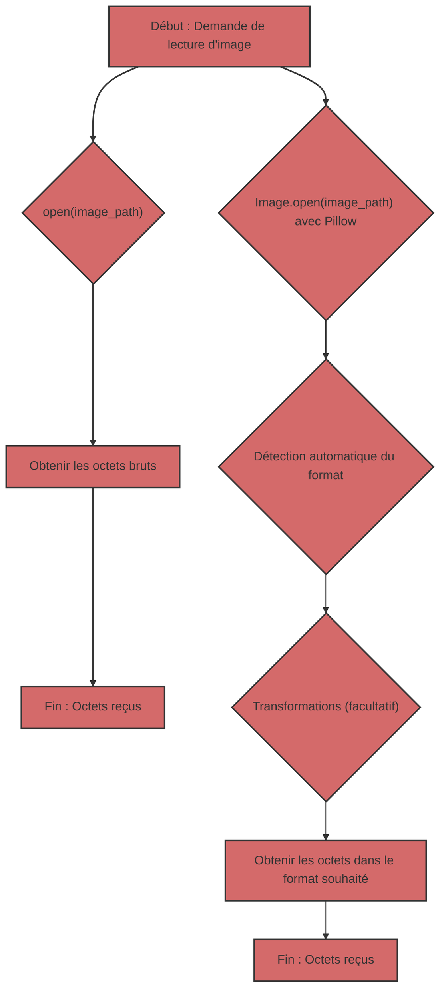

## Lecture d'images : octets bruts vs Pillow

Lorsqu'il s'agit de travailler avec des images en Python, vous avez deux approches principales :

1.  **Lecture d'octets bruts :** Utilisation de `open()` pour lire le contenu d'un fichier image sous forme de séquence d'octets.
2.  **Utilisation de Pillow :** Utilisation de la bibliothèque Pillow pour ouvrir et traiter les images.

Examinons chaque approche en détail et découvrons leurs différences et quand utiliser quelle approche.

### 1. Lecture d'octets bruts avec `open()`

#### Qu'est-ce que c'est ?

Lorsque vous ouvrez un fichier image en mode binaire (`"rb"`) avec `open()`, vous accédez au contenu du fichier sous forme de séquence d'octets. Cela signifie que vous obtenez des données "brutes", sans aucune interprétation ni traitement.

#### À quoi cela ressemble-t-il dans le code ?

```python
from pathlib import Path

def read_image_bytes_direct(image_path: Path) -> bytes | None:
    """
    Lit une image sous forme d'octets directement à l'aide de open().

    Args:
        image_path: Chemin d'accès au fichier image.

    Returns:
        bytes: Octets de l'image.
        None: Si une erreur s'est produite.
    """
    try:
        with open(image_path, "rb") as image_file:
            image_data = image_file.read()
            return image_data
    except Exception as e:
        print(f"Erreur de lecture du fichier : {e}")
        return None


if __name__ == '__main__':
    image_path = Path("test.jpg")  # Remplacez par le chemin d'accès à votre image

    if not image_path.is_file():
        print(f"Le fichier {image_path} n'existe pas")
    else:
       image_bytes_direct = read_image_bytes_direct(image_path)

       if image_bytes_direct:
           print(f"Image lue directement, taille : {len(image_bytes_direct)} octets")
           # Vous pouvez utiliser image_bytes_direct, par exemple, pour l'envoyer sur le réseau
       else:
           print("Impossible de lire l'image.")
```

#### Quand est-ce utile ?

*   **Transfert de données réseau :** Lorsque vous avez juste besoin de transférer des données d'image sur un réseau, sans vous soucier du format.
*   **Enregistrement sur disque :** Lorsque vous avez besoin d'enregistrer le contenu du fichier sur le disque sans modifications.
*   **Accès de bas niveau :** Lorsque vous avez besoin d'un accès de bas niveau aux données du fichier, et que vous savez comment les interpréter vous-même.

#### Limites

*   **Pas de traitement de format :** Vous n'obtenez que des octets, sans aucune information sur le format de l'image (JPEG, PNG, GIF, etc.).
*   **Pas de validation :** Il n'y a pas de vérification si le fichier est réellement une image.
*   **Pas de métadonnées :** Vous n'avez pas accès aux métadonnées de l'image (taille, espace colorimétrique, etc.).
*   **Pas de transformations pratiques :** Vous ne pouvez pas redimensionner, reformater ou appliquer d'autres transformations sans traitement supplémentaire.

### 2. Utilisation de Pillow pour lire des images

#### Qu'est-ce que c'est ?

Pillow est une bibliothèque puissante pour travailler avec des images. Elle vous permet d'ouvrir des images de différents formats, d'obtenir des métadonnées, de redimensionner, de convertir des formats et bien plus encore.

#### À quoi cela ressemble-t-il dans le code ?

```python
from pathlib import Path
from PIL import Image
from io import BytesIO

def read_image_pillow(image_path: Path) -> bytes | None:
    """
    Lit une image à l'aide de Pillow et la renvoie sous forme d'octets JPEG.

    Args:
        image_path: Chemin d'accès au fichier image.

    Returns:
         bytes: Octets de l'image au format JPEG.
         None: Si une erreur s'est produite.
    """
    try:
        img = Image.open(image_path)
        img_byte_arr = BytesIO()
        img.save(img_byte_arr, format="JPEG")
        return img_byte_arr.getvalue()
    except Exception as e:
        print(f"Erreur de lecture de l'image avec Pillow : {e}")
        return None

if __name__ == '__main__':
    image_path = Path("test.jpg") # Remplacez par le chemin d'accès à votre image

    if not image_path.is_file():
        print(f"Le fichier {image_path} n'existe pas")
    else:
        image_bytes_pillow = read_image_pillow(image_path)
        if image_bytes_pillow:
           print(f"Image lue avec Pillow, taille : {len(image_bytes_pillow)} octets")
           # Vous pouvez utiliser image_bytes_pillow, par exemple, pour l'envoyer au modèle Gemini.
        else:
           print("Impossible de lire l'image avec Pillow.")
```

#### Quand est-ce utile ?

*   **Travail avec des images :** Lorsque vous avez besoin de travailler avec des images, et pas seulement des octets.
*   **Détection automatique du format :** Pillow détecte automatiquement le format de l'image.
*   **Conversion de format :** Vous pouvez facilement convertir des images entre différents formats (JPEG, PNG, GIF, etc.).
*   **Redimensionnement :** Vous pouvez redimensionner l'image avant le traitement.
*   **Métadonnées :** Vous pouvez accéder aux métadonnées de l'image (taille, profil de couleur, etc.).
*   **Gestion des erreurs :** Pillow gère les erreurs lors de l'ouverture de fichiers corrompus.

#### Avantages

*   **Flexibilité :** Pillow offre de nombreuses fonctionnalités pour travailler avec des images.
*   **Fiabilité :** Pillow vérifie si le fichier est une image valide.
*   **Commodité :** Pillow simplifie le processus de traitement d'images.

### Comparaison dans un tableau

| Caractéristique | `open(image_path, "rb")` | Pillow |
| :------------------------- | :---------------------------------------------------------- | :---------------------------------------------------------- |
| **Ce qu'il fait** | Lit le fichier comme une séquence d'octets | Ouvre et traite l'image |
| **Format** | Ne reconnaît pas le format | Détecte automatiquement le format |
| **Métadonnées** | Pas d'accès aux métadonnées | Fournit un accès aux métadonnées |
| **Traitement** | Pas de capacités de traitement | Redimensionnement, conversion de format, etc. |
| **Validation** | Pas de validation | Vérifie si le fichier est une image valide |
| **Quand l'utiliser** | Transfert simple d'octets, accès de bas niveau | Traitement d'images, transformations, gestion des erreurs |
| **Exemple** | Transfert d'octets sur le réseau, enregistrement sur disque | Préparation d'images pour Gemini, développement Web |

### Dans le contexte de Gemini

Les modèles Gemini attendent des données d'image dans un format spécifique (généralement JPEG ou PNG). L'utilisation de Pillow garantit que vous fournissez des images dans le bon format, et non pas seulement des octets "bruts". De plus, Pillow vous permet de redimensionner l'image si nécessaire.

### Diagramme de comparaison



Si vous avez juste besoin de lire un fichier sous forme d'octets, sans aucun traitement, `open(image_path, "rb")` fonctionnera. Cependant, pour le traitement d'images, en particulier pour interagir avec des API qui attendent des images dans un format spécifique, l'utilisation de Pillow est une solution plus fiable et flexible.
